# charEdge — ULTIMATE STRATEGIC TASK LIST v10.0

> **Date:** March 4, 2026 | **Baseline:** v9.0 → v10.0 | **Current GPA:** ~4.05  
> **Audit Score:** 74/100 → Target: 95+ | **Expert Auditors:** 8 domain specialists
>
> **Codebase Snapshot:** 986 files · 102,000+ LOC · **151** test files · **255** .ts files (**26%**) · **29** CSS modules · 11 design components · **27** SVG icons · 7 WGSL shaders · 16 E2E specs

---

## WHAT CHANGED FROM v9.0

> [!IMPORTANT]
> **v10 is a ground-up restructure**, not an incremental update. Sources:
>
> - **8 Expert Auditor Reports** (Product Architect, Lead Quant, Testing Expert, DevOps Engineer, UX Design Lead, Data Infra Architect, Ecosystem Strategist, AI/ML Engineer)
> - **Competitive Audit** (74/100, benchmarked against 20 competitors including TradingView, Sierra Chart, TrendSpider)
> - **Trading Journal Strategy** (18 net-new behavioral intelligence features)
> - **Data Ingestion Research** (3 new high-value adapters for APAC, DEX, and deep forex history)
> - **Master Sprint Plans v2** (deep-dive framework integration)
>
> **Key structural changes:**
>
> 1. Tasks now have **ROI scores** (Impact ÷ Effort) — do the highest-ROI work first
> 2. Tasks now have **dependency chains** — no more starting work that's blocked
> 3. Tasks now have **risk ratings** — flag what could go wrong
> 4. Added **7 net-new categories** the v9 list was completely missing
> 5. Removed duplicate tasks that appeared across multiple waves
> 6. Actual completion status verified against codebase (not assumed)

---

## PROGRESS SNAPSHOT

```
WAVE 1  ██████████ 100%   (18 ✅   0 🔶   0 ⬜)  Integrity & CI
WAVE 2  ██████████ 100%   (18 ✅   0 🔶   0 ⬜)  TS Migration & Decomp
WAVE 3  █████████░  90%   (22 ✅   0 🔶   2 ⬜)  CSS & Design System
WAVE 4  ██████░░░░  64%   (12 ✅   0 🔶   5 ⬜)  Testing Depth
WAVE 5  ███░░░░░░░  30%   ( 6 ✅   0 🔶  14 ⬜)  Engine & Data Infra
WAVE 6  █░░░░░░░░░   5%   ( 1 ✅   0 🔶  25 ⬜)  AI & Differentiation
WAVE 7  ░░░░░░░░░░   0%   ( 0 ✅   0 🔶  19 ⬜)  Ship & Growth
WAVE 8  ██████████ 100%   ( 8 ✅   0 🔶   0 ⬜)  Chart Feel & Hardening
── NEW IN v10 ──────────────────────────────────
WAVE 9  ░░░░░░░░░░   0%   ( 0 ✅   0 🔶  12 ⬜)  Production Readiness
WAVE 10 ░░░░░░░░░░   0%   ( 0 ✅   0 🔶  10 ⬜)  Observability & Reliability
WAVE 11 ░░░░░░░░░░   0%   ( 0 ✅   0 🔶   8 ⬜)  Data Coverage Expansion
WAVE 12 ░░░░░░░░░░   0%   ( 0 ✅   0 🔶   7 ⬜)  Developer Experience
─────────────────────────────────────────────
TOTAL   █████░░░░░  44%   (85 ✅   0 🔶 122 ⬜)
```

---

## STATUS KEY

| Symbol | Meaning               |
| ------ | --------------------- |
| ✅     | Done                  |
| 🔶     | Partial / In Progress |
| ⬜     | Not Started           |
| 🔴     | Critical / Do First   |
| 🟠     | High Priority         |
| 🟡     | Medium Priority       |
| ⚪     | Low Priority / Future |

**ROI Score** = (Impact 1-5) ÷ (Effort in hours) × 10 — higher is better. Tasks with ROI ≥ 5 are steal-deals.

---

## WAVE 1: INTEGRITY & CI FOUNDATION — 100% Complete ✅

> All 18 tasks complete. OffscreenCanvas audit, dead code purge, CI pipeline, production observability.

---

## WAVE 2: TYPESCRIPT MIGRATION + MODULE DECOMPOSITION — 100% Complete ✅

> All 18 tasks complete. God object decomp, 255 .ts files, docs, naming conventions.

---

## WAVE 3: CSS ARCHITECTURE + DESIGN SYSTEM — 90% Complete

> **Remaining effort:** ~7h

| #     | Task                                                   | Status | Pri | Effort | ROI | Dep |
| ----- | ------------------------------------------------------ | ------ | --- | ------ | --- | --- |
| 3.2.2 | Replace `useBreakpoints()` with `@container` queries   | ⬜     | 🟡  | 3h     | 3.3 | —   |
| 3.2.3 | `@property` declarations for theme color interpolation | ⬜     | 🟡  | 1h     | 5.0 | —   |
| 3.4.5 | Page transitions with `AnimatePresence`                | ⬜     | ⚪  | 2h     | 2.5 | —   |
| 3.6.3 | Dark/light mode shadow treatments                      | ⬜     | ⚪  | 1h     | 3.0 | —   |

---

## WAVE 4: TESTING DEPTH + QUALITY GATES — 64% Complete

> **Remaining effort:** ~1.5 days

| #     | Task                                           | Status | Pri | Effort | ROI | Risk                            |
| ----- | ---------------------------------------------- | ------ | --- | ------ | --- | ------------------------------- |
| 4.1.8 | Accessibility tree assertions                  | ⬜     | 🟡  | 2h     | 5.0 | Low                             |
| 4.3.3 | Fix flaky benchmarks: statistical assertions   | ⬜     | 🟡  | 2h     | 3.5 | Med                             |
| 4.3.4 | Visual regression via Playwright screenshots   | ⬜     | 🟡  | 4h     | 5.0 | Low                             |
| 4.3.5 | Frame time regression tests                    | ⬜     | 🟡  | 3h     | 4.3 | Med — needs headless Chrome GPU |
| 4.3.6 | Benchmark CI job with 10% regression threshold | ⬜     | 🟡  | 2h     | 5.0 | Low                             |

---

## WAVE 5: ENGINE HARDENING + DATA INFRASTRUCTURE — 30% Complete

> **Goal:** Upgrade from "impressive demo" to "production trading tool."

### 5.1 Historical Data & Storage

| #     | Task                                                  | Status | Pri | Effort | ROI | Dep   | Risk                        |
| ----- | ----------------------------------------------------- | ------ | --- | ------ | --- | ----- | --------------------------- |
| 5.1.1 | `TimeSeriesStore.ts` — IndexedDB-backed block storage | ⬜     | 🟠  | 6h     | 4.2 | —     | Med — migration path needed |
| 5.1.2 | B-tree index for range queries                        | ⬜     | 🟠  | 4h     | 3.8 | 5.1.1 | Med                         |
| 5.1.3 | `barBisect()` — binary search replacing O(n) lookups  | ✅     | —   | —      | —   | —     | —                           |
| 5.1.4 | Data windowing — virtual scroll for bars              | ⬜     | 🟡  | 4h     | 3.8 | 5.1.1 | Low                         |
| 5.1.5 | Automatic time aggregation (1m → 5m → 1h → 1d)        | ⬜     | 🟠  | 4h     | 6.3 | —     | Low                         |
| 5.1.6 | LRU block eviction policy                             | ⬜     | 🟡  | 2h     | 3.5 | 5.1.1 | Low                         |
| 5.1.7 | ~~Gap detection + backfill via REST~~                 | ✅     | —   | —      | —   | —     | —                           |

> **Source: Lead Quant Auditor** — "Build automatic time aggregation. When a user switches from 1m to 5m, aggregate locally. Cuts latency by 90%."

### 5.2 Public API & Plugin Architecture

| #     | Task                                 | Status | Pri | Effort | ROI | Dep   |
| ----- | ------------------------------------ | ------ | --- | ------ | --- | ----- |
| 5.2.1 | `ChartAPI.ts` — typed public methods | ⬜     | 🟠  | 4h     | 5.0 | —     |
| 5.2.2 | Typed `EventEmitter`                 | ⬜     | 🟠  | 3h     | 3.3 | —     |
| 5.2.3 | Configuration schema with JSDoc      | ⬜     | 🟡  | 2h     | 3.5 | —     |
| 5.2.4 | Plugin registry with lifecycle hooks | ⬜     | 🟡  | 4h     | 3.8 | 5.2.1 |
| 5.2.5 | Standalone `charEdge.min.js` widget  | ⬜     | ⚪  | 4h     | 2.5 | 5.2.1 |

### 5.3 Memory Management

| #     | Task                                          | Status | Pri | Effort | ROI | Dep   |
| ----- | --------------------------------------------- | ------ | --- | ------ | --- | ----- |
| 5.3.1 | ~~`MemoryBudget` — track allocations~~        | ✅     | —   | —      | —   | —     |
| 5.3.2 | `Float32Array` buffer pool                    | ⬜     | 🟡  | 2h     | 3.5 | —     |
| 5.3.3 | WebGL texture cleanup on unmount              | ⬜     | 🟡  | 2h     | 5.0 | —     |
| 5.3.4 | Memory pressure detection + auto decimation   | ⬜     | 🟠  | 3h     | 5.0 | 5.3.1 |
| 5.3.5 | `FinalizationRegistry` for GPU buffer cleanup | ⬜     | ⚪  | 2h     | 2.5 | 5.3.3 |

> **Source: Lead Quant Auditor** — "On a 4GB phone rendering 50K candles with footprint data, you'll OOM. Wire MemoryBudget → LODManager → force higher decimation."

### 5.4 Responsive Chart Engine

| #     | Task                                         | Status | Pri | Effort | ROI |
| ----- | -------------------------------------------- | ------ | --- | ------ | --- |
| 5.4.1 | Container query breakpoints on chart panels  | ⬜     | 🟡  | 2h     | 3.5 |
| 5.4.2 | Automatic axis tick reduction at small sizes | ⬜     | 🟡  | 2h     | 3.5 |
| 5.4.3 | Responsive legend                            | ⬜     | 🟡  | 1h     | 5.0 |
| 5.4.4 | Touch-friendly toolbar sizing (44×44px)      | ⬜     | 🟡  | 1h     | 5.0 |
| 5.4.5 | Mobile-first crosshair (long-press)          | ⬜     | ⚪  | 2h     | 2.5 |
| 5.4.6 | Label collision avoidance                    | ⬜     | ⚪  | 3h     | 1.7 |

### 5.5 Async Shader Compilation

| #     | Task                                    | Status | Pri | Effort | ROI |
| ----- | --------------------------------------- | ------ | --- | ------ | --- |
| 5.5.1 | `KHR_parallel_shader_compile` extension | ⬜     | 🟡  | 2h     | 5.0 |
| 5.5.2 | Shimmer skeleton until shaders compiled | ⬜     | 🟡  | 1h     | 5.0 |

### 5.6 🆕 Trade Context Capture ("Invisible Journal")

> _Phase 1 of Trading Journal Strategy. The foundation for every analytics upgrade._

| #     | Task                                               | Status | Pri | Effort | ROI | Dep                | Risk                           |
| ----- | -------------------------------------------------- | ------ | --- | ------ | --- | ------------------ | ------------------------------ |
| 5.6.1 | `TradeSnapshot.ts` — market state capture schema   | ⬜     | 🔴  | 3h     | 8.3 | —                  | Low                            |
| 5.6.2 | `SnapshotCapture` hook — auto-capture on trade log | ⬜     | 🔴  | 4h     | 7.5 | 5.6.1              | Low                            |
| 5.6.3 | Ghost Chart — persist drawing layers per trade     | ⬜     | 🟡  | 3h     | 3.3 | 5.6.1              | Med — serialization complexity |
| 5.6.4 | MFE/MAE intra-trade tracking                       | ⬜     | 🟠  | 4h     | 6.3 | Wave 8 tick stream | Low                            |
| 5.6.5 | Multi-timeframe snapshot viewer                    | ⬜     | 🟡  | 3h     | 3.3 | 5.6.1, 5.6.2       | Low                            |
| 5.6.6 | `TruePnL.ts` — fee decomposition                   | ⬜     | 🟠  | 3h     | 6.7 | —                  | Low                            |
| 5.6.7 | `RegimeTagger.ts` — market regime detection        | ⬜     | 🟡  | 3h     | 3.3 | 5.6.1              | Low                            |
| 5.6.8 | Auto-Screenshot — pixel capture on trade execution | ⬜     | 🟡  | 2h     | 5.0 | —                  | Low                            |

---

## WAVE 6: AI + BEHAVIORAL INTELLIGENCE + DIFFERENTIATION — 5% Complete

> **Goal:** Transform charEdge from "trading journal" to "Decision Intelligence Co-Pilot."

### 6.1 AI Coach → Actual AI

| #      | Task                                                                              | Status | Pri | Effort | ROI | Dep          | Risk                         |
| ------ | --------------------------------------------------------------------------------- | ------ | --- | ------ | --- | ------------ | ---------------------------- |
| 6.1.1  | `LLMService.ts` — provider-agnostic interface                                     | ⬜     | 🟠  | 4h     | 6.3 | —            | Med — API key management     |
| 6.1.2  | LLM-powered trade analysis narrative                                              | ⬜     | 🟠  | 3h     | 5.0 | 6.1.1        | Low                          |
| 6.1.3  | LLM journal summarization (actionable, not descriptive)                           | ⬜     | 🟡  | 2h     | 5.0 | 6.1.1        | Low                          |
| 6.1.3a | 🆕 Journal Note Mining — pattern extraction from text                             | ⬜     | 🟡  | 3h     | 5.0 | 6.1.1        | Low                          |
| 6.1.4  | `FeatureExtractor.ts` — rolling volatility, momentum                              | ⬜     | 🟡  | 4h     | 3.8 | —            | Low                          |
| 6.1.4a | 🆕 Enhanced FeatureExtractor — order flow imbalance, delta slope, spread          | ⬜     | 🟡  | 4h     | 5.0 | 6.1.4        | Low                          |
| 6.1.5  | Trade pattern classifier (tf.js / ONNX)                                           | ⬜     | ⚪  | 8h     | 1.9 | 6.1.4        | High — model training        |
| 6.1.6  | RAG for trade context                                                             | ⬜     | ⚪  | 6h     | 2.5 | 6.1.1        | Med                          |
| 6.1.7  | Prediction feedback loop                                                          | ⬜     | 🟡  | 3h     | 5.0 | 6.1.1        | Low                          |
| 6.1.8  | 🆕 Voice-to-Journal — Web Speech API transcription                                | ⬜     | 🟡  | 3h     | 5.0 | —            | Med — browser compat         |
| 6.1.9  | 🆕 AI Session Summary — daily narrative report                                    | ⬜     | 🟡  | 3h     | 5.0 | 6.1.1        | Low                          |
| 6.1.10 | 🆕 Warden Agent — behavioral tilt auto-lock                                       | ⬜     | ⚪  | 4h     | 3.8 | 6.5.1        | Low                          |
| 6.1.11 | 🆕 **Co-Pilot real-time wire** — FrameState → FeatureExtractor → LLM → CopilotBar | ⬜     | 🔴  | 8h     | 6.3 | 6.1.1, 6.1.4 | Med — latency                |
| 6.1.12 | 🆕 **ONNX inference pipeline** — telemetry → feature vectors → model              | ⬜     | 🟡  | 6h     | 3.3 | 6.1.4        | High — `onnx.ts` is orphaned |
| 6.1.13 | 🆕 **PreTradeAnalyzer → OrderEntry integration**                                  | ⬜     | 🟠  | 4h     | 5.0 | 6.1.11       | Low                          |
| 6.1.14 | 🆕 **Per-asset anomaly baselines** — self-calibrating per asset class             | ⬜     | 🟡  | 3h     | 3.3 | —            | Low                          |
| 6.1.15 | 🆕 **Trading DNA v1** — exportable PDF behavioral report                          | ⬜     | 🟡  | 8h     | 3.8 | 6.1.4, 6.5.1 | Med                          |
| 6.1.16 | 🆕 **LLM call batching** — 30s context window for cost efficiency                 | ⬜     | 🟡  | 3h     | 3.3 | 6.1.1        | Low                          |

> **Source: AI/ML Auditor** — "Wire FrameState → feature extraction → LLM prompt → streaming response. The user should see: 'Bearish divergence on RSI (4h) while footprint shows iceberg buying. Your last 5 trades here: 3W 2L, +1.4R avg.'"

### 6.2 Security Hardening

| #     | Task                                                | Status | Pri | Effort | ROI  |
| ----- | --------------------------------------------------- | ------ | --- | ------ | ---- |
| 6.2.1 | IndexedDB encryption (activate `EncryptedStore.js`) | ⬜     | 🟠  | 3h     | 5.0  |
| 6.2.2 | SRI hashes on external resources                    | ⬜     | 🟡  | 1h     | 5.0  |
| 6.2.3 | CSP reporting endpoint                              | ⬜     | 🟡  | 1h     | 5.0  |
| 6.2.4 | `Permissions-Policy` header                         | ⬜     | 🟡  | 30m    | 10.0 |
| 6.2.5 | Distributed rate limiting via Upstash Redis         | ⬜     | 🟡  | 3h     | 2.3  |
| 6.2.6 | Migrate `localStorage` → encrypted IndexedDB        | ⬜     | ⚪  | 4h     | 1.9  |

### 6.3 Accessibility — WCAG 2.1 AA

| #     | Task                                                 | Status | Pri | Effort | ROI |
| ----- | ---------------------------------------------------- | ------ | --- | ------ | --- |
| 6.3.1 | Color contrast audit (4.5:1 minimum)                 | ⬜     | 🟠  | 2h     | 5.0 |
| 6.3.2 | Keyboard navigation for chart elements               | ⬜     | 🟠  | 3h     | 5.0 |
| 6.3.3 | `:focus-visible` styles on every interactive element | ⬜     | 🟠  | 2h     | 5.0 |
| 6.3.4 | Focus trap for all modals and dialogs                | ⬜     | 🟠  | 2h     | 5.0 |
| 6.3.5 | `aria-live` regions for dynamic price updates        | ⬜     | 🟡  | 1h     | 5.0 |
| 6.3.6 | Touch target audit — all buttons ≥ 44×44px           | ⬜     | 🟡  | 2h     | 3.5 |
| 6.3.7 | ~~`prefers-reduced-motion` comprehensive audit~~     | ✅     | —   | —      | —   |
| 6.3.8 | Screen reader announcements                          | ⬜     | 🟡  | 2h     | 3.5 |
| 6.3.9 | High contrast mode support                           | ⬜     | ⚪  | 2h     | 2.5 |

### 6.4 Data Quality

| #     | Task                                                                                    | Status | Pri | Effort | ROI | Risk                    |
| ----- | --------------------------------------------------------------------------------------- | ------ | --- | ------ | --- | ----------------------- |
| 6.4.1 | `SecurityMaster.ts` — canonical instrument identifiers                                  | ⬜     | 🟡  | 4h     | 3.8 | Low                     |
| 6.4.2 | Data quality framework — stale/spike/anomaly detection per bar                          | ⬜     | 🟡  | 3h     | 5.0 | Low                     |
| 6.4.3 | Exchange latency monitoring dashboard                                                   | ⬜     | ⚪  | 2h     | 2.5 | Low                     |
| 6.4.4 | 🆕 **Canonical data schemas** (`CanonicalBar`, `CanonicalTick`, `CanonicalTrade`)       | ⬜     | 🟠  | 4h     | 6.3 | Med — adapter migration |
| 6.4.5 | 🆕 **Adapter health dashboard** — latency p50/p95, error rate, freshness, circuit state | ⬜     | 🟡  | 6h     | 3.3 | Low                     |
| 6.4.6 | 🆕 **OPFS compaction background job** — merge + dedup + re-index                        | ⬜     | 🟡  | 4h     | 2.5 | Low                     |
| 6.4.7 | 🆕 **Server-side data normalization** — adapter response → canonical → client           | ⬜     | 🟡  | 6h     | 3.3 | Med                     |

> **Source: Data Infra Auditor** — "Each adapter returns data in its own format. A subtle field naming difference between Binance (`closeTime`) and Coinbase (`time`) will cause silent bugs."

### 6.5 🆕 Behavioral Intelligence ("Leak Detection")

> _The "aha moment" features. What makes charEdge beat TraderSync, TradeZella, and TradesViz._

| #     | Task                                                           | Status | Pri | Effort | ROI | Dep   | Risk |
| ----- | -------------------------------------------------------------- | ------ | --- | ------ | --- | ----- | ---- |
| 6.5.1 | `LeakDetector.ts` — automatic behavioral tagging               | ⬜     | 🔴  | 4h     | 7.5 | —     | Low  |
| 6.5.2 | Reaction Bar — post-trade quick capture (2-tap widget)         | ⬜     | 🔴  | 3h     | 8.3 | —     | Low  |
| 6.5.3 | Discipline Curve — actual vs. "if I followed rules"            | ⬜     | 🟡  | 4h     | 5.0 | 6.5.1 | Low  |
| 6.5.4 | Expectancy display — (Win% × Avg Win R) − (Loss% × Avg Loss R) | ⬜     | 🟡  | 2h     | 7.5 | —     | Low  |
| 6.5.5 | Rule Engine v2 — automated plan compliance                     | ⬜     | 🟡  | 4h     | 5.0 | —     | Low  |
| 6.5.6 | Multi-axis heatmap — Profit × Asset × Session × Day            | ⬜     | 🟡  | 4h     | 3.8 | —     | Low  |
| 6.5.7 | Setup Grading by day/session                                   | ⬜     | ⚪  | 3h     | 3.3 | 6.5.1 | Low  |

---

## WAVE 7: SHIP + GROWTH + PLATFORM — 0% Complete

> **Goal:** Get charEdge into the hands of real traders.

### 7.1 User Accounts

| #     | Task                                             | Status | Pri | Effort | ROI |
| ----- | ------------------------------------------------ | ------ | --- | ------ | --- |
| 7.1.1 | Supabase authentication (email/Google/GitHub)    | ⬜     | 🟡  | 4h     | 6.3 |
| 7.1.2 | Cloud sync for journal, settings, drawings       | ⬜     | 🟡  | 4h     | 6.3 |
| 7.1.3 | Onboarding redesign — "Aha moment" in 30 seconds | ⬜     | 🟡  | 3h     | 5.0 |

### 7.2 Mobile & PWA

| #     | Task                                                 | Status | Pri | Effort | ROI  |
| ----- | ---------------------------------------------------- | ------ | --- | ------ | ---- |
| 7.2.1 | `prefers-color-scheme` auto-detection                | ⬜     | 🟡  | 1h     | 10.0 |
| 7.2.2 | PWA install banner                                   | ⬜     | 🟡  | 2h     | 5.0  |
| 7.2.3 | Push notifications (price alerts, journal reminders) | ⬜     | 🟡  | 4h     | 3.8  |
| 7.2.4 | Service Worker overhaul via Workbox                  | ⬜     | 🟡  | 3h     | 5.0  |
| 7.2.5 | Haptic feedback                                      | ⬜     | ⚪  | 1h     | 5.0  |
| 7.2.6 | Capacitor native wrapper                             | ⬜     | ⚪  | 8h     | 1.6  |

### 7.3 Launch & Distribution

| #     | Task                                   | Status | Pri | Effort | ROI  |
| ----- | -------------------------------------- | ------ | --- | ------ | ---- |
| 7.3.1 | Product Hunt launch                    | ⬜     | 🟡  | 4h     | 5.0  |
| 7.3.2 | Reddit launch posts                    | ⬜     | 🟡  | 2h     | 5.0  |
| 7.3.3 | Twitter/X GPU speed comparison content | ⬜     | 🟡  | 2h     | 5.0  |
| 7.3.4 | Discord community                      | ⬜     | 🟡  | 1h     | 10.0 |
| 7.3.5 | SEO content pages                      | ⬜     | 🟡  | 3h     | 3.3  |

### 7.4 Deployment Optimization

| #     | Task                                         | Status | Pri | Effort | ROI |
| ----- | -------------------------------------------- | ------ | --- | ------ | --- |
| 7.4.1 | Migrate to Vercel Edge Functions             | ⬜     | 🟡  | 3h     | 3.3 |
| 7.4.2 | ISR for SEO pages                            | ⬜     | 🟡  | 2h     | 3.5 |
| 7.4.3 | Bundle analysis — main chunk < 200KB gzipped | ⬜     | 🟡  | 2h     | 5.0 |

### 7.5 🆕 Bot Integration ("Alpha Co-Pilot")

| #     | Task                                             | Status | Pri | Effort | ROI |
| ----- | ------------------------------------------------ | ------ | --- | ------ | --- |
| 7.5.1 | Bot API Listener — ingest arb bot execution logs | ⬜     | 🟡  | 4h     | 3.8 |
| 7.5.2 | Bot vs. Human Benchmarking dashboard             | ⬜     | 🟡  | 4h     | 3.8 |
| 7.5.3 | Alpha Leakage metric                             | ⬜     | ⚪  | 3h     | 2.3 |

---

## WAVE 8: CHART FEEL & ENGINE HARDENING — 100% Complete ✅

> All 8 tasks complete. TickChannel, FormingCandleInterpolator, numeric timestamps, MemoryBudget wiring, rate budgets, GapDetector, Safari polyfill, staging env.

---

## WAVE 9: 🆕 PRODUCTION READINESS — 0% Complete

> **Source: DevOps Auditor, Product Architect, Data Infra Auditor**
> **Goal:** Close the gap from 52/100 Production Readiness score. "You're building a Ferrari with no road to drive it on."

| #    | Task                                                                                   | Status | Pri | Effort | ROI | Dep   | Risk                      |
| ---- | -------------------------------------------------------------------------------------- | ------ | --- | ------ | --- | ----- | ------------------------- |
| 9.1  | **Structured logging** — server + client, JSON format                                  | ⬜     | 🔴  | 3h     | 8.3 | —     | Low                       |
| 9.2  | **Staging environment** — `vercel.staging.json` auto-deploy                            | ✅     | —   | —      | —   | —     | —                         |
| 9.3  | **Health check endpoints** — test downstream deps (WS, DB, adapters)                   | ⬜     | 🟠  | 3h     | 6.7 | —     | Low                       |
| 9.4  | **Database migration safety** — checksums, dry-run, auto-backup, rollback              | ⬜     | 🟠  | 4h     | 5.0 | —     | Med                       |
| 9.5  | **CDN strategy** — immutable caching with content-hashed filenames                     | ⬜     | 🟡  | 2h     | 5.0 | —     | Low                       |
| 9.6  | **Merge backup services** — `CloudBackup.js` + `FileSystemBackup.js` → `BackupService` | ⬜     | 🟡  | 4h     | 3.8 | —     | Low                       |
| 9.7  | **Cloud data sync via Supabase** — layouts, trades, drawings, settings                 | ⬜     | 🟠  | 8h     | 5.0 | 7.1.1 | Med — conflict resolution |
| 9.8  | **Public demo mode** — read-only, zero-auth, pre-loaded BTC/USD chart                  | ⬜     | 🟠  | 4h     | 6.3 | —     | Low                       |
| 9.9  | **Bundle audit** — `vite-bundle-visualizer`, lazy-load adapters by config              | ⬜     | 🟠  | 4h     | 6.3 | —     | Low                       |
| 9.10 | **Route architecture cleanup** — extract `routes.ts` manifest from 14KB `App.jsx`      | ⬜     | 🟡  | 3h     | 5.0 | —     | Low                       |
| 9.11 | **Error boundary per route** — granular crash isolation                                | ⬜     | 🟡  | 2h     | 5.0 | 9.10  | Low                       |
| 9.12 | **Idempotent migrations** — ensure re-run safety                                       | ⬜     | 🟡  | 2h     | 5.0 | 9.4   | Low                       |

> **Source: Product Architect** — "Ship authentication before anything else. Without auth, you don't have users. Without users, gamification, journal, AI coaching, and social features are all dead code."

---

## WAVE 10: 🆕 OBSERVABILITY & RELIABILITY — 0% Complete

> **Source: Testing Expert, Lead Quant Auditor, DevOps Engineer**
> **Goal:** Close the gap from 58/100 Testing & Reliability score. "157 test files is vanity. Coverage without confidence is worse than no tests."

| #     | Task                                                                                                                                          | Status | Pri | Effort | ROI | Dep | Risk                       |
| ----- | --------------------------------------------------------------------------------------------------------------------------------------------- | ------ | --- | ------ | --- | --- | -------------------------- |
| 10.1  | **Chart engine integration test** — headless render → pixel comparison                                                                        | ⬜     | 🔴  | 4h     | 7.5 | —   | Med — GPU in CI            |
| 10.2  | **WebSocket chaos testing proxy** — random drops, delays, malformed data                                                                      | ⬜     | 🟠  | 4h     | 5.0 | —   | Low                        |
| 10.3  | **Store tests for 5 critical stores** — `useChartStore`, `usePaperTradeStore`, `useJournalStore`, `useOrderFlowStore`, `useGamificationStore` | ⬜     | 🟠  | 4h     | 5.0 | —   | Low                        |
| 10.4  | **Mutation testing** — Stryker.js to verify tests catch actual bugs                                                                           | ⬜     | 🟡  | 4h     | 3.8 | —   | Low                        |
| 10.5  | **Dead test helper cleanup** — audit 21 helpers for orphans                                                                                   | ⬜     | 🟡  | 1h     | 5.0 | —   | Low                        |
| 10.6  | **Integration test: full data pipeline** — adapter → WS → TickerPlant → indicators → store → render trigger                                   | ⬜     | 🟠  | 6h     | 5.0 | —   | Med                        |
| 10.7  | **GPU capability fingerprint** — benchmark 1000-element EMA, fallback to Worker if GPU slower                                                 | ⬜     | 🟡  | 4h     | 3.8 | —   | Med                        |
| 10.8  | **BinaryCodec vs JSON.parse benchmark** — verify MessagePack actually wins for your payloads                                                  | ⬜     | 🟡  | 2h     | 3.5 | —   | Low                        |
| 10.9  | **Consolidate dual circuit breakers** — `CircuitBreaker.ts` + `AdapterCircuitBreaker.js` → one                                                | ⬜     | 🟡  | 2h     | 5.0 | —   | Low                        |
| 10.10 | **WebSocket → SharedWorker** — move parse + validate off main thread, 60Hz batching                                                           | ⬜     | 🟡  | 8h     | 3.1 | —   | High — SharedWorker compat |

> **Source: Testing Expert** — "You don't have a single test that actually renders a chart. Your most important feature is untested at the integration level."

---

## WAVE 11: 🆕 DATA COVERAGE EXPANSION — 0% Complete

> **Source: Data Ingestion Research, Data Infra Auditor**
> **Goal:** Fill geographic and asset-class coverage gaps.

| #    | Task                                                                               | Status | Pri | Effort | ROI | Risk                          |
| ---- | ---------------------------------------------------------------------------------- | ------ | --- | ------ | --- | ----------------------------- | --- |
| 11.1 | **iTick Adapter** — HK, JP, AU, SG equities via WebSocket                          | ⬜     | 🟡  | 8h     | 2.5 | Med — APAC timezone handling  |
| 11.2 | **Bitquery Adapter** — DEX flow (mempool, LP swaps, token trades) via GraphQL WS   | ⬜     | 🟡  | 8h     | 3.1 | Med — schema complexity       |
| 11.3 | **Dukascopy Historical Backfill** — 15yr tick-by-tick forex/commodity via bulk CSV | ⬜     | 🟡  | 8h     | 2.5 | Low                           |
| 11.4 | **Tick-level ring buffer persistence** — SharedArrayBuffer + OPFS flush            | ⬜     | 🟡  | 8h     | 3.1 | High — SharedArrayBuffer reqs |
| 11.5 | 🆕 **Fuzzy symbol search** — Fuse.js or trigram index for `SymbolRegistry`         | ✅     | —   | —      | —   | —                             |
| 11.6 | 🆕 **Per-adapter circuit breaker tuning** — configurable thresholds per upstream   | ⬜     | 🟡  | 3h     | 3.3 | Low                           |
| 11.7 | 🆕 **Data freshness SLA** — stale data detection + user notification               | ⬜     | 🟡  | 3h     | 5.0 | Low                           |
| 11.8 | 🆕 **Adapter compliance audit** — verify all 25 adapters return canonical format   | ⬜     | 🟠  | 4h     | 5.0 | 6.4.4                         | Low |

---

## WAVE 12: 🆕 DEVELOPER EXPERIENCE — 0% Complete

> **Source: Product Architect, Ecosystem Strategist, Testing Expert**
> **Goal:** Make charEdge contributor-friendly and community-ready. Close the 28/100 Ecosystem score gap.

| #    | Task                                                                                 | Status | Pri | Effort | ROI  | Risk                  |
| ---- | ------------------------------------------------------------------------------------ | ------ | --- | ------ | ---- | --------------------- |
| 12.1 | **Storybook component catalog** — all 11 design components documented                | ⬜     | 🟡  | 12h    | 2.1  | Low                   |
| 12.2 | **Stylelint enforcement** — ban hardcoded colors/spacing values                      | ⬜     | 🟡  | 30m    | 20.0 | Low                   |
| 12.3 | **State architecture diagram** — which stores depend on which                        | ⬜     | 🟡  | 2h     | 5.0  | Low                   |
| 12.4 | **State consolidation** — merge redundant social slices (75 → ~50 stores)            | ⬜     | 🟡  | 8h     | 2.5  | Med — regression risk |
| 12.5 | **Documentation site** — Docusaurus/Starlight: chart API, indicator API, adapter API | ⬜     | 🟡  | 8h     | 2.5  | Low                   |
| 12.6 | **npm package alpha** — `@charedge/charts` standalone chart engine                   | ⬜     | ⚪  | 16h    | 1.9  | Med — API surface     |
| 12.7 | **"How We Built WebGPU Charting" blog post** — technical content for HN              | ⬜     | 🟡  | 6h     | 3.3  | Low                   |

> **Source: Ecosystem Strategist** — "Extract the chart engine as a standalone npm package. This generates awareness, community, and potential enterprise licensing revenue."

---

## WAVE 8 (Complete) — Details

| #   | Task                                                     | Status | Evidence                    |
| --- | -------------------------------------------------------- | ------ | --------------------------- |
| 8.1 | `TickChannel.ts` — direct data flow to ChartEngine       | ✅     | 168L                        |
| 8.2 | `FormingCandleInterpolator.ts` — smooth candle animation | ✅     | 217L                        |
| 8.3 | Numeric timestamps in hot paths                          | ✅     | —                           |
| 8.4 | `MemoryBudget` wired to render loop                      | ✅     | 252L + GPUMemoryBudget 188L |
| 8.5 | Per-adapter rate budget tracking                         | ✅     | —                           |
| 8.6 | `GapDetector.ts` — data gap detection + backfill         | ✅     | 177L                        |
| 8.7 | Safari `requestIdleCallback` polyfill                    | ✅     | —                           |
| 8.8 | Staging environment                                      | ✅     | —                           |

---

## FUTURE HORIZON (Post-Launch)

| #    | Task                                                             | Pri | Notes                                         |
| ---- | ---------------------------------------------------------------- | --- | --------------------------------------------- |
| F.1  | Broker adapter interface (Alpaca, IBKR)                          | ⚪  |                                               |
| F.2  | Order management system with real-time PnL                       | ⚪  |                                               |
| F.3  | DOM/Depth ladder with one-click trading                          | ⚪  |                                               |
| F.4  | Multi-asset normalizer (forex, futures, options)                 | ⚪  |                                               |
| F.5  | Risk engine (Kelly criterion, max drawdown)                      | ⚪  |                                               |
| F.6  | Worker-based backtesting                                         | ⚪  |                                               |
| F.7  | i18n layer                                                       | ⚪  |                                               |
| F.8  | Declarative Mark System (D3-style)                               | ⚪  |                                               |
| F.9  | Scale Registry                                                   | ⚪  |                                               |
| F.10 | Transition Manager                                               | ⚪  |                                               |
| F.11 | Community leaderboards                                           | ⚪  |                                               |
| F.12 | Open-source npm package                                          | ⚪  | Overlap with 12.6                             |
| F.13 | On-device ML inference via WebNN/tf.js                           | ⚪  |                                               |
| F.14 | Storybook                                                        | ⚪  | Overlap with 12.1                             |
| F.15 | Drawing tool expansion to 30+ tools                              | ⚪  |                                               |
| F.16 | Compliance layer (FINRA/SEC/MiFID II)                            | ⚪  |                                               |
| F.17 | Keyboard shortcuts cheat sheet                                   | ✅  | Done (KeyboardShortcutModal)                  |
| F.18 | Stripe integration                                               | ⚪  |                                               |
| F.19 | Computer Vision pattern recognition on snapshots                 | ⚪  |                                               |
| F.20 | PostgreSQL backend for multi-device sync                         | ⚪  |                                               |
| F.21 | Predictive Edge Discovery (ML-graded setups)                     | ⚪  |                                               |
| F.22 | 🆕 Custom scripting language (Pine-like DSL)                     | ⚪  | Competitive moat — TradingView's #1 advantage |
| F.23 | 🆕 Strategy backtesting with walk-forward optimization           | ⚪  |                                               |
| F.24 | 🆕 WASM fallback for GPU-less devices                            | ⚪  |                                               |
| F.25 | 🆕 Cross-exchange arb visual overlay (unify existing components) | ⚪  |                                               |
| F.26 | 🆕 Partner outreach — 5 trading YouTubers                        | ⚪  |                                               |

---

## SUMMARY STATISTICS

| Metric                | v7.0  | v8.0  | v8.8  | v9.0   | **v10.0 (Now)** |
| --------------------- | ----- | ----- | ----- | ------ | --------------- |
| **Total Tasks**       | 143   | 127   | 132   | 150    | **207** (+57)   |
| ✅ **Done**           | 14    | 35    | 71    | 85     | **85**          |
| 🔶 **Partial**        | 8     | 4     | 0     | 0      | **0**           |
| ⬜ **Remaining**      | 121   | 88    | 61    | 65     | **122** (+57)   |
| **TypeScript Files**  | 44    | 46    | 46    | 255    | **255**         |
| **TS Coverage**       | 4.9%  | 5.3%  | 5.3%  | 26%    | **26%**         |
| **Tests Passing**     | 2,928 | 2,775 | 3,022 | 3,022+ | **3,022+**      |
| **Test Files**        | —     | —     | 113   | 151    | **151**         |
| **E2E Specs**         | —     | —     | —     | 16     | **16**          |
| **CSS Modules**       | 4     | 14    | 24    | 29     | **29**          |
| **SVG Icons**         | 0     | 0     | 27    | 27     | **27**          |
| **Design Components** | 5     | 5     | 10    | 11     | **11**          |
| **WGSL Shaders**      | —     | —     | 7     | 7      | **7**           |
| **LOC**               | —     | —     | —     | 102K+  | **102K+**       |
| **Audit Score**       | —     | —     | —     | —      | **74/100**      |
| **Estimated GPA**     | ~2.88 | ~3.15 | ~3.85 | ~4.05  | **~4.05**       |

---

## v9 → v10 DELTA: WHAT'S NEW

### 57 Net-New Tasks Added

| Source                       | Tasks Added                    | Key Additions                                                                                                                                                   |
| ---------------------------- | ------------------------------ | --------------------------------------------------------------------------------------------------------------------------------------------------------------- |
| **AI/ML Auditor**            | 6                              | Co-Pilot real-time wire, ONNX pipe, PreTradeAnalyzer → OrderEntry, Trading DNA, LLM batching, per-asset anomaly baselines                                       |
| **DevOps Auditor**           | 12                             | Structured logging, health checks, migration safety, CDN, cloud sync, demo mode, bundle audit, route cleanup                                                    |
| **Data Infra Auditor**       | 8                              | Canonical schemas, adapter health dashboard, OPFS compaction, server-side normalization, freshness SLA, adapter compliance audit                                |
| **Testing Expert**           | 10                             | Chart engine integration test, chaos testing, store tests, mutation testing, dead helper cleanup, full pipeline integration test, circuit breaker consolidation |
| **UX Design Lead**           | (absorbed into existing waves) | Empty states, loading narratives, animation budget — folded into Wave 3/7                                                                                       |
| **Product Architect**        | 7                              | State diagram, state consolidation, stylelint, Storybook, docs site, npm package, blog post                                                                     |
| **Ecosystem Strategist**     | (absorbed into Wave 7/12)      | Discord, Twitter, Product Hunt, demo video, educator partnerships                                                                                               |
| **Data Ingestion Research**  | 3                              | iTick, Bitquery, Dukascopy adapters                                                                                                                             |
| **Trading Journal Strategy** | Already in v9, refined         | Priorities + dependencies clarified                                                                                                                             |

### 4 New Waves Added

| Wave                                     | Purpose                                        | Source                                       |
| ---------------------------------------- | ---------------------------------------------- | -------------------------------------------- |
| **Wave 9: Production Readiness**         | Auth, monitoring, CDN, cloud sync, demo mode   | DevOps + Product Architect auditors          |
| **Wave 10: Observability & Reliability** | Integration tests, chaos testing, benchmarking | Testing Expert + Lead Quant auditors         |
| **Wave 11: Data Coverage**               | APAC/DEX/Forex adapters, tick persistence      | Data Ingestion Research + Data Infra auditor |
| **Wave 12: Developer Experience**        | Storybook, docs, npm package, blog             | Ecosystem Strategist + Product Architect     |

### Every Task Now Has

- **ROI Score** — prioritize steal-deals (ROI ≥ 5) first
- **Dependency chain** — know what's blocked
- **Risk rating** — flag potential pitfalls before starting
- **Source attribution** — trace every task back to the auditor or document that recommended it

---

## WHAT TO DO NEXT

> [!IMPORTANT]
> **The v10 execution order is driven by ROI, not wave order.**
> Work the highest-ROI tasks from across ALL waves simultaneously.

### 🔥 Sprint 0 — "Steal-Deal Sweep" (Day 1, ~8h)

> _Tasks with ROI ≥ 7. Maximum impact per hour invested._

| #     | Task                                     | Effort | ROI | Why                                    |
| ----- | ---------------------------------------- | ------ | --- | -------------------------------------- |
| 5.6.1 | `TradeSnapshot.ts` — market state schema | 3h     | 8.3 | Everything downstream depends on this  |
| 6.5.2 | Reaction Bar — 2-tap post-trade widget   | 3h     | 8.3 | Frictionless journaling = #1 USP       |
| 9.1   | Structured logging                       | 3h     | 8.3 | Can't operate in production without it |
| 6.5.4 | Expectancy display                       | 2h     | 7.5 | Quick analytics win                    |
| 6.5.1 | `LeakDetector.ts` — behavioral auto-tags | 4h     | 7.5 | The "aha" differentiator               |
| 5.6.2 | `SnapshotCapture` hook                   | 4h     | 7.5 | Auto-capture trade context             |
| 10.1  | Chart engine integration test            | 4h     | 7.5 | Prove the engine works                 |

### 🟠 Sprint 1 — "Production Floor" (Week 1, ~24h)

> _Close the Production Readiness gap (52 → 75+)_

| #     | Task                             | Effort | ROI | Why                             |
| ----- | -------------------------------- | ------ | --- | ------------------------------- |
| 9.3   | Health check endpoints           | 3h     | 6.7 | Know when things break          |
| 5.6.6 | `TruePnL.ts` — fee decomposition | 3h     | 6.7 | Arb-specific killer feature     |
| 5.1.5 | Automatic time aggregation       | 4h     | 6.3 | 90% latency cut on TF switching |
| 6.4.4 | Canonical data schemas           | 4h     | 6.3 | Foundation for data quality     |
| 6.1.1 | `LLMService.ts` — AI foundation  | 4h     | 6.3 | All AI features depend on this  |
| 9.8   | Public demo mode                 | 4h     | 6.3 | Your pitch deck to the world    |
| 9.9   | Bundle audit                     | 4h     | 6.3 | Get under 300KB gzipped         |

### 🟡 Sprint 2 — "Behavioral Intelligence" (Week 2-3, ~30h)

> _Build the features that make charEdge beat every journal app_

| #      | Task                         | Effort | ROI | Why                               |
| ------ | ---------------------------- | ------ | --- | --------------------------------- |
| 5.6.4  | MFE/MAE tracking             | 4h     | 6.3 | "How much you left on the table"  |
| 6.1.11 | Co-Pilot real-time wire      | 8h     | 6.3 | Blue ocean feature                |
| 6.5.3  | Discipline Curve             | 4h     | 5.0 | Visual proof of rule-following    |
| 6.5.5  | Rule Engine v2               | 4h     | 5.0 | Automated compliance              |
| 6.1.13 | PreTradeAnalyzer integration | 4h     | 5.0 | Block impulsive trades            |
| 5.6.8  | Auto-Screenshot capture      | 2h     | 5.0 | Pixel proof of every trade        |
| 5.6.7  | Market Regime Tagger         | 3h     | 3.3 | Trending/Ranging/Volatile context |

### 🟢 Sprint 3 — "Community & Launch" (Week 4-6, ~40h)

> _From 28/100 Ecosystem → 60+_

| #     | Task                     | Effort | ROI  | Why                          |
| ----- | ------------------------ | ------ | ---- | ---------------------------- |
| 7.3.4 | Discord community        | 1h     | 10.0 | Communities compound         |
| 12.2  | Stylelint enforcement    | 30m    | 20.0 | 30 minutes saves 30 hours    |
| 7.2.1 | Color scheme auto-detect | 1h     | 10.0 | Table stakes for modern apps |
| 12.7  | WebGPU blog post for HN  | 6h     | 3.3  | 10K visitors from one post   |
| 9.8   | Public demo mode         | 4h     | 6.3  | Top-of-funnel                |
| 7.3.1 | Product Hunt launch      | 4h     | 5.0  | Go-to-market                 |
| 12.5  | Documentation site       | 8h     | 2.5  | Developer adoption           |
| 12.6  | npm package alpha        | 16h    | 1.9  | Ecosystem play               |

---

## COMPETITIVE SCORE PROJECTION

| After Sprint | Audit Score | Key Unlock                                                        |
| ------------ | ----------- | ----------------------------------------------------------------- |
| **Current**  | **74**      | —                                                                 |
| **Sprint 0** | **80**      | Trade context capture, leak detection, structured logging         |
| **Sprint 1** | **86**      | Production-ready, AI foundation, demo mode, canonical data        |
| **Sprint 2** | **91**      | AI Co-Pilot live, behavioral intelligence suite, discipline curve |
| **Sprint 3** | **95+**     | Community, ecosystem, documentation, public launch                |

> [!TIP]
> **Sprint 0 alone moves you from 74 → 80 in one day.** The entire path to 95+ takes ~6 weeks of focused execution. Stop building features in isolation. Start shipping proof.

---

## DEPENDENCY GRAPH

```mermaid
graph TD
    A[5.6.1 TradeSnapshot Schema] --> B[5.6.2 SnapshotCapture Hook]
    A --> C[5.6.3 Ghost Chart]
    A --> D[5.6.5 Multi-TF Viewer]
    A --> E[5.6.7 RegimeTagger]

    F[6.1.1 LLMService] --> G[6.1.2 Trade Analysis]
    F --> H[6.1.3 Journal Summary]
    F --> I[6.1.3a Note Mining]
    F --> J[6.1.9 Session Summary]
    F --> K[6.1.16 LLM Batching]

    L[6.1.4 FeatureExtractor] --> M[6.1.4a Enhanced Features]
    L --> N[6.1.5 Pattern Classifier]
    F --> O[6.1.11 Co-Pilot Wire]
    L --> O
    O --> P[6.1.13 PreTradeAnalyzer Integration]

    Q[6.5.1 LeakDetector] --> R[6.5.3 Discipline Curve]
    Q --> S[6.5.7 Setup Grading]
    Q --> T[6.1.10 Warden Agent]
    Q --> U[6.1.15 Trading DNA]
    L --> U

    V[6.4.4 Canonical Schemas] --> W[11.8 Adapter Compliance Audit]
    V --> X[6.4.7 Server-side Normalization]

    Y[7.1.1 Supabase Auth] --> Z[9.7 Cloud Sync]

    AA[9.10 Route Cleanup] --> AB[9.11 Error Boundary Per Route]
    AC[9.4 Migration Safety] --> AD[9.12 Idempotent Migrations]
```



---

## RISK REGISTER

| Risk                                  | Impact | Probability | Mitigation                                                      |
| ------------------------------------- | ------ | ----------- | --------------------------------------------------------------- |
| WebGPU adoption stalls                | High   | Low         | WASM fallback (F.24) + WebGL2 already works                     |
| LLM API costs at scale                | Med    | Med         | Local ONNX inference (6.1.12) + batching (6.1.16)               |
| SharedWorker browser compat           | Med    | Med         | Feature detection + main-thread fallback                        |
| GPU-in-CI for visual regression       | Med    | High        | Use software renderer in CI, GPU tests local-only               |
| Community doesn't materialize         | High   | Med         | Partner with trading educators (F.26) + open-source npm package |
| IndexedDB corruption on mobile Safari | High   | Low         | Write-ahead log + backup-before-read pattern                    |
| Bundle size regression                | Med    | High        | CI-gated size budget (7.4.3)                                    |
