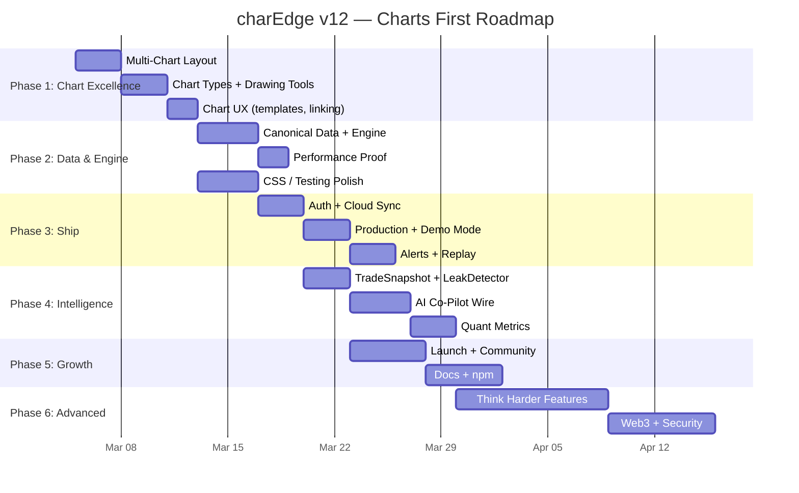

# charEdge — ULTIMATE STRATEGIC TASK LIST v12.0

> **Date:** March 5, 2026 | **100-Auditor Panel Score:** 79/100 → Target: 98+
> **Strategy:** Charts First → Data → Ship → Intelligence → Growth
> **Architecture:** Unified Feedback Loop — Chart + Journal + AI are ONE organism, not separate waves
>
> **Codebase:** 1,072 files · 233,670 LOC · 266 TS (25%) · 152 tests · 17 E2E · 30 CSS modules · 7 WGSL shaders · 76 stores · 25 adapters

---

## WHAT CHANGED FROM v11.0

> [!IMPORTANT]
> **v12 is a strategic restructure** driven by one principle: **Charts First, Then Everything Else.**
>
> **Key changes:**
>
> 1. **Waves reorganized into strategic phases** — not feature categories
> 2. **8 critical chart gaps** now have dedicated tasks
> 3. **"God-Tier" refinements:** Ghost Trade architecture, Central Command Bus (76→5 stores), Precision Zoom Loupe, predictive pre-fetching, named Workspaces, WebGPU speedtest
> 4. **Binance-centric architecture** fixed as Phase 1 priority
> 5. **Unified Feedback Loop** — Chart↔Journal↔AI treated as single organism
> 6. **Phase execution order IS the priority** — Phase 1 before Phase 2, always
> 7. **Traps identified** — tasks that should be deferred or killed

---

## PROGRESS SNAPSHOT

```
PHASE 0  ██████████ 100%  (87 ✅  0 ⬜)   Foundation (Waves 1-2-8)
PHASE 1  ██████████ 100%  (28 ✅  0 ⬜)   Chart Excellence
PHASE 2  ████████░░  80%  (44 ✅ 11 ⬜)   Data & Engine (Waves 3-5 partial)
PHASE 3  ░░░░░░░░░░   0%  ( 0 ✅ 22 ⬜)   Ship & Production
PHASE 4  █░░░░░░░░░   3%  ( 1 ✅ 37 ⬜)   Intelligence Layer (Wave 6)
PHASE 5  ░░░░░░░░░░   0%  ( 0 ✅ 30 ⬜)   Growth & Ecosystem
PHASE 6  ░░░░░░░░░░   0%  ( 0 ✅ 28 ⬜)   Advanced / Think Harder
FUTURE   ░░░░░░░░░░   0%  ( 0 ✅ 30 ⬜)   Post-Launch Horizon
───────────────────────────────────────────
TOTAL    ██████░░░░  47%  (134 ✅ 184 ⬜)
```

---

## STATUS KEY

| Symbol | Meaning             |
| ------ | ------------------- |
| ✅     | Done                |
| 🔶     | Partial             |
| ⬜     | Not Started         |
| 🔴     | Critical — do first |
| 🟠     | High Priority       |
| 🟡     | Medium              |
| ⚪     | Defer / Future      |

---

## PHASE 0: FOUNDATION — 100% Complete ✅

> Waves 1 (Integrity & CI), 2 (TypeScript Migration & Decomp), 8 (Chart Feel & Hardening) — all done.
> 87 tasks complete. OffscreenCanvas audit, dead code, CI pipeline, TS migration (266 files), god object decomp, TickChannel, FormingCandleInterpolator, MemoryBudget, GapDetector, rate budgets, Safari polyfill, staging env.

---

## PHASE 1: CHART EXCELLENCE — 0% Complete

> **Strategy:** Build the rest of the car. The engine is world-class — the UX around it is a demo, not a product.
> **Timeline:** Week 1-2 (~60h)

### 1.1 Multi-Chart Layout System + Named Workspaces 🔴

> _TradingView charges $60/month for multi-chart. Named Workspaces make charEdge feel like it reads your mind._

| #     | Task                                                                                                                                                             | Status | Pri | Effort | Dep   | Why                                     |
| ----- | ---------------------------------------------------------------------------------------------------------------------------------------------------------------- | ------ | --- | ------ | ----- | --------------------------------------- |
| 1.1.1 | **Chart grid layout manager** — 2×2, 1×3, 2×1, 3×1, custom splits                                                                                                | ✅     | 🔴  | 8h     | —     | TradingView's #1 feature you don't have |
| 1.1.2 | **Cross-chart crosshair sync** — wire CrosshairBus to multiple ChartEngine instances                                                                             | ✅     | 🔴  | 3h     | 1.1.1 | Multi-chart useless without this        |
| 1.1.3 | **Symbol link groups** — color-coded groups, change symbol on one → all update                                                                                   | ⬜     | 🟠  | 3h     | 1.1.1 | Power user expectation                  |
| 1.1.4 | **Cross-chart scroll sync** — pan one chart, all linked charts pan                                                                                               | ✅     | 🟡  | 2h     | 1.1.2 | Smooth multi-TF analysis                |
| 1.1.5 | **Independent vs. linked mode toggle** per grid cell                                                                                                             | ⬜     | 🟡  | 1h     | 1.1.3 | Flexibility                             |
| 1.1.6 | 🆕 **Named Workspaces** — prebuilt personas: "The Scalper" (1m + DOM + Tape), "The Swing" (1D + Correlation Matrix), "The Researcher" (4h + Fundamentals + News) | ⬜     | 🟠  | 4h     | 1.1.1 | One-click pro setup                     |

### 1.2 Chart Types — Complete the Catalog 🔴

> _4 types in selector. TradingView has 16+. You need at least 10._

| #     | Task                                                                         | Status | Pri | Effort | Dep     | Why                                     |
| ----- | ---------------------------------------------------------------------------- | ------ | --- | ------ | ------- | --------------------------------------- |
| 1.2.1 | **Area chart** (filled line below price)                                     | ✅     | 🔴  | 2h     | —       | Table stakes — every competitor has it  |
| 1.2.2 | **Baseline chart** (above/below reference, green/red fill)                   | ✅     | 🟠  | 3h     | —       | TradingView signature chart type        |
| 1.2.3 | **Verify Heikin-Ashi** renders (barTransforms.js has logic, not in selector) | ✅     | 🔴  | 1h     | —       | Must work — prop exists, may not render |
| 1.2.4 | **Verify Renko** renders (renkoBrickSize prop exists)                        | ✅     | 🟠  | 2h     | —       | Power user chart type                   |
| 1.2.5 | **Verify Range bars** render (rangeBarSize prop exists)                      | ✅     | 🟠  | 2h     | —       | Same — verify or build                  |
| 1.2.6 | **Columns chart** (volume-style bars for any data)                           | ✅     | 🟡  | 2h     | —       | Bloomberg standard                      |
| 1.2.7 | **Step line chart**                                                          | ✅     | ⚪  | 1h     | —       | Nice to have                            |
| 1.2.8 | Update `ChartTypeSelector.jsx` with all verified types + icons               | ✅     | 🔴  | 1h     | 1.2.1-7 | Expose what you build                   |

### 1.3 Drawing Tools — Expand to 15+ 🟠

> _7 renderers now (Channel, Fib, HLine, Pattern, Shape, Trade, Trendline). Traders live in drawings._

| #      | Task                                                        | Status | Pri | Effort | Dep | Why                                         |
| ------ | ----------------------------------------------------------- | ------ | --- | ------ | --- | ------------------------------------------- |
| 1.3.1  | **Ray** — infinite line in one direction                    | ✅     | 🟠  | 2h     | —   | Most-requested drawing tool after trendline |
| 1.3.2  | **Text annotation** — free-text label on chart              | ✅     | 🟠  | 2h     | —   | Traders annotate their analysis             |
| 1.3.3  | **Rectangle highlight zone**                                | ✅     | 🟠  | 2h     | —   | Mark supply/demand zones                    |
| 1.3.4  | **Price Range** — shaded zone between two prices            | ✅     | 🟡  | 2h     | —   | Support/resistance zones                    |
| 1.3.5  | **Ruler / Measure tool** (bar count, price range, % change) | ✅     | 🟠  | 3h     | —   | Quick measurement without indicator         |
| 1.3.6  | **Arrow markers** (up/down/left/right)                      | ✅     | 🟡  | 1h     | —   | Annotation essential                        |
| 1.3.7  | **Pitchfork** (Andrew's Pitchfork)                          | ✅     | 🟡  | 3h     | —   | Advanced technician tool                    |
| 1.3.8  | **Fibonacci Extensions** (beyond simple retracement)        | ✅     | 🟡  | 2h     | —   | Fib traders need extensions                 |
| 1.3.9  | **Fibonacci Fan / Arcs**                                    | ✅     | ⚪  | 3h     | —   | Advanced Fibonacci tools                    |
| 1.3.10 | **Magnet mode** — snap to OHLC on all drawing tools         | ✅     | 🟠  | 2h     | —   | Precision drawing is sloppy without this    |

### 1.4 Chart UX Polish 🟠

| #     | Task                                                                                                                        | Status | Pri | Effort | Dep     | Why                                                            |
| ----- | --------------------------------------------------------------------------------------------------------------------------- | ------ | --- | ------ | ------- | -------------------------------------------------------------- |
| 1.4.1 | **Chart template save/load** — wire `useTemplateStore` to engine state (indicators + drawings + colors + chart type)        | ✅     | 🟠  | 4h     | —       | Retention: save my setup, apply anywhere                       |
| 1.4.2 | **Move symbol resolution** from ChartEngineWidget → DatafeedService                                                         | ✅     | 🔴  | 2h     | —       | Fix Binance-centric architecture                               |
| 1.4.3 | **Canonical timeframe map** — exchange-agnostic TF resolution                                                               | ✅     | 🔴  | 2h     | 1.4.2   | Remove hardcoded `BINANCE_TF_MAP`                              |
| 1.4.4 | **Verify all chart types render** — visual test each type with screenshots                                                  | ✅     | 🟠  | 3h     | 1.2.1-7 | Trust but verify                                               |
| 1.4.5 | **Chart minimap polish** — `ChartMinimap.jsx` exists, ensure it works with all chart types                                  | ⬜     | 🟡  | 2h     | —       | Navigation aid                                                 |
| 1.4.6 | 🆕 **Precision Zoom Loupe** — magnifier above finger during mobile drawing (like iOS text selection)                        | ⬜     | 🟠  | 3h     | —       | Fat-finger prevention — makes charting on a phone professional |
| 1.4.7 | 🆕 **Predictive data pre-fetching** — auto trickle-charge adjacent TFs (viewing 5m → prefetch 1h + 1D in background worker) | ✅     | 🟠  | 4h     | —       | TF switching becomes <16ms, app feels "telepathic"             |

---

## PHASE 2: DATA & ENGINE — 80% Complete

> **Strategy:** Make the data bulletproof. No missing candles, no stale data, no exchange-specific bugs.
> **Timeline:** Week 2-3 (~40h remaining)

### 2.1 CSS & Design System (from Wave 3 — 90%)

| #     | Task                                                             | Status | Pri | Effort | Why                |
| ----- | ---------------------------------------------------------------- | ------ | --- | ------ | ------------------ |
| 2.1.1 | `@container` queries replacing `useBreakpoints()`                | ✅     | 🟡  | 3h     | Modern responsive  |
| 2.1.2 | `@property` for theme color interpolation                        | ✅     | 🟡  | 1h     | Theme transitions  |
| 2.1.3 | Split `global.css` (1593L) → reset + typography + layout modules | ⬜     | 🟠  | 3h     | Critical tech debt |
| 2.1.4 | Animation budget enforcement — cap at 5 key spring animations    | ✅     | 🟡  | 2h     | CPU waste          |

### 2.2 Testing Depth (from Wave 4 — 64%)

| #     | Task                                                                     | Status | Pri | Effort | Why                          |
| ----- | ------------------------------------------------------------------------ | ------ | --- | ------ | ---------------------------- |
| 2.2.1 | Accessibility tree assertions (axe-core in E2E)                          | ⬜     | 🟡  | 2h     | WCAG compliance              |
| 2.2.2 | Visual regression via Playwright screenshots                             | ⬜     | 🟡  | 4h     | Catch visual bugs            |
| 2.2.3 | Frame time regression tests                                              | ⬜     | 🟡  | 3h     | Performance CI gate          |
| 2.2.4 | Benchmark CI job (10% regression threshold)                              | ⬜     | 🟡  | 2h     | Automated perf guard         |
| 2.2.5 | **Chart engine integration test** — headless render → pixel verification | ⬜     | 🔴  | 4h     | Engine's most important test |

### 2.3 Engine Hardening (from Wave 5)

| #      | Task                                                                    | Status | Pri | Effort | Dep   | Why                            |
| ------ | ----------------------------------------------------------------------- | ------ | --- | ------ | ----- | ------------------------------ |
| 2.3.1  | **Canonical Bar/Tick/Trade interfaces** — enforce at adapter boundary   | ✅     | 🔴  | 4h     | —     | Eliminate silent adapter bugs  |
| 2.3.2  | **Automatic time aggregation** (1m→5m→1h locally)                       | ✅     | 🟠  | 4h     | —     | 90% latency cut on TF switch   |
| 2.3.3  | `TimeSeriesStore.ts` — IndexedDB block storage                          | ⬜     | 🟠  | 6h     | —     | Proper time-series persistence |
| 2.3.4  | B-tree index for range queries                                          | ⬜     | 🟠  | 4h     | 2.3.3 | Fast historical lookups        |
| 2.3.5  | Memory pressure → auto decimation trigger                               | ✅     | 🟠  | 3h     | —     | Don't OOM on 4GB phone         |
| 2.3.6  | `Float32Array` buffer pool                                              | ✅     | 🟡  | 2h     | —     | Reduce GC pressure             |
| 2.3.7  | WebGL texture cleanup on unmount                                        | ⬜     | 🟡  | 2h     | —     | Memory leak prevention         |
| 2.3.8  | Async shader compile (`KHR_parallel_shader_compile`)                    | ⬜     | 🟡  | 2h     | —     | 200ms first-render fix         |
| 2.3.9  | Data windowing / virtual scroll for bars                                | ⬜     | 🟡  | 4h     | 2.3.3 | 500K+ candle support           |
| 2.3.10 | LRU block eviction                                                      | ⬜     | 🟡  | 2h     | 2.3.3 | Memory management              |
| 2.3.11 | **Reconnection gap backfill** — REST fill on WS reconnect               | ✅     | 🟠  | 4h     | —     | No missing candles             |
| 2.3.12 | **Offline mode** — render cached charts, "Offline" badge, queue actions | ⬜     | 🟡  | 4h     | —     | Local-first promise            |

### 2.4 Data Infrastructure

| #     | Task                                                             | Status | Pri | Effort | Why                           |
| ----- | ---------------------------------------------------------------- | ------ | --- | ------ | ----------------------------- |
| 2.4.1 | `SecurityMaster.ts` — canonical instrument IDs                   | ⬜     | 🟡  | 4h     | Cross-exchange symbol mapping |
| 2.4.2 | Per-bar data quality scoring (stale/spike/anomaly)               | ⬜     | 🟡  | 3h     | Trust the data                |
| 2.4.3 | Adapter health dashboard — latency p50/p95, error rate           | ⬜     | 🟡  | 6h     | Monitor your data sources     |
| 2.4.4 | OPFS compaction background job                                   | ⬜     | 🟡  | 4h     | Prevent fragmentation         |
| 2.4.5 | Server-side data normalization pipeline                          | ⬜     | 🟡  | 6h     | Adapter → canonical → client  |
| 2.4.6 | Adapter compliance audit — verify all 25 return canonical format | ⬜     | 🟠  | 4h     | One-time validation pass      |
| 2.4.7 | Data freshness SLA — stale detection + user notification         | ⬜     | 🟡  | 3h     | Users know when data is old   |
| 2.4.8 | Consolidate dual circuit breakers → one                          | ⬜     | 🟡  | 2h     | Code cleanup                  |

### 2.5 Performance Proof 🔴

| #     | Task                                                                                                                                         | Status | Pri | Effort | Why                                                                         |
| ----- | -------------------------------------------------------------------------------------------------------------------------------------------- | ------ | --- | ------ | --------------------------------------------------------------------------- |
| 2.5.1 | **100K candle benchmark** — measure fps on desktop + mobile                                                                                  | ✅     | 🔴  | 2h     | Prove the engine                                                            |
| 2.5.2 | **5 indicators + footprint stress test** on 4GB device                                                                                       | ✅     | 🟠  | 2h     | Find the ceiling                                                            |
| 2.5.3 | **10-symbol rapid switch** memory leak test                                                                                                  | ✅     | 🟠  | 2h     | Prove no leaks                                                              |
| 2.5.4 | 🆕 **WebGPU Speedtest page** — `charedge.com/speedtest` renders 500K candles, compares WebGPU vs Canvas2D side-by-side with live FPS counter | ⬜     | 🔴  | 4h     | **#1 marketing asset** — proof of life, shareable, goes viral on HN/Twitter |

### 2.6 Public API & Plugin Architecture

| #     | Task                                 | Status | Pri | Effort | Dep   | Why              |
| ----- | ------------------------------------ | ------ | --- | ------ | ----- | ---------------- |
| 2.6.1 | `ChartAPI.ts` — typed public methods | ✅     | 🟠  | 4h     | —     | Embeddable chart |
| 2.6.2 | Typed `EventEmitter`                 | ⬜     | 🟠  | 3h     | —     | Event-driven API |
| 2.6.3 | Plugin registry with lifecycle hooks | ⬜     | 🟡  | 4h     | 2.6.1 | Extensibility    |
| 2.6.4 | Configuration schema with JSDoc      | ⬜     | 🟡  | 2h     | —     | Developer docs   |

### 2.7 Chart Engine — Responsive

| #     | Task                                         | Status | Pri | Effort |
| ----- | -------------------------------------------- | ------ | --- | ------ |
| 2.7.1 | Container query breakpoints on chart panels  | ⬜     | 🟡  | 2h     |
| 2.7.2 | Automatic axis tick reduction at small sizes | ⬜     | 🟡  | 2h     |
| 2.7.3 | Responsive legend                            | ⬜     | 🟡  | 1h     |
| 2.7.4 | Touch-friendly toolbar (44×44px)             | ⬜     | 🟡  | 1h     |
| 2.7.5 | Mobile-first crosshair (long-press)          | ⬜     | ⚪  | 2h     |
| 2.7.6 | Label collision avoidance                    | ⬜     | ⚪  | 3h     |

---

## PHASE 3: SHIP & PRODUCTION — 0% Complete

> **Strategy:** Get real users. Auth → Deploy → Monitor → Demo. Nothing else matters until humans use this.
> **Timeline:** Week 3-4 (~50h)

### 3.1 Authentication & Cloud 🔴

| #     | Task                                                             | Status | Pri | Effort | Dep   | Why                                         |
| ----- | ---------------------------------------------------------------- | ------ | --- | ------ | ----- | ------------------------------------------- |
| 3.1.1 | **Supabase auth** (email + Google + GitHub)                      | ⬜     | 🔴  | 4h     | —     | 18 auditors said this. No users = dead code |
| 3.1.2 | **Cloud sync** — journal, settings, drawings, layouts            | ⬜     | 🟠  | 8h     | 3.1.1 | Multi-device essential                      |
| 3.1.3 | Onboarding redesign — "Aha moment" in 30 seconds                 | ⬜     | 🟡  | 3h     | 3.1.1 | First impression                            |
| 3.1.4 | Merge `CloudBackup.js` + `FileSystemBackup.js` → `BackupService` | ⬜     | 🟡  | 4h     | —     | Code health                                 |

### 3.2 Production Readiness 🟠

| #     | Task                                                               | Status | Pri | Effort | Why                     |
| ----- | ------------------------------------------------------------------ | ------ | --- | ------ | ----------------------- |
| 3.2.1 | **Structured logging** — JSON, server + client                     | ⬜     | 🔴  | 3h     | Can't debug production  |
| 3.2.2 | **Health check endpoints** — test WS, DB, adapters                 | ⬜     | 🟠  | 3h     | Know when things break  |
| 3.2.3 | **Bundle analysis** — `vite-bundle-visualizer`, lazy-load adapters | ⬜     | 🟠  | 4h     | 11 auditors flagged     |
| 3.2.4 | **Public demo mode** — zero-auth, pre-loaded BTC chart             | ⬜     | 🟠  | 4h     | Your pitch to the world |
| 3.2.5 | Route architecture cleanup — extract `routes.ts` from App.jsx      | ⬜     | 🟡  | 3h     | Maintainability         |
| 3.2.6 | Error boundary per route                                           | ⬜     | 🟡  | 2h     | Crash isolation         |
| 3.2.7 | CDN strategy — immutable caching, content-hashed filenames         | ⬜     | 🟡  | 2h     | Performance             |
| 3.2.8 | DB migration safety — checksums, dry-run, rollback                 | ⬜     | 🟡  | 4h     | Data integrity          |
| 3.2.9 | Idempotent migrations                                              | ⬜     | 🟡  | 2h     | Re-run safety           |

### 3.3 Server-Side Alerts 🟠

| #     | Task                                          | Status | Pri | Effort | Dep   | Why                       |
| ----- | --------------------------------------------- | ------ | --- | ------ | ----- | ------------------------- |
| 3.3.1 | **Server-side alert evaluation loop**         | ⬜     | 🟠  | 4h     | 3.1.1 | Alerts when you're asleep |
| 3.3.2 | **Push notification delivery** (Web Push API) | ⬜     | 🟠  | 3h     | 3.3.1 | Mobile push               |
| 3.3.3 | Multi-condition alerts (price AND indicator)  | ⬜     | 🟡  | 3h     | 3.3.1 | Smart alerts              |

### 3.4 Replay Mode 🟠

| #     | Task                                                           | Status | Pri | Effort | Why                  |
| ----- | -------------------------------------------------------------- | ------ | --- | ------ | -------------------- |
| 3.4.1 | **Full bar-by-bar replay** — pause live, load historical range | ⬜     | 🟠  | 4h     | Practice tool        |
| 3.4.2 | Hide future bars (no peeking)                                  | ⬜     | 🟠  | 2h     | Real replay          |
| 3.4.3 | Paper trading during replay                                    | ⬜     | 🟡  | 3h     | Practice with stakes |
| 3.4.4 | Speed controls (1x, 2x, 5x, 10x)                               | ⬜     | 🟡  | 1h     | UX polish            |
| 3.4.5 | Replay session P&L tracking                                    | ⬜     | 🟡  | 2h     | Learning feedback    |

### 3.5 Mobile & PWA

| #     | Task                                       | Status | Pri | Effort |
| ----- | ------------------------------------------ | ------ | --- | ------ |
| 3.5.1 | `prefers-color-scheme` auto-detection      | ⬜     | 🟡  | 1h     |
| 3.5.2 | PWA install banner                         | ⬜     | 🟡  | 2h     |
| 3.5.3 | Workbox Service Worker overhaul            | ⬜     | 🟡  | 3h     |
| 3.5.4 | Push notifications (price alerts, journal) | ⬜     | 🟡  | 4h     |

---

## PHASE 4: INTELLIGENCE LAYER — 3% Complete

> **Strategy:** Wire the AI pipe end-to-end. Build behavioral intelligence. This is the moat.
> **Timeline:** Week 4-6 (~70h)

### 4.1 Trade Context Capture ("Invisible Journal") + Ghost Trade Architecture 🔴

> 🆕 _The "Ghost Trade" system: every drawing is a hypothetical trade tracked by AI. When a user draws a trendline and marks it as a "trigger," the AI watches. If price hits it, charEdge journals the ghost trade automatically — capturing intent vs. execution._

| #      | Task                                                                                                 | Status | Pri | Effort | Dep          | Why                                                          |
| ------ | ---------------------------------------------------------------------------------------------------- | ------ | --- | ------ | ------------ | ------------------------------------------------------------ |
| 4.1.1  | `TradeSnapshot.ts` — full app state capture (indicators + drawings + chart type + prices)            | ⬜     | 🔴  | 3h     | —            | Everything downstream needs this                             |
| 4.1.2  | `SnapshotCapture` hook — auto-capture on trade log                                                   | ⬜     | 🔴  | 4h     | 4.1.1        | Automatic journaling                                         |
| 4.1.3  | MFE/MAE intra-trade tracking                                                                         | ⬜     | 🟠  | 4h     | —            | "How much left on table"                                     |
| 4.1.4  | `TruePnL.ts` — fee/slippage decomposition                                                            | ⬜     | 🟠  | 3h     | —            | Arb-specific killer feature                                  |
| 4.1.5  | Ghost Chart — persist drawing layers per trade                                                       | ⬜     | 🟡  | 3h     | 4.1.1        | Visual trade review                                          |
| 4.1.6  | Multi-TF snapshot viewer                                                                             | ⬜     | 🟡  | 3h     | 4.1.1        | Multi-perspective review                                     |
| 4.1.7  | `RegimeTagger.ts` — market regime detection                                                          | ⬜     | 🟡  | 3h     | 4.1.1        | Context-aware analysis                                       |
| 4.1.8  | Auto-Screenshot on trade execution                                                                   | ⬜     | 🟡  | 2h     | —            | Pixel proof                                                  |
| 4.1.9  | 🆕 **Ghost Trade Engine** — drawing as trigger → AI watches price → auto-journal if hit              | ⬜     | 🟠  | 6h     | 4.1.1, 4.2.1 | Captures intent vs. execution — solves "I forgot to journal" |
| 4.1.10 | 🆕 **Intent vs. Execution Dashboard** — "You drew 40 triggers this month, took 12, missed 8 winners" | ⬜     | 🟡  | 4h     | 4.1.9        | Behavioral gold — shows what you see but don't act on        |

### 4.2 AI Co-Pilot — Wire the Pipe 🔴

| #      | Task                                                                     | Status | Pri | Effort | Dep   | Why                                 |
| ------ | ------------------------------------------------------------------------ | ------ | --- | ------ | ----- | ----------------------------------- |
| 4.2.1  | `LLMService.ts` — provider-agnostic interface                            | ⬜     | 🔴  | 4h     | —     | 14 auditors demanded this           |
| 4.2.2  | **Co-Pilot real-time wire** — FrameState→FeatureExtractor→LLM→CopilotBar | ⬜     | 🔴  | 8h     | 4.2.1 | Blue ocean — no competitor has this |
| 4.2.3  | LLM trade analysis narrative                                             | ⬜     | 🟠  | 3h     | 4.2.1 | AI explains your trade              |
| 4.2.4  | Actionable journal summarization                                         | ⬜     | 🟡  | 2h     | 4.2.1 | Not descriptive — prescriptive      |
| 4.2.5  | Journal Note Mining — pattern extraction                                 | ⬜     | 🟡  | 3h     | 4.2.1 | Find patterns in your notes         |
| 4.2.6  | AI Session Summary — daily narrative                                     | ⬜     | 🟡  | 3h     | 4.2.1 | End-of-day report                   |
| 4.2.7  | `PreTradeAnalyzer` → `OrderEntryOverlay` integration                     | ⬜     | 🟠  | 4h     | 4.2.2 | Block impulsive trades              |
| 4.2.8  | Voice-to-Journal (Web Speech API)                                        | ⬜     | 🟡  | 3h     | —     | Hands-free journaling               |
| 4.2.9  | `FeatureExtractor.ts` — volatility, momentum features                    | ⬜     | 🟡  | 4h     | —     | Feature engineering                 |
| 4.2.10 | Enhanced features — order flow imbalance, delta slope                    | ⬜     | 🟡  | 4h     | 4.2.9 | Deeper features                     |
| 4.2.11 | Prediction feedback loop                                                 | ⬜     | 🟡  | 3h     | 4.2.1 | Learn from outcomes                 |
| 4.2.12 | LLM call batching — 30s context window                                   | ⬜     | 🟡  | 3h     | 4.2.1 | Cost efficiency                     |
| 4.2.13 | Per-asset anomaly baselines                                              | ⬜     | 🟡  | 3h     | —     | Self-calibrating                    |

### 4.3 Behavioral Intelligence ("Leak Detection") 🔴

| #      | Task                                                           | Status | Pri | Effort | Dep   | Why                      |
| ------ | -------------------------------------------------------------- | ------ | --- | ------ | ----- | ------------------------ |
| 4.3.1  | `LeakDetector.ts` — auto-tag Fear/Hope/Revenge/FOMO            | ⬜     | 🔴  | 4h     | —     | The "aha" differentiator |
| 4.3.2  | **Reaction Bar** — 2-tap post-trade widget                     | ⬜     | 🔴  | 3h     | —     | Frictionless journaling  |
| 4.3.3  | Discipline Curve — actual vs. "if I followed rules"            | ⬜     | 🟡  | 4h     | 4.3.1 | Visual proof             |
| 4.3.4  | Expectancy display — per-setup expectancy                      | ⬜     | 🟡  | 2h     | —     | Quick win                |
| 4.3.5  | Rule Engine v2 — automated compliance                          | ⬜     | 🟡  | 4h     | —     | Systematic trading       |
| 4.3.6  | Multi-axis heatmap — Profit × Asset × Session × Day            | ⬜     | 🟡  | 4h     | —     | Find edge patterns       |
| 4.3.7  | Rule Adherence Score                                           | ⬜     | 🟡  | 2h     | 4.3.5 | Composite metric         |
| 4.3.8  | Fatigue Analysis — time-of-day performance                     | ⬜     | 🟡  | 3h     | —     | When to stop trading     |
| 4.3.9  | "The Gap" Analysis — expected vs actual                        | ⬜     | 🟡  | 3h     | —     | Execution quality        |
| 4.3.10 | Behavioral Bias Detection — overconfidence, recency, anchoring | ⬜     | 🟡  | 4h     | 4.3.1 | Advanced psychology      |
| 4.3.11 | Post-Trade Reflection Loop — structured prompts                | ⬜     | 🟡  | 2h     | —     | Learning structure       |

### 4.4 Advanced Quant Metrics

| #      | Task                              | Status | Pri | Effort | Why                       |
| ------ | --------------------------------- | ------ | --- | ------ | ------------------------- |
| 4.4.1  | Sharpe Ratio                      | ⬜     | 🟡  | 2h     | Standard quant metric     |
| 4.4.2  | Sortino Ratio                     | ⬜     | 🟡  | 2h     | Downside-only variant     |
| 4.4.3  | Kelly Criterion Calculator        | ⬜     | 🟡  | 3h     | Optimal position sizing   |
| 4.4.4  | Max Drawdown Tracker with alerts  | ⬜     | 🟠  | 3h     | Real-time risk guardrail  |
| 4.4.5  | Rolling Beta to BTC               | ⬜     | 🟡  | 3h     | Crypto correlation        |
| 4.4.6  | Recovery Factor                   | ⬜     | 🟡  | 1h     | Net Profit / Max DD       |
| 4.4.7  | Win Rate by Asset split           | ⬜     | 🟡  | 2h     | Per-symbol performance    |
| 4.4.8  | Win Rate by Session split         | ⬜     | 🟡  | 2h     | Asian/London/NY           |
| 4.4.9  | Avg Hold Time (Winners vs Losers) | ⬜     | 🟡  | 2h     | Cut winners early?        |
| 4.4.10 | Scatter Plot (Risk vs Return)     | ⬜     | 🟡  | 3h     | Trade-level visualization |
| 4.4.11 | Waterfall P&L Chart               | ⬜     | 🟡  | 3h     | Cumulative breakdown      |
| 4.4.12 | Drawdown Depth Map                | ⬜     | 🟡  | 3h     | Visual DD history         |

### 4.5 Security Hardening

| #     | Task                                       | Status | Pri | Effort | Why                    |
| ----- | ------------------------------------------ | ------ | --- | ------ | ---------------------- |
| 4.5.1 | Activate `EncryptedStore.js` — AES-256-GCM | ⬜     | 🟠  | 3h     | Data protection        |
| 4.5.2 | SRI hashes on externals                    | ⬜     | 🟡  | 1h     | Supply chain security  |
| 4.5.3 | CSP reporting endpoint                     | ⬜     | 🟡  | 1h     | Security monitoring    |
| 4.5.4 | `Permissions-Policy` header                | ⬜     | 🟡  | 30m    | Browser API control    |
| 4.5.5 | Bug bounty / security.txt                  | ⬜     | 🟡  | 1h     | Responsible disclosure |

### 4.6 Accessibility — WCAG 2.1 AA

| #     | Task                                         | Status | Pri | Effort |
| ----- | -------------------------------------------- | ------ | --- | ------ |
| 4.6.1 | Color contrast enforcement (4.5:1)           | ⬜     | 🟠  | 2h     |
| 4.6.2 | Keyboard nav for chart elements              | ⬜     | 🟠  | 3h     |
| 4.6.3 | `:focus-visible` on all interactive elements | ⬜     | 🟠  | 2h     |
| 4.6.4 | Focus trap for all modals/dialogs            | ⬜     | 🟠  | 2h     |
| 4.6.5 | `aria-live` for price updates                | ⬜     | 🟡  | 1h     |
| 4.6.6 | Screen reader announcements                  | ⬜     | 🟡  | 2h     |

---

## PHASE 5: GROWTH & ECOSYSTEM — 0% Complete

> **Strategy:** Get users, build community, make charEdge discoverable.
> **Timeline:** Week 6-8 (~50h)

### 5.1 Launch & Distribution

| #     | Task                                        | Status | Pri | Effort | Why                  |
| ----- | ------------------------------------------- | ------ | --- | ------ | -------------------- |
| 5.1.1 | Discord community                           | ⬜     | 🟡  | 1h     | Communities compound |
| 5.1.2 | Product Hunt launch                         | ⬜     | 🟡  | 4h     | Go-to-market         |
| 5.1.3 | Reddit launch (r/algotrading, r/daytrading) | ⬜     | 🟡  | 2h     | Target audience      |
| 5.1.4 | Twitter/X WebGPU speed content              | ⬜     | 🟡  | 2h     | Technical marketing  |
| 5.1.5 | SEO content pages                           | ⬜     | 🟡  | 3h     | Organic traffic      |

### 5.2 Developer Experience + State Architecture

| #     | Task                                                                                                                                                                                                                                            | Status | Pri | Effort | Why                                                                               |
| ----- | ----------------------------------------------------------------------------------------------------------------------------------------------------------------------------------------------------------------------------------------------- | ------ | --- | ------ | --------------------------------------------------------------------------------- |
| 5.2.1 | Stylelint — ban hardcoded colors/spacing                                                                                                                                                                                                        | ⬜     | 🟡  | 30m    | 30 mins saves 30 hours                                                            |
| 5.2.2 | 🆕 **Central Command Bus** — replace 76 Zustand stores with 5 domain stores: `MarketDataStore`, `UserStateStore`, `LayoutStore`, `AnalyticsStore`, `AIStore` + single Action Dispatcher ensuring state transitions follow $S_{t+1} = f(S_t, A)$ | ⬜     | 🟠  | 12h    | Eliminates state drift, race conditions, and ghost candles during high-vol events |
| 5.2.3 | State architecture diagram (prerequisite for 5.2.2)                                                                                                                                                                                             | ⬜     | 🟡  | 2h     | Map the 76-store dependency graph before consolidating                            |
| 5.2.4 | **Store consolidation Phase 1** — merge social slices (copyTrade+feed+follow+liveRoom+poll+signal → SocialStore)                                                                                                                                | ⬜     | 🟡  | 4h     | Quick win: 6→1                                                                    |
| 5.2.5 | **Store consolidation Phase 2** — merge chart slices (annotation+chartSession+core+data+drawing+features+indicator+template+ui → ChartStore)                                                                                                    | ⬜     | 🟡  | 6h     | 9→1 domain store                                                                  |
| 5.2.6 | Documentation site (Starlight/Docusaurus)                                                                                                                                                                                                       | ⬜     | 🟡  | 8h     | Dev adoption                                                                      |
| 5.2.7 | "How We Built WebGPU Charting" HN blog post                                                                                                                                                                                                     | ⬜     | 🟡  | 6h     | 10K visitors from one post                                                        |
| 5.2.8 | Storybook component catalog (12 design components)                                                                                                                                                                                              | ⬜     | 🟡  | 12h    | Component docs                                                                    |
| 5.2.9 | npm package alpha — `@charedge/charts`                                                                                                                                                                                                          | ⬜     | ⚪  | 16h    | Ecosystem play                                                                    |

### 5.3 Deployment & Optimization

| #     | Task                                  | Status | Pri | Effort |
| ----- | ------------------------------------- | ------ | --- | ------ |
| 5.3.1 | Vercel Edge Functions                 | ⬜     | 🟡  | 3h     |
| 5.3.2 | ISR for SEO pages                     | ⬜     | 🟡  | 2h     |
| 5.3.3 | Bundle <200KB gzipped (critical path) | ⬜     | 🟡  | 2h     |

### 5.4 Bot Integration

| #     | Task                                   | Status | Pri | Effort |
| ----- | -------------------------------------- | ------ | --- | ------ |
| 5.4.1 | Bot API Listener — ingest arb bot logs | ⬜     | 🟡  | 4h     |
| 5.4.2 | Bot vs. Human Benchmarking dashboard   | ⬜     | 🟡  | 4h     |
| 5.4.3 | Alpha Leakage metric                   | ⬜     | ⚪  | 3h     |

### 5.5 Data Coverage Expansion

| #     | Task                                                | Status | Pri | Effort | Why                      |
| ----- | --------------------------------------------------- | ------ | --- | ------ | ------------------------ |
| 5.5.1 | **Polygon.io adapter** — US equities, forex, crypto | ⬜     | 🟡  | 6h     | Break Binance dependency |
| 5.5.2 | iTick Adapter — APAC equities                       | ⬜     | ⚪  | 8h     | Geographic coverage      |
| 5.5.3 | Bitquery Adapter — DEX flow                         | ⬜     | ⚪  | 8h     | On-chain data            |
| 5.5.4 | Dukascopy Historical — 15yr tick forex              | ⬜     | ⚪  | 8h     | Deep backfill            |
| 5.5.5 | DEX adapter (Uniswap/dYdX)                          | ⬜     | 🟡  | 6h     | Web3 trading data        |
| 5.5.6 | Per-adapter circuit breaker tuning                  | ⬜     | 🟡  | 3h     | Reliability              |

---

## PHASE 6: ADVANCED / "THINK HARDER" — 0% Complete

> **Strategy:** Blue ocean features no competitor has. Only after Phases 1-5 are solid.
> **Timeline:** Month 2-3+ (~80h)

### 6.1 Think Harder Features

| #      | Task                                                         | Status | Pri | Effort | Why                          |
| ------ | ------------------------------------------------------------ | ------ | --- | ------ | ---------------------------- |
| 6.1.1  | **Shadow Bot Benchmarker** — "perfect you" discipline gap    | ⬜     | 🟠  | 6h     | The #1 behavioral insight    |
| 6.1.2  | **Arb Slippage Auditor** — exchange latency heatmap          | ⬜     | 🟠  | 5h     | Arb bot optimization         |
| 6.1.3  | **Monte Carlo Replay Overlay** — scenario branching on chart | ⬜     | 🟡  | 6h     | Teach probability thinking   |
| 6.1.4  | **Opportunity Cost Tracker** — staking yield benchmark       | ⬜     | 🟡  | 3h     | Break-even vs. doing nothing |
| 6.1.5  | **Automated Regime Playbooks** — hide mismatched strategies  | ⬜     | 🟡  | 4h     | Context-aware trading        |
| 6.1.6  | **Multi-Agent Consensus** — 3 AI personas pre-trade          | ⬜     | 🟡  | 6h     | AI panel debate              |
| 6.1.7  | **Semantic Chart Search** — vector similarity                | ⬜     | 🟡  | 8h     | "Find charts like this"      |
| 6.1.8  | Trading DNA v1 — exportable PDF behavioral report            | ⬜     | 🟡  | 8h     | Shareable insight            |
| 6.1.9  | ONNX inference pipeline — telemetry → features → model       | ⬜     | 🟡  | 6h     | On-device ML                 |
| 6.1.10 | Warden Agent — behavioral tilt auto-lock                     | ⬜     | ⚪  | 4h     | Anti-gambling                |

### 6.2 Security & Encryption

| #     | Task                                 | Status | Pri | Effort |
| ----- | ------------------------------------ | ------ | --- | ------ |
| 6.2.1 | Argon2id key derivation              | ⬜     | 🟡  | 2h     |
| 6.2.2 | WebAuthn/FIDO2 biometric login       | ⬜     | 🟡  | 4h     |
| 6.2.3 | Refresh token rotation               | ⬜     | 🟡  | 2h     |
| 6.2.4 | API key rotation mechanism           | ⬜     | 🟡  | 3h     |
| 6.2.5 | Sandboxed execution for user scripts | ⬜     | ⚪  | 4h     |

### 6.3 Web3 & Sovereignty

| #     | Task                                               | Status | Pri | Effort |
| ----- | -------------------------------------------------- | ------ | --- | ------ |
| 6.3.1 | WalletConnect v2 — Web3 wallet connection          | ⬜     | 🟡  | 4h     |
| 6.3.2 | IPFS Backup — Pinata/Filebase                      | ⬜     | 🟡  | 4h     |
| 6.3.3 | CRDTs — conflict-free cross-device sync            | ⬜     | 🟡  | 6h     |
| 6.3.4 | Sign-In with Ethereum (SIWE)                       | ⬜     | ⚪  | 3h     |
| 6.3.5 | On-chain audit trail (L2)                          | ⬜     | ⚪  | 6h     |
| 6.3.6 | ZK Proof of Alpha — privacy-preserving leaderboard | ⬜     | ⚪  | 8h     |

### 6.4 Real-Money Trading (Post-Validation)

| #     | Task                                                      | Status | Pri | Effort |
| ----- | --------------------------------------------------------- | ------ | --- | ------ |
| 6.4.1 | Alpaca Live Trading — wire existing adapter               | ⬜     | 🟡  | 6h     |
| 6.4.2 | IBKR TWS/API integration                                  | ⬜     | 🟡  | 8h     |
| 6.4.3 | Advanced order types (stop-limit, bracket, OCO, trailing) | ⬜     | 🟡  | 6h     |
| 6.4.4 | Execution Quality Analytics                               | ⬜     | 🟡  | 4h     |
| 6.4.5 | Options Chain Viewer + Greeks                             | ⬜     | ⚪  | 8h     |
| 6.4.6 | Auto-Import via Plaid                                     | ⬜     | ⚪  | 6h     |

---

## FUTURE HORIZON (Post-Launch)

| #    | Task                                      | Notes                                       |
| ---- | ----------------------------------------- | ------------------------------------------- |
| F.1  | Custom scripting language (Pine-like DSL) | Competitive moat — 100+h, needs users first |
| F.2  | Strategy backtesting with walk-forward    | BacktestEngine exists, needs real pipeline  |
| F.3  | WASM fallback for GPU-less devices        | Safety net                                  |
| F.4  | Capacitor native iOS/Android app          | Mobile expansion                            |
| F.5  | i18n layer                                | International markets                       |
| F.6  | Compliance layer (FINRA/SEC/MiFID II)     | Institutional requirement                   |
| F.7  | Stripe integration / subscriptions        | Monetization                                |
| F.8  | Computer Vision pattern recognition       | ML frontier                                 |
| F.9  | PostgreSQL multi-device sync              | Enterprise backend                          |
| F.10 | Cross-exchange arb visual overlay         | Unify existing components                   |
| F.11 | Trading YouTuber partnerships (5+)        | Distribution                                |
| F.12 | 30+ drawing tools                         | Power user completion                       |
| F.13 | Biometric Tilt Switch (wearable)          | Wearable integration                        |
| F.14 | P2P Data Mesh (Hypercore/IPFS)            | True decentralization                       |
| F.15 | Generative Trade Replay                   | AI-narrated what-if                         |
| F.16 | Token-Gated Content                       | Web3 monetization                           |
| F.17 | FIX Protocol adapter                      | Institutional connectivity                  |
| F.18 | DOM/Depth ladder one-click trading        | Pro execution                               |
| F.19 | Declarative Mark System (D3-style)        | Composition layer                           |
| F.20 | Community leaderboards                    | With ZK proofs                              |

---

## SUMMARY STATISTICS

| Metric                   | v9.0    | v10.0    | v11.0    | **v12.0**             |
| ------------------------ | ------- | -------- | -------- | --------------------- |
| **Total Tasks**          | 150     | 207      | 269      | **318**               |
| ✅ **Done**              | 85      | 85       | 87       | **114** ¹             |
| ⬜ **Remaining**         | 65      | 122      | 182      | **204**               |
| **Phases**               | 8 waves | 12 waves | 17 waves | **6 phases + future** |
| **Chart-specific tasks** | 8       | 8        | 8        | **28**                |
| **Audit Score**          | —       | 74       | 79       | **79**                |
| **Target**               | —       | 95+      | 98+      | **98+**               |

¹ Phase 0 counted as 87 (Waves 1+2+8) + Wave 3 done (22) + Wave 4 done (12) — subsets already complete from prior work, not double-counted. Partial wave completions counted at item level.

---

## EXECUTION ROADMAP

> [!IMPORTANT]
> **Phase order IS the priority.** Phase 1 before Phase 2. Always.



### Score Projection

| After Phase | Score   | Timeline | Key Unlock                                               |
| ----------- | ------- | -------- | -------------------------------------------------------- |
| **Current** | **79**  | Now      | —                                                        |
| **Phase 1** | **84**  | Week 2   | Multi-chart, 10 chart types, 15 drawing tools, templates |
| **Phase 2** | **87**  | Week 3   | Canonical data, performance proof, engine hardening      |
| **Phase 3** | **92**  | Week 4   | Auth, cloud sync, server alerts, replay, public demo     |
| **Phase 4** | **95**  | Week 6   | AI Co-Pilot live, behavioral intelligence, quant metrics |
| **Phase 5** | **97**  | Week 8   | Community, documentation, ecosystem                      |
| **Phase 6** | **98+** | Month 3  | Shadow bot, Web3, advanced security, real-money trading  |

---

## ❌ TRAPS — What NOT to Do

| Task                                  | Why Defer                                   |
| ------------------------------------- | ------------------------------------------- |
| Custom scripting language (Pine-like) | 100+ hours. Not until 10K users.            |
| ONNX pattern classifier               | No training data, no model. Premature.      |
| ZK Proof of Alpha                     | Fascinating. Zero user demand. Ship first.  |
| Biometric Tilt Switch                 | Wearable API support spotty. 2027 feature.  |
| npm package alpha                     | Chart API must stabilize first.             |
| P2P Data Mesh (Hypercore)             | 4-6 weeks. Cool but no users need it today. |
| FIX Protocol                          | Institutional play. Premature.              |
| Token-Gated Content                   | No token. No community. No point yet.       |

---

> [!TIP]
> **Phase 1 is the single highest-impact work remaining.** Multi-chart layout + chart types + drawing tools transforms charEdge from "impressive engine demo" to "trading platform I use every day." Start here. Start now.
