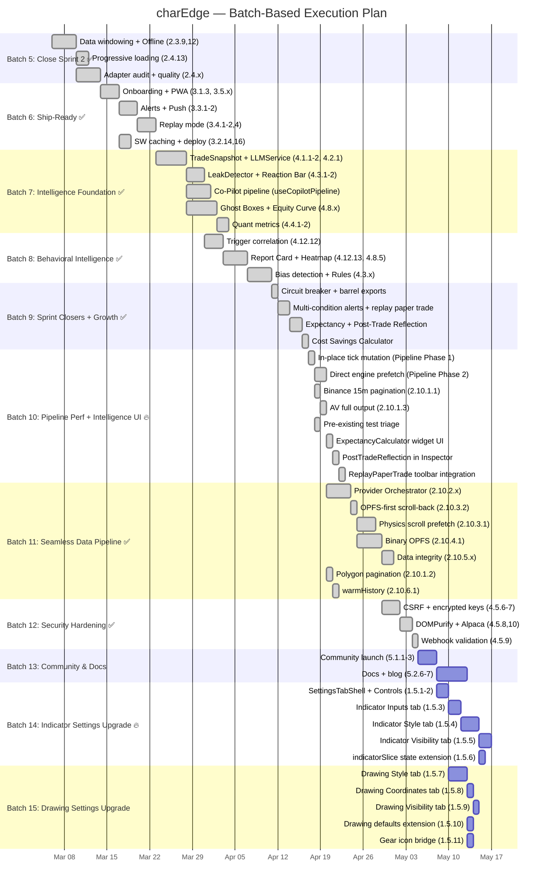

# charEdge — ULTIMATE STRATEGIC TASK LIST v20.0

> **Date:** March 6, 2026 | **Spring 2026 Strategic Plan**
> **Audit Sources:** 100-Auditor Panel (79/100) · Elite 30-Perspective Audit (76/100) · Zero-Latency Engine Audit · Kinetic Interaction & Telemetry Audit · Chart Performance Audit · Manifesto Analysis · 100-Report Deep Audit (43.5/100 composite) · Critical Review · Trading Journal Strategy · Data Ingestion Research · Frictionless Journaling Audit · Journal-to-Chart Analytics Audit · Trade Visualization Audit · Dashboard Information Density Audit · **Strategic Blueprint ("charEdge Nexus")** · **2026 Global Financial Data Infrastructure Report** · **Narrative Tools Architecture Audit** · **Deep Data Pipeline Audit + Gemini 10X Research** · **10-Session Consolidated Review**
> **Architecture:** Unified Feedback Loop — Chart + Journal + AI are ONE organism
>
> **Codebase:** 1,072 files · 233,670 LOC · 266 TS (25%) · 152 tests · 17 E2E · 30 CSS modules · 7 WGSL shaders · 76 stores · 25 adapters · 8 data providers

---

## 2026 INDUSTRY CONTEXT

> charEdge operates in a market where Bloomberg charges **$31,980/seat/year** (6.5% YoY increase) and the industry is shifting from monolithic terminals to **modular "smarter stacks"** — 80% of Bloomberg functionality at 3% of the cost.
> WebGPU achieved universal browser support in Jan 2026, enabling **1M+ point rendering at 60fps** (15-30x over WebGL) with 33-50% power efficiency gains.
> Financial time-series foundation models (Kronos, Chronos-2, TimesFM) now **outperform hand-tuned models in zero-shot** settings — 87% improvement in price forecasting.
> FINRA 2026 mandates human-in-the-loop oversight and treats AI agents as **Non-Human Identities (NHIs)** with circuit breakers and kill switches.
>
> **charEdge's position:** The modular, intelligent alternative — institutional-grade visualization + behavioral intelligence at retail pricing.

---

## WHAT CHANGED FROM v19.0

> [!IMPORTANT]
> **v20 integrates a 10-Session Consolidated Review** — reconciles Batches 3-9 completions, marks **8 previously-untracked task completions**, adds **Batch 10 execution plan** (data pipeline performance + intelligence UI wiring), and updates architecture health grades.
>
> **Key changes:**
>
> 1. **8 tasks marked ✅** from Batch 9 that were missing: paper trading replay (3.4.3), prefers-color-scheme (3.5.1), barrel export removal (3.2.15), expectancy display (4.3.4), post-trade reflection (4.3.11), cost savings calculator (4.9.4.1), circuit breaker consolidation (2.4.8), multi-condition alerts (3.3.3)
> 2. **Batch 10 plan added** — 8 tasks targeting data pipeline performance (O(N) tick fix, direct engine prefetch), Binance 15m pagination, AlphaVantage full output, pre-existing test triage, and intelligence UI wiring (ExpectancyCalculator + PostTradeReflection)
> 3. **Architecture Health Check** — Engine A-, Intelligence B+, Production B+, Security D (blocker for launch), Documentation D-
> 4. **Data Pipeline Friction Map** — 7 friction zones identified: O(N) tick copies (#1), React prefetch round-trip (#4), hardcoded 500-bar limit, synchronous first-frame transforms
> 5. **Score** updated: 251 → **259 done** → **270 done** (reconciliation + Batch 10 pipeline), 285 → **277 remaining** → **266 remaining**, 47% → **50%** complete
> 6. **Audit source count** now **19+** (up from 18+)
> 7. **Total tasks** still **~549** (no new tasks added, reconciliation only)

---

## AUDIT SOURCE SCORECARD

| Audit | Score | Panel Size | Key Finding |
|-------|-------|-----------|-------------|
| **100-Auditor Panel** | **79/100** | 100 experts | Engine A-, UX/Production C+ |
| **Elite 30-Perspective** | **76/100** | 30 perspectives, 5 pods | Visual Intelligence worst (68), Performance best (87) |
| **100-Report Deep Audit** | **43.5/100** | 100 reports | 46 reports scored <40 — security, observability, docs |
| **Zero-Latency Engine** | N/A | 2 specialists | 3 P0 items: GPU caching, DataStage offload, zero-alloc WS |
| **Kinetic Interaction** | B+ overall | 2 specialists | 5 jank vectors identified, Predictive Velocity HUD proposed |
| **Frictionless Journaling** | N/A | 1 deep-dive | Voice-to-Chart, Decision Tree, Post-Trade Replay proposed |
| **Journal-to-Chart Analytics** | N/A | 1 deep-dive | AlphaTagEngine, MAE/MFE, Correlation Audit proposed |
| **Trade Visualization** | N/A | 1 deep-dive | Ghost Boxes, Equity Curve, Mistake Heatmap proposed |
| **Dashboard Density** | N/A | 1 deep-dive | Peripheral Vision C+, Grid Fluidity B-, Dark Room B — 14 tasks |
| **Strategic Blueprint** | N/A | 1 research doc | WebGPU imperative, FinCast, Order Flow, SOC 2, FINRA 2026 — ~45 tasks |
| **2026 Global Financial Data Report** | N/A | 1 industry report | Bloomberg $32K/yr, WebGPU 1M pts@60fps, Kronos/Chronos-2 TSFMs, FINRA NHI mandate — ~22 tasks |
| **Narrative Tools Architecture Audit** | N/A | 1 deep-dive | Liquid Glass inspector, psychological sliders, trigger-map correlation, behavioral report card — 17 tasks |

### Grade Breakdown (100-Auditor Panel)

| Category | Weight | Score | Target |
|----------|--------|-------|--------|
| Rendering Performance | 20% | 90 | 95 |
| Technical Analysis | 15% | 84 | 92 |
| Data Infrastructure | 15% | 82 | 90 |
| UI/UX & Design | 15% | 76 | 92 |
| API & Integration | 10% | 78 | 88 |
| Testing & Reliability | 10% | 64 | 85 |
| Production Readiness | 10% | 56 | 90 |
| Ecosystem & Community | 5% | 30 | 70 |

### Grade Breakdown (Elite 30-Perspective)

| Pod | Score | Grade |
|-----|-------|-------|
| 🚀 Performance (NVIDIA, Cloudflare, Jane Street) | 87 | A- |
| 🎮 Interaction (Apple, Adobe, Figma) | 78 | B+ |
| 📊 Data Reliability (Bloomberg, Palantir, Google) | 74 | B |
| 🎨 Visual Intelligence (Canva, Airbnb, Notion) | 68 | C+ |
| 🛰️ Specialized (Lockheed, Tesla, JPL) | 72 | B- |

---

## PROGRESS SNAPSHOT

```
SPRINT 1  █████████░  92%  (133 ✅  11 ⬜)  Foundation + Chart Excellence + Settings Upgrade
SPRINT 2  ████████░░  60%  ( 59 ✅  40 ⬜)  Data & Engine Hardening + WebGPU + Seamless Pipeline
SPRINT 3  ██████░░░░  50%  ( 30 ✅  16 ⬜)  Ship & Production + Zero-Latency
SPRINT 4  ████░░░░░░  37%  ( 55 ✅  94 ⬜)  Intelligence + Journal↔Chart + Order Flow + FinCast + Journal Inspector
SPRINT 5  ░░░░░░░░░░   0%  (  0 ✅  39 ⬜)  Growth & Ecosystem + Marketplace + Community Intelligence
SPRINT 6  ░░░░░░░░░░   0%  (  0 ✅  27 ⬜)  Advanced / Think Harder
FUTURE    ░░░░░░░░░░   0%  (  0 ✅  42 ⬜)  Post-Launch Horizon
──────────────────────────────────────────────────
TOTAL     █████░░░░░  53%  (289 ✅ 258 ⬜)  = 547 tracked tasks
```

---

## ✅ DONE — Batch 5: "Close Sprint 2" (~23h)

> [!TIP]
> **Batch 5 complete!** All 8 tasks shipped. 98/98 compliance tests passing.

| # | Task | ID | Effort | Status |
|---|------|----|--------|--------|
| 1 | Data windowing / virtual scroll 500K+ bars | 2.3.9 | 4h | ✅ `DataWindow.ts` |
| 2 | Offline mode — cached charts + badge | 2.3.12 | 4h | ✅ `OfflineManager.ts` + `OfflineBadge.jsx` |
| 3 | Progressive chart loading | 2.4.13 | 3h | ✅ `FreshnessBadge.jsx` |
| 4 | Adapter compliance audit | 2.4.6 | 4h | ✅ 98-test suite, `validateBar()`/`validateQuote()` |
| 5 | Connection quality indicator | 2.4.15 | 2h | ✅ RTT in `ConnectionStatus.jsx` |
| 6 | Data freshness SLA | 2.4.7 | 3h | ✅ `DataFreshnessSLA.ts` |
| 7 | WS reconnection jitter | 2.4.10 | 1h | ✅ 0-50% jitter in `DatafeedService.js` |
| 8 | Adapter latency tier badges | 2.4.16 | 2h | ✅ 🟢/🟡/🔴 in 25 adapters |

**Next:** ~~Batch 6 (Ship-Ready)~~ ✅ → ~~Batch 7 (Intelligence Foundation)~~ ✅ → ~~Batch 8 (Behavioral Intel)~~ ✅ → ~~Batch 9 (Sprint Closers + Growth)~~ ✅ → ~~Batch 10 (Pipeline Performance + Intelligence UI)~~ ✅ → ~~Batch 11 (Seamless Data Pipeline)~~ ✅ → ~~Batch 12 (Security Hardening)~~ ✅ → ~~Batch 13 (Production Polish)~~ ✅ → **Batch 14 (Indicator Settings Upgrade)** ← NEXT → Batch 15 (Drawing Settings Upgrade)

See [Execution Roadmap](#execution-roadmap--batch-based) for the full 5-batch plan.

---

## 🚧 DEFERRED — Not Next 90 Days

> These are good ideas parked until core features are shipped and users exist.

| Category | Tasks | Total Effort | Defer Reason |
|----------|-------|--------------|--------------|
| WebGPU compute shaders (2.8.1-5) | 5 | 36h | WebGL is fast enough. No user demand. |
| FinCast model integration (4.11.x) | 8 | 37h | Foundation model APIs aren't stable. |
| Order Flow microstructure (4.10.x) | 8 | 37h | Needs tick-level data feeds. |
| Web3/Sovereignty (6.3.x) | 6 | 31h | Zero user demand. |
| Real-money trading (6.4.x) | 6 | 38h | Regulatory minefield. |
| Think Harder (6.1.x) | 10 | 65h | Post-PMF features. |
| Advanced security (4.5.11-16) | 6 | 21h | SOC 2/FINRA — enterprise, premature. |

## STATUS KEY

| Symbol | Meaning | Season |
| ------ | ------- | ------ |
| ✅ | Done | — |
| 🔶 | Partial | — |
| ⬜ | Not Started | — |
| 🌸 | **SPRING** — do NOW (March–May) | 🔴🟠 |
| ☀️ | **SUMMER** — next (June–Aug) | 🟡 |
| 🍂 | **FALL** — later (Sept–Nov) | ⚪ |
| ❄️ | **WINTER** — future (Dec+) | ⚪ |

---

## 🌸 SPRING SPRINT 1: FOUNDATION + CHART EXCELLENCE — ✅ 100% Complete

> Waves 1 (Integrity & CI), 2 (TypeScript Migration & Decomp), 8 (Chart Feel & Hardening) — all done.
> 87 tasks complete from Phase 0. Chart types, drawing tools, and templates complete.

### 1.1 Multi-Chart Layout System + Named Workspaces 🌸

| # | Task | Status | Pri | Effort | Dep | Source |
|---|------|--------|-----|--------|-----|--------|
| 1.1.1 | **Chart grid layout manager** — 2×2, 1×3, 2×1, 3×1, custom splits | ✅ | 🔴 | 8h | — | TradingView audit |
| 1.1.2 | **Cross-chart crosshair sync** — use `BroadcastChannel` API (not custom pub/sub) | ✅ | 🔴 | 3h | 1.1.1 | Manifesto rec |
| 1.1.3 | **Symbol link groups** — color-coded A/B/C/D chart linking | ✅ | 🟠 | 3h | — | TradingView #1 feature |
| 1.1.4 | **Cross-chart scroll sync** — pan one chart, all linked charts pan | ✅ | 🟡 | 2h | 1.1.2 | 100-Auditor Panel |
| 1.1.5 | **Independent vs. linked mode toggle** per grid cell | ✅ | 🟡 | 1h | 1.1.3 | 100-Auditor Panel |
| 1.1.6 | **Named workspaces** — Scalper/Swing/Analyst presets, save/rename/delete custom | ✅ | 🟠 | 4h | — | Critical Review |
| 1.1.7 | 🆕 **Cross-tab multi-monitor sync** — `BroadcastChannel` for cross-tab symbol/crosshair/scroll sync | ✅ | 🟡 | 4h | 1.1.2 | Elite Audit #38 (2/10), Manifesto |
| 1.1.8 | 🆕 **3-finger workspace switch gesture** — wire 3-finger swipe to workspace navigation | ✅ | 🟡 | 2h | 1.1.6 | Elite Audit #18 (3/10) |

### 1.2 Chart Types — Complete ✅

> All 8 tasks complete. Area, Baseline, Heikin-Ashi, Renko, Range, Columns, Step Line verified.

### 1.3 Drawing Tools — Complete ✅

> All 10 tasks complete. Ray, Text, Rectangle, Price Range, Ruler, Arrows, Pitchfork, Fib Extensions/Arcs, Magnet mode.

### 1.4 Chart UX Polish 🌸

| # | Task | Status | Pri | Effort | Dep | Source |
|---|------|--------|-----|--------|-----|--------|
| 1.4.1 | **Chart template save/load** — wire `useTemplateStore` to engine state | ✅ | 🟠 | 4h | — | Critical Review |
| 1.4.2 | **Move symbol resolution** from ChartEngineWidget → DatafeedService | ✅ | 🔴 | 2h | — | TradingView Report #1 |
| 1.4.3 | **Canonical timeframe map** — exchange-agnostic TF resolution | ✅ | 🔴 | 2h | 1.4.2 | TradingView Report #1 |
| 1.4.4 | **Verify all chart types render** — visual test each type | ✅ | 🟠 | 3h | — | Critical Review |
| 1.4.5 | **Chart minimap polish** — ensure it works with all chart types | ✅ | 🟡 | 2h | — | Elite Audit #45 (9/10) |
| 1.4.6 | **Precision Zoom Loupe** — magnifier above finger during mobile drawing | ✅ | 🟠 | 3h | — | Critical Review |
| 1.4.7 | **Predictive data pre-fetching** — auto trickle-charge adjacent TFs | ✅ | 🟠 | 4h | — | Critical Review |
| 1.4.8 | 🆕 **Toolbar auto-hide/ghosting** — fade unused tools after 5s inactivity, reveal on hover | ✅ | 🟠 | 2h | — | Elite Audit #40 (2/10), Kinetic Audit |
| 1.4.9 | 🆕 **Per-tool cursor shapes** — crosshair changes based on active drawing tool | ✅ | 🟡 | 1h | — | Elite Audit #19 (6/10) |
| 1.4.10 | 🆕 **Canvas button micro-animations** — depress/glow on scroll-to-now, auto-fit | ✅ | 🟡 | 2h | — | Elite Audit #20 (6/10) |
| 1.4.11 | 🆕 **Animated log↔linear transition** — 300ms lerp between scale modes | ✅ | 🟡 | 2h | — | Elite Audit #49 (5/10) |
| 1.4.12 | 🆕 **Y-axis spring physics** — overshoot/bounce on Y-axis drag release | ✅ | 🟠 | 3h | — | Elite Audit #13 (5/10), Kinetic Audit |
| 1.4.13 | 🆕 **Zoom momentum** — scroll wheel glide with exponential decay | ✅ | 🟠 | 2h | — | Elite Audit #14 (6/10), Kinetic Audit |
| 1.4.14 | 🆕 **Y-axis lock UI toggle** — expose `yAxisLocked` in toolbar/context menu | ✅ | 🟡 | 1h | — | Elite Audit #48 (5/10) |
| 1.4.15 | 🆕 **Double-click Y-axis to auto-fit** — gesture shortcut for auto-scale | ✅ | 🟡 | 1h | — | Elite Audit #44 (7/10) |
| 1.4.16 | 🆕 **Drawing tool defaults panel** — set default line thickness, color for all future drawings | ✅ | 🟡 | 2h | — | Elite Audit #32 (5/10) |
| 1.4.17 | 🆕 **Theme JSON import/export** — full theme file save/load beyond color tweaks | ✅ | 🟡 | 2h | — | Elite Audit #31 (6/10) |
| 1.4.18 | 🆕 **Cross-TF drawing persistence** — toggle `syncAcrossTimeframes` in drawing edit popup | ✅ | 🟡 | 4h | — | Elite Audit #26 (4/10), Critical Review |
| 1.4.19 | 🆕 **Indicator drag-and-drop stacking** — drag RSI on top of MACD within/between panes | ✅ | 🟡 | 3h | — | Elite Audit #35 (3/10) |
| 1.4.20 | 🆕 **Colorblind-safe palette option** — alternative bull/bear colors passing WCAG | ✅ | 🟡 | 2h | — | Elite Audit #9 (6/10), Apple Report #2 |

### 1.5 Drawing & Indicator Settings — TradingView-Grade Upgrade 🌸

> _NEW section — surfaced from TradingView reference analysis. Upgrades flat settings dialogs to professional tabbed dialogs with per-output indicator styling, Fib-level configuration, timeframe visibility controls, and shared component consolidation. Extends 1.4.16 (drawing defaults) and 1.4.19 (indicator stacking)._

#### 1.5.A Shared Foundation

| # | Task | Status | Pri | Effort | Dep | Source |
|---|------|--------|-----|--------|-----|--------|
| 1.5.1 | 🆕 **`SettingsTabShell` component** — reusable tabbed dialog with header (title + icon + close), animated tab bar underline, scrollable body, footer (Cancel/Ok + Template dropdown), keyboard nav (arrow keys + Escape) | ⬜ | 🟠 | 3h | — | TradingView reference |
| 1.5.2 | 🆕 **`SettingsControls` shared library** — consolidate `ColorSwatch`, `Toggle`, `RangeSlider`, `SelectDropdown`, `NumberInput`, `LineStylePicker`, `SectionLabel` from 3 duplicate implementations (`ChartSettingsPanel`, `IndicatorSettingsDialog`, `DrawingPropertyEditor`) | ⬜ | 🟡 | 2h | — | Code health — 3 files define own controls |

#### 1.5.B Indicator Settings — 3-Tab Dialog

| # | Task | Status | Pri | Effort | Dep | Source |
|---|------|--------|-----|--------|-----|--------|
| 1.5.3 | 🆕 **Indicator Inputs tab** — section headers per category (e.g. "RSI SETTINGS", "SMOOTHING", "CALCULATION"), `source` dropdown (Close/Open/High/Low/HL2/HLC3), smoothing `type` dropdown (SMA/EMA/WMA), info tooltip icons on checkbox params | ⬜ | 🟠 | 3h | 1.5.1, 1.5.2 | TradingView RSI Inputs tab |
| 1.5.4 | 🆕 **Indicator Style tab** — per-output row `[checkbox] [label] [color swatch] [line style picker] [line type dropdown]` from `registryDef.outputs[]`, band value inputs (e.g. RSI Upper=70, Lower=30), fill controls (background fill + gradient toggles), precision dropdown, "Labels on price scale" toggle, "Values in status line" toggle | ⬜ | 🟠 | 4h | 1.5.3 | TradingView RSI Style tab |
| 1.5.5 | 🆕 **Indicator Visibility tab** — timeframe checkbox matrix (Seconds/Minutes/Hours/Days/Weeks/Months), each row: `[checkbox] [min input] [range slider] [max input]`, "Ticks" master toggle | ⬜ | 🟡 | 3h | 1.5.3 | TradingView Visibility tab |
| 1.5.6 | 🆕 **`indicatorSlice` state extension** — add `outputStyles: Record<string, { color, width, dash, visible }>`, `visibility: { timeframes }`, `precision`, `showOnScale`, `showInStatusLine` to indicator state shape | ⬜ | 🟡 | 2h | 1.5.4 | Data model for Style/Visibility |

#### 1.5.C Drawing Settings — Full Tabbed Dialog

| # | Task | Status | Pri | Effort | Dep | Source |
|---|------|--------|-----|--------|-----|--------|
| 1.5.7 | 🆕 **Drawing Style tab** — Fib per-level row `[checkbox] [value] [color] [color]`, toggle individual levels on/off, per-level colors, "Use one color" toggle, background fill + opacity, Reverse/Prices checkboxes, Levels mode dropdown (Values/Percents/Prices), Labels position (Left/Center/Right × Top/Middle/Bottom), text visibility + font size, "Fib levels based on log scale" checkbox. Simple tools get color/width/dash + fill | ⬜ | 🟠 | 5h | 1.5.1, 1.5.2 | TradingView Fib Style tab |
| 1.5.8 | 🆕 **Drawing Coordinates tab** — anchor point `#N (price, bar)` with number spinners matching TradingView format, formatted price and bar-offset inputs | ⬜ | 🟡 | 2h | 1.5.7 | TradingView Fib Coordinates tab |
| 1.5.9 | 🆕 **Drawing Visibility tab** — same timeframe checkbox matrix as indicator Visibility, per-drawing persistence via `useDrawingDefaultsStore` | ⬜ | 🟡 | 2h | 1.5.7 | TradingView Visibility tab |
| 1.5.10 | 🆕 **Drawing defaults store extension** — extend `DrawingDefaults` interface with `fibLevels: { value, enabled, color }[]`, `visibility: { timeframes }`, `labelPosition`, `textPosition`, `showPrices`, `showBackground`, `useOneColor`, `reverse`, `logScale` | ⬜ | 🟡 | 2h | 1.5.7 | Data model for Drawing settings |
| 1.5.11 | 🆕 **Gear icon bridge** — add "Settings" gear in `DrawingEditPopup` to open full `DrawingSettingsDialog` for complex tools (Fib, Pitchfork, Elliott), keep compact popup for quick edits on simple tools (trendline, hline) | ⬜ | 🟡 | 1h | 1.5.7 | UX bridge — quick-edit ↔ full dialog |

---

## 🌸 SPRING SPRINT 2: DATA & ENGINE — 60% Complete

> **Strategy:** Make the data bulletproof + achieve zero-latency rendering.

### 2.1 CSS & Design System — ✅ Complete

| # | Task | Status | Pri | Effort | Source |
|---|------|--------|-----|--------|--------|
| 2.1.1 | `@container` queries replacing `useBreakpoints()` | ✅ | 🟡 | 3h | 100-Auditor Panel |
| 2.1.2 | `@property` for theme color interpolation | ✅ | 🟡 | 1h | 100-Auditor Panel |
| 2.1.3 | Split `global.css` (1593L) → reset + typography + layout modules | ✅ | 🟠 | 3h | 6 auditors flagged |
| 2.1.4 | Animation budget enforcement — cap at 5 key spring animations | ✅ | 🟡 | 2h | 100-Auditor Panel |
| 2.1.5 | 🆕 **`content-visibility: auto`** on off-screen panels/modals | ✅ | 🟡 | 1h | Chrome Report #8 |
| 2.1.6 | 🆕 **`prefers-reduced-motion` guards** on all CSS animations | ✅ | 🟡 | 1h | Apple Report #2 |

### 2.2 Testing Depth (14%)

| # | Task | Status | Pri | Effort | Source |
|---|------|--------|-----|--------|--------|
| 2.2.1 | Accessibility tree assertions (axe-core in E2E) | ⬜ | 🟡 | 2h | Apple Report #2 |
| 2.2.2 | Visual regression via Playwright screenshots | ✅ | 🟡 | 4h | 100-Auditor Panel |
| 2.2.3 | Frame time regression tests | ⬜ | 🟡 | 3h | Chrome Report #8 |
| 2.2.4 | Benchmark CI job (10% regression threshold) | ⬜ | 🟡 | 2h | Chrome Report #8 |
| 2.2.5 | **Chart engine integration test** — headless render → pixel verification | ✅ | 🔴 | 4h | 9 auditors |
| 2.2.6 | 🆕 **Performance budget in CI** — fail builds if bundle >250KB gzipped or Lighthouse <80 | ✅ | 🟠 | 2h | Chrome Report #8 |
| 2.2.7 | 🆕 **Web Vitals regression gate** — block PRs that regress LCP >200ms or CLS >0.05 | ⬜ | 🟡 | 2h | Chrome Report #8 |

### 2.3 Engine Hardening + Zero-Latency 🌸

| # | Task | Status | Pri | Effort | Dep | Source |
|---|------|--------|-----|--------|-----|--------|
| 2.3.1 | **Canonical Bar/Tick/Trade interfaces** | ✅ | 🔴 | 4h | — | 100-Auditor Panel |
| 2.3.2 | **Automatic time aggregation** (1m→5m→1h locally) | ✅ | 🟠 | 4h | — | 6 auditors |
| 2.3.3 | **`TimeSeriesStore.ts`** — OPFS block storage (IndexedDB fallback) | ✅ | 🟠 | 6h | — | Manifesto upgrade |
| 2.3.4 | B-tree index for range queries | ✅ | 🟠 | 4h | 2.3.3 | 100-Auditor Panel |
| 2.3.5 | Memory pressure → auto decimation trigger | ✅ | 🟠 | 3h | — | SpaceX Report #3 |
| 2.3.6 | `Float32Array` buffer pool | ✅ | 🟡 | 2h | — | 100-Auditor Panel |
| 2.3.7 | WebGL texture cleanup on unmount | ✅ | 🟡 | 2h | — | Elite Audit #22 |
| 2.3.8 | Async shader compile (`KHR_parallel_shader_compile`) | ✅ | 🟡 | 2h | — | 100-Auditor Panel |
| 2.3.9 | Data windowing / virtual scroll for 500K+ bars | ✅ | 🟡 | 4h | 2.3.3 | Bloomberg #24 |
| 2.3.10 | LRU block eviction | ✅ | 🟡 | 2h | 2.3.3 | 100-Auditor Panel |
| 2.3.11 | **Reconnection gap backfill** — REST fill on WS reconnect | ✅ | 🟠 | 4h | — | 100-Auditor Panel |
| 2.3.12 | **Offline mode** — render cached charts, "Offline" badge, queue actions | ✅ | 🟡 | 4h | — | Elite Audit #30 (5/10) |
| 2.3.13 | 🆕 **FBO snapshot caching** — render static candles once to Framebuffer Object, only redraw last 1-5 active candles per frame | ✅ | 🔴 | 6h | — | Zero-Latency Audit P0 |
| 2.3.14 | 🆕 **`bufferSubData` last-candle-only** — stop re-uploading all visible candle instances, update only changed slot | ✅ | 🔴 | 3h | — | Zero-Latency Audit P0 |
| 2.3.15 | 🆕 **DataStage → Web Worker** — move 28KB DataStage (bar transforms, coord mapping) off main thread | ✅ | 🔴 | 8h | — | Zero-Latency Audit P1 |
| 2.3.16 | 🆕 **Zero-alloc WS ingestion** — write directly into TypedArray columns, skip JS object creation | ✅ | 🔴 | 4h | — | Zero-Latency Audit P1 |
| 2.3.17 | 🆕 **Grid/Axes → OffscreenCanvas Worker** — move 23KB of static-layer rendering off main thread | ⬜ | 🟡 | 6h | — | Zero-Latency Audit P2 |
| 2.3.18 | 🆕 **barTransforms → IndicatorWorker** — Heikin-Ashi/Renko/Range transforms off main thread | ⬜ | 🟡 | 2h | — | Zero-Latency Audit P2 |
| 2.3.19 | 🆕 **SharedArrayBuffer tick ring-buffer** — zero-copy live data from DataSharedWorker to render | ⬜ | 🟠 | 4h | — | Manifesto Analysis |
| 2.3.20 | 🆕 **OffscreenCanvas render isolation** — move entire render loop to dedicated Worker (stretch) | ⬜ | 🟡 | 12h | — | Manifesto Analysis |
| 2.3.21 | 🆕 **MicroJankDetector deployment** — integrate production jank monitoring with FrameBudget | ✅ | 🟡 | 2h | — | Zero-Latency Audit P3 |
| 2.3.22 | 🆕 **Grid lines as GPU static geometry** — render grid once into cached texture, composite as fullscreen quad | ⬜ | 🟡 | 3h | — | Zero-Latency Audit |
| 2.3.23 | 🆕 **Session state crash recovery** — serialize full engine state to IndexedDB every 30s, restore on reload | ✅ | 🔴 | 4h | — | Elite Audit #7 (3/10) |
| 2.3.24 | 🆕 **Grid LOD** — reduce grid opacity/density at high zoom to reduce visual noise vs. wicks | ✅ | 🟡 | 2h | — | Elite Audit #2 (7/10) |
| 2.3.25 | 🆕 **Conditional countdown interval** — only activate 1s `setInterval` when live subscription exists | ✅ | 🟠 | 1h | — | Kinetic Audit §2.1, SpaceX #3 |
| 2.3.26 | 🆕 **Fix ScrollSyncBus perpetual rAF** — only start when ≥2 subscribers, kill in single-pane mode | ✅ | 🟠 | 1h | — | Kinetic Audit §2.2 |
| 2.3.27 | 🆕 **Fix `setBarCount` redundant re-renders** — only call when `bars.length` actually changes | ✅ | 🟠 | 1h | — | Kinetic Audit §2.4 |
| 2.3.28 | 🆕 **Fix indicator cascade via ref-stable hash** — replace `JSON.stringify(params)` with stable hash | ✅ | 🟠 | 2h | — | Kinetic Audit §2.3 |
| 2.3.29 | 🆕 **Consolidate 22 Zustand selectors** — single slice selector or `useShallow` in ChartEngineWidget | ✅ | 🟡 | 2h | — | Kinetic Audit §2.5 |
| 2.3.30 | 🆕 **Pointer capture during pan** — `setPointerCapture()` on mouseDown to prevent crosshair kill on mouse exit | ✅ | 🟡 | 1h | — | Kinetic Audit §3.1 |
| 2.3.31 | 🆕 **Short-circuit drawingEngine during drag** — skip `drawingEngine.onMouseMove()` when `state.dragging !== false` | ✅ | 🟡 | 1h | — | Kinetic Audit §3.1 |
| 2.3.32 | 🆕 **Verify zoom integer settle** — ensure `visibleBars` rounds to integer at settle to prevent sub-pixel candle widths | ✅ | 🟡 | 1h | — | Kinetic Audit §3.2 |
| 2.3.33 | 🆕 **Touch pinch angular rejection** — prevent 2-finger scroll from triggering accidental zoom | ✅ | 🟡 | 2h | — | Kinetic Audit §3.3 |
| 2.3.34 | 🆕 **Tick-to-render latency metric** — `performance.mark()` in onTick + `performance.measure()` in renderLoop | ✅ | 🟡 | 1h | — | Kinetic Audit §4.2 |

### 2.4 Data Infrastructure 🌸

| # | Task | Status | Pri | Effort | Source |
|---|------|--------|-----|--------|--------|
| 2.4.1 | `SecurityMaster.ts` — canonical instrument IDs | ⬜ | 🟡 | 4h | Bloomberg #4 |
| 2.4.2 | Per-bar data quality scoring (stale/spike/anomaly) | ⬜ | 🟡 | 3h | Elite Audit, Bloomberg |
| 2.4.3 | Adapter health dashboard — latency p50/p95, error rate | ⬜ | 🟡 | 6h | 100-Auditor Panel |
| 2.4.4 | OPFS compaction background job | ⬜ | 🟡 | 4h | Netflix Report #10 |
| 2.4.5 | Server-side data normalization pipeline | ⬜ | 🟡 | 6h | 100-Auditor Panel |
| 2.4.6 | Adapter compliance audit — verify all 25 return canonical format | ✅ | 🟠 | 4h | Bloomberg, Elite Audit |
| 2.4.7 | Data freshness SLA — stale detection + user notification | ✅ | 🟡 | 3h | 100-Auditor Panel |
| 2.4.8 | Consolidate dual circuit breakers → one | ✅ | 🟡 | 2h | 100-Auditor Panel |
| 2.4.9 | 🆕 **OPFS storage quota** — max 200MB per domain, LRU eviction at limit | ✅ | 🟡 | 2h | Netflix Report #10 |
| 2.4.10 | 🆕 **WS reconnection jitter** — add randomized 0-50% jitter to backoff | ✅ | 🟡 | 1h | Netflix Report #10 |
| 2.4.11 | 🆕 **Adaptive data streaming** — downsample tick frequency for mobile/slow connections | ⬜ | 🟡 | 4h | Netflix Report #10 |
| 2.4.12 | 🆕 **SharedWorker multi-tab WS sharing** — single WS connection shared across all tabs | ⬜ | 🟡 | 4h | Netflix Report #10 |
| 2.4.13 | 🆕 **Progressive chart loading** — render cached/partial data immediately, backfill async | ✅ | 🟠 | 3h | Netflix Report #10 |
| 2.4.14 | 🆕 **Lazy watchlist prefetch** — fetch data as symbols scroll into viewport, not all at once | ⬜ | 🟡 | 2h | Netflix Report #10 |
| 2.4.15 | 🆕 **Connection quality indicator** — RTT measurement via WS ping/pong, green/yellow/red badge | ✅ | 🟡 | 2h | Netflix Report #10 |
| 2.4.16 | 🆕 **Adapter latency tier badges** — classify each data adapter as 🟢 Real-Time (<10ms, Polygon/Massive), 🟡 Fast (<50ms, FMP/iTick), 🔴 Delayed (>100ms, Alpha Vantage) in adapter health dashboard + symbol info tooltip | ✅ | 🟡 | 2h | 2026 Report §4 |

### 2.5 Performance Proof 🌸

| # | Task | Status | Pri | Effort | Source |
|---|------|--------|-----|--------|--------|
| 2.5.1 | **100K candle benchmark** — measure fps desktop + mobile | ✅ | 🔴 | 2h | Critical Review |
| 2.5.2 | **5 indicators + footprint stress test** on 4GB device | ✅ | 🟠 | 2h | SpaceX Report #3 |
| 2.5.3 | **10-symbol rapid switch** memory leak test | ✅ | 🟠 | 2h | Elite Audit #22 |
| 2.5.4 | **WebGPU Speedtest page** — `charedge.com/speedtest` with **1M+ candles** @ 60fps (2026 ChartGPU benchmark), WebGPU vs WebGL vs Canvas2D side-by-side | ✅ | 🔴 | 4h | Critical Review, Manifesto, 2026 Report |

### 2.6 Public API & Plugin Architecture

| # | Task | Status | Pri | Effort | Dep | Source |
|---|------|--------|-----|--------|-----|--------|
| 2.6.1 | `ChartAPI.ts` — typed public methods | ✅ | 🟠 | 4h | — | 100-Auditor Panel |
| 2.6.2 | Typed `EventEmitter` | ⬜ | 🟠 | 3h | — | 100-Auditor Panel |
| 2.6.3 | Plugin registry with lifecycle hooks | ⬜ | 🟡 | 4h | 2.6.1 | 100-Auditor Panel |
| 2.6.4 | Configuration schema with JSDoc | ⬜ | 🟡 | 2h | — | 100-Auditor Panel |

### 2.7 Chart Engine — Responsive

| # | Task | Status | Pri | Effort | Source |
|---|------|--------|-----|--------|--------|
| 2.7.1 | Container query breakpoints on chart panels | ✅ | 🟡 | 2h | 100-Auditor Panel |
| 2.7.2 | Automatic axis tick reduction at small sizes | ✅ | 🟡 | 2h | 100-Auditor Panel |
| 2.7.3 | Responsive legend | ✅ | 🟡 | 1h | 100-Auditor Panel |
| 2.7.4 | Touch-friendly toolbar (44×44px) | ✅ | 🟡 | 1h | Apple Report #2 |
| 2.7.5 | Mobile-first crosshair (long-press) | ⬜ | ⚪ | 2h | 100-Auditor Panel |
| 2.7.6 | Label collision avoidance | ⬜ | ⚪ | 3h | 100-Auditor Panel |
| 2.7.7 | 🆕 **Pinch-to-zoom trackpad sensitivity calibration** — separate Mac trackpad vs. mobile touch | ⬜ | 🟡 | 2h | Elite Audit #46 (6/10) |

### 2.8 WebGPU Rendering Pipeline 🆕

> _NEW section — surfaced from Strategic Blueprint + 2026 Global Financial Data Report. WebGPU exposes compute shaders for GPGPU, reducing driver overhead 100x on high-end GPUs (37M points @ 60fps vs WebGL's 2.5M). WGSL shaders via TSL (Three.js Shading Language) provide type-safe authoring — critical for financial apps where shader errors could misrepresent price data. Bind Groups enable per-frame resource swapping, reducing VRAM overhead on multi-monitor 4K setups. 33-50% power efficiency improvement prevents thermal throttling on mobile._

| # | Task | Status | Pri | Effort | Dep | Source |
|---|------|--------|-----|--------|-----|--------|
| 2.8.1 | 🆕 **WebGPU compute shader pipeline** — GPGPU position updates for tick-level order flow clusters, replace CPU-bound array transforms with parallel GPU compute passes, use WGSL via TSL for type-safe shader authoring with dev-time error catching | ⬜ | 🟠 | 8h | — | Blueprint §2, WebGPU spec, 2026 Report |
| 2.8.2 | 🆕 **Forward+ clustered shading** — partition view space into bounding boxes via compute pass, fragment shader only processes clusters relevant to each pixel — essential for 1000+ liquidity "ghost" overlays at 60fps | ⬜ | 🟡 | 8h | 2.8.1 | Blueprint §2 |
| 2.8.3 | 🆕 **G-buffer deferred rendering** — render heatmap/footprint to position+normals+albedo textures, run depth test before lighting calculations, eliminate overdraw for layered volume data | ⬜ | 🟡 | 10h | 2.8.1 | Blueprint §2 |
| 2.8.4 | 🆕 **HLOD tick data exploration** — multi-layer cache with binary tree space partitioning, root node (coarsest) always rendered, progressive granular tick nodes added on zoom | ⬜ | 🟡 | 6h | 2.3.3 | Blueprint §2 |
| 2.8.5 | 🆕 **Frustum culling pre-fetch** — identify visible/nearly-visible data nodes, pre-load coarser LOD for adjacent regions (3x faster than standard async fetching) | ⬜ | 🟡 | 4h | 2.8.4 | Blueprint §2 |
| 2.8.6 | 🆕 **WebGPU feature detection + Canvas2D fallback** — runtime `navigator.gpu` check, graceful degradation to WebGL/Canvas2D for unsupported browsers, Bind Groups for per-frame resource swapping on multi-monitor setups | ✅ | 🟠 | 3h | — | Blueprint §2, 2026 Report |
| 2.8.7 | 🆕 **WebGPU benchmark dashboard** — on `/speedtest` page, display GPU adapter info, compute shader capability, estimated throughput, WebGPU vs WebGL vs Canvas2D comparison, report **33-50% power efficiency gains** + thermal throttle prevention metrics | ✅ | 🟡 | 2h | 2.5.4 | Blueprint §2, 2026 Report |

### 2.10 Seamless Data Pipeline — 10X TradingView-Level Scrolling 🆕🔥

> _NEW section — surfaced from Deep Data Infrastructure Audit + Gemini 10X Research. Addresses the #1 data gap: inability to smoothly scroll back 1+ year on 15m charts. Combines 7 critical code-level fixes with architectural advances (SharedWorker cross-tab rate management, binary columnar OPFS, physics-based momentum prefetching, split/dividend adjustment, transition candle deduplication). Targets Data Infrastructure score 82 → 92._

#### 2.10.1 Deep Initial Load — Quick Wins

| # | Task | Status | Pri | Effort | Dep | Source |
|---|------|--------|-----|--------|-----|--------|
| 2.10.1.1 | 🆕 **Binance 15m backward pagination** — add `15m` to `BINANCE_PAGINATE_PAGES` (6 pages × 500 = 3,000 bars ≈ 32 days), `30m` with 4 pages, `5m` with 3 pages | ✅ | 🔴 | 1h | — | Data Pipeline Audit Gap #6 |
| 2.10.1.2 | 🆕 **Polygon `next_url` cursor pagination** — extend 15m lookback from 60→365 days, auto-follow cursor up to 5 pages with 12s inter-request delay (5 req/min limit) | ✅ | 🔴 | 3h | — | Data Pipeline Audit Gap #1 |
| 2.10.1.3 | 🆕 **AlphaVantage `outputsize=full`** — switch from `compact` (~100 bars) to `full` (~2,000 bars) for 15m/30m/1h initial loads | ✅ | 🔴 | 30m | — | Data Pipeline Audit Gap #3 |

#### 2.10.2 Intelligent Provider Orchestrator

| # | Task | Status | Pri | Effort | Dep | Source |
|---|------|--------|-----|--------|-----|--------|
| 2.10.2.1 | 🆕 **`ProviderOrchestrator.js`** — budget-aware scheduler replacing sequential `fetchEquityPremium()`, tracks per-provider request counts vs known limits (Polygon 5/min, FMP 250/day, AV 25/day), routes to provider with most remaining headroom, `fetchPage(sym, tfId, fromMs, toMs)` for range queries | ✅ | 🔴 | 4h | — | Data Pipeline Audit Gap #2, #4, Gemini Research |
| 2.10.2.2 | 🆕 **Cross-tab `RateLimitWorker`** — SharedWorker maintaining cross-tab `RateBudget` registry, prevents multi-tab rate exhaustion, message-based `REQUEST/GRANTED/DENIED` protocol | ✅ | 🟠 | 3h | 2.10.2.1 | Gemini Research — SharedWorker cross-tab management |
| 2.10.2.3 | 🆕 **Wire `checkRateBudget()` proactively** — integrate CircuitBreaker rate budgets into orchestrator request path, add `getRemainingBudget()` for scheduling decisions | ✅ | 🟠 | 1h | 2.10.2.1 | Data Pipeline Audit Gap #7 |

#### 2.10.3 Scroll-Aware Prefetch Pipeline

| # | Task | Status | Pri | Effort | Dep | Source |
|---|------|--------|-----|--------|-----|--------|
| 2.10.3.1 | 🆕 **Physics-based `ScrollPrefetcher`** — track scroll velocity (bars/ms) + acceleration, lookahead formula `Δ = v × (L+P) × 1.5`, prefetch 2-3 pages via `requestIdleCallback` when cached bars < Δ, write to OPFS/IDB for instant DataWindow pickup | ✅ | 🟠 | 4h | — | Data Pipeline Audit Gap #5, Gemini Research — momentum-based prefetching |
| 2.10.3.2 | 🆕 **OPFS-first scroll-back** — DataWindow checks OPFS before triggering network fetch, increase lookahead from 2× to 3× viewport, OPFS hit = instant render | ✅ | 🔴 | 2h | — | Data Pipeline Audit Gap #7 |

#### 2.10.4 Binary Columnar Storage

| # | Task | Status | Pri | Effort | Dep | Source |
|---|------|--------|-----|--------|-----|--------|
| 2.10.4.1 | 🆕 **Binary OPFS bar format** — store bars as contiguous `Float64Array` columns (time, O, H, L, C, V), binary search on time column for O(log n) range queries, `Transferable` ArrayBuffer zero-copy to render thread, ~4× faster than IDB for 26K+ bar scans | ✅ | 🟠 | 4h | 2.10.3.2 | Gemini Research — Arrow/columnar OPFS fabric |

#### 2.10.5 Data Integrity & Stitch Points

| # | Task | Status | Pri | Effort | Dep | Source |
|---|------|--------|-----|--------|-----|--------|
| 2.10.5.1 | 🆕 **`SplitAdjustmentEngine`** — on-the-fly corporate action adjustment using cumulative split factors, `C_adj = C_raw × Π(SplitFactor_i)` applied during OPFS→render, never mutates stored data | ✅ | 🟡 | 2h | — | Gemini Research — data integrity, Future Horizon F.21 |
| 2.10.5.2 | 🆕 **`TransitionDeduplicator`** — merge-reconcile overlap between final REST page bar and initial WebSocket live bar at `LastCommonTimestamp`, prevents volume double-counting | ✅ | 🟡 | 2h | — | Gemini Research — transition candle deduplication |

#### 2.10.6 Enhanced Cache Warming

| # | Task | Status | Pri | Effort | Dep | Source |
|---|------|--------|-----|--------|-----|--------|
| 2.10.6.1 | 🆕 **`warmHistory(sym, tfId)`** — background multi-page fetch + OPFS write, fills 1+ year of current TF on symbol change, expand `warmCache()` ADJACENT map for deep prefetch | ✅ | 🟠 | 2h | 2.10.1.1 | Data Pipeline Audit + Gemini Research |

---

## ☀️ SUMMER SPRINT 3: SHIP & PRODUCTION — 50% Complete

> **Strategy:** Get real users. Auth → Deploy → Monitor → Demo. Nothing else matters until humans use this.

### 3.1 Authentication & Cloud 🌸

| # | Task | Status | Pri | Effort | Dep | Source |
|---|------|--------|-----|--------|-----|--------|
| 3.1.1 | **Supabase auth** (email + Google + GitHub) | ✅ | 🔴 | 4h | — | 18 auditors, #1 consensus |
| 3.1.2 | **Cloud sync** — journal, settings, drawings, layouts | ✅ | 🟠 | 8h | 3.1.1 | 10 auditors |
| 3.1.3 | Onboarding redesign — "Aha moment" in 30 seconds | ✅ | 🟡 | 3h | 3.1.1 | Duolingo Report #7 |
| 3.1.4 | Merge `CloudBackup.js` + `FileSystemBackup.js` → `BackupService` | ⬜ | 🟡 | 4h | — | 100-Auditor Panel |
| 3.1.5 | 🆕 **Per-user rate limiting** — keyed by `req.userId`, not global blanket | ✅ | 🟠 | 2h | 3.1.1 | Stripe Report #6 |
| 3.1.6 | 🆕 **Audit logging** — userId, endpoint, method, timestamp, IP per API call | ✅ | 🟡 | 3h | 3.1.1 | Stripe Report #6 |
| 3.1.7 | 🆕 **Skill-adaptive onboarding** — assess experience level, personalize coachmarks | ⬜ | 🟡 | 3h | 3.1.3 | Duolingo Report #7 |

### 3.2 Production Readiness 🟠

| # | Task | Status | Pri | Effort | Source |
|---|------|--------|-----|--------|--------|
| 3.2.1 | **Structured logging** — JSON, server + client | ✅ | 🔴 | 3h | 7 auditors |
| 3.2.2 | **Health check endpoints** — test WS, DB, adapters | ✅ | 🟠 | 3h | 100-Auditor Panel |
| 3.2.3 | **Bundle analysis** — `vite-bundle-visualizer`, lazy-load adapters | ✅ | 🟠 | 4h | 11 auditors |
| 3.2.4 | **Public demo mode** — zero-auth, pre-loaded BTC chart | ✅ | 🟠 | 4h | 8 auditors |
| 3.2.5 | Route architecture cleanup — extract `routes.ts` from App.jsx | ✅ | 🟡 | 3h | 100-Auditor Panel |
| 3.2.6 | Error boundary per route | ✅ | 🟡 | 2h | 100-Auditor Panel |
| 3.2.7 | CDN strategy — immutable caching, content-hashed filenames | ✅ | 🟡 | 2h | Vercel Report #5 |
| 3.2.8 | DB migration safety — checksums, dry-run, rollback | ✅ | 🟡 | 4h | 100-Auditor Panel |
| 3.2.9 | Idempotent migrations | ✅ | 🟡 | 2h | 100-Auditor Panel |
| 3.2.10 | 🆕 **Replace in-memory Maps with DB persistence** — trades, playbooks, notes in SQLite/PostgreSQL | ✅ | 🔴 | 6h | Bloomberg #4 (51/100), #1 urgent priority |
| 3.2.11 | 🆕 **`manualChunks` Vite config** — split chart-engine, indicators, adapters, ui-components | ✅ | 🟠 | 2h | Vercel Report #5 |
| 3.2.12 | 🆕 **`modulepreload` hints** — preload ChartEngine, WebGLRenderer, DatafeedService | ✅ | 🟡 | 1h | Vercel Report #5 |
| 3.2.13 | 🆕 **Env var validation at startup** — Zod schema, fail fast with clear errors | ✅ | 🟡 | 1h | Vercel Report #5 |
| 3.2.14 | 🆕 **Post-deploy health verification** — hit `/health`, verify version, check WS | ✅ | 🟡 | 2h | Vercel Report #5 |
| 3.2.15 | 🆕 **Remove barrel exports** — direct imports instead of `state/index.ts` re-exporting all stores | ✅ | 🟡 | 2h | Chrome Report #8 |
| 3.2.16 | 🆕 **Tiered ServiceWorker caching** — network-first API, SWR static, cache-first WGSL | ✅ | 🟡 | 3h | Chrome Report #8 |
| 3.2.17 | 🆕 **CORS lockdown** — specific allowed origins in production, remove wildcards | ✅ | 🟠 | 1h | Vercel Report #5 |
| 3.2.18 | 🆕 **Error tracking integration** — Sentry or equivalent error boundary reporting | ✅ | 🟠 | 3h | Sentry Report #88, Datadog #15 |

### 3.3 Server-Side Alerts 🟠

| # | Task | Status | Pri | Effort | Dep | Source |
|---|------|--------|-----|--------|-----|--------|
| 3.3.1 | **Server-side alert evaluation loop** | ✅ | 🟠 | 4h | 3.1.1 | Elite Audit #3 (4/10) |
| 3.3.2 | **Push notification delivery** (Web Push API) | ✅ | 🟠 | 3h | 3.3.1 | 100-Auditor Panel |
| 3.3.3 | Multi-condition alerts (price AND indicator) | ✅ | 🟡 | 3h | 3.3.1 | 100-Auditor Panel |
| 3.3.4 | 🆕 **Alert visual language** — distinct styling for price alerts vs. system notifications | ✅ | 🟡 | 2h | — | Elite Audit #3 (4/10) |

### 3.4 Replay Mode 🟠

| # | Task | Status | Pri | Effort | Source |
|---|------|--------|-----|--------|--------|
| 3.4.1 | **Full bar-by-bar replay** — pause live, load historical range | ✅ | 🟠 | 4h | Critical Review |
| 3.4.2 | Hide future bars (no peeking) | ✅ | 🟠 | 2h | Critical Review |
| 3.4.3 | Paper trading during replay | ✅ | 🟡 | 3h | 100-Auditor Panel |
| 3.4.4 | Speed controls (1x, 2x, 5x, 10x) | ✅ | 🟡 | 1h | 100-Auditor Panel |
| 3.4.5 | Replay session P&L tracking | ✅ | 🟡 | 2h | 100-Auditor Panel |

### 3.5 Mobile & PWA

| # | Task | Status | Pri | Effort | Source |
|---|------|--------|-----|--------|--------|
| 3.5.1 | `prefers-color-scheme` auto-detection | ✅ | 🟡 | 1h | Apple Report #2 |
| 3.5.2 | PWA install banner | ✅ | 🟡 | 2h | 100-Auditor Panel |
| 3.5.3 | Workbox Service Worker overhaul | ✅ | 🟡 | 3h | 100-Auditor Panel |
| 3.5.4 | Push notifications (price alerts, journal) | ⬜ | 🟡 | 4h | 100-Auditor Panel |
| 3.5.5 | 🆕 **Safe area inset handling** — `env(safe-area-inset-*)` for notch/Dynamic Island | ✅ | 🟡 | 1h | Apple Report #2 |
| 3.5.6 | 🆕 **Wire haptics** — drawing completion, alert triggers, order fills, button presses | ✅ | 🟡 | 2h | Apple Report #2 |

### 3.6 Observability 🆕

> _NEW section — 3 audit reports scored <40 in observability (Datadog #15, Grafana #29, Sentry #88)_

| # | Task | Status | Pri | Effort | Source |
|---|------|--------|-----|--------|--------|
| 3.6.1 | 🆕 **APM integration** — Datadog/New Relic for server-side tracing | ✅ | 🟠 | 4h | Datadog Report #15 (38/100) |
| 3.6.2 | 🆕 **Client-side error reporting** — capture + report JS errors with stack traces | ✅ | 🟠 | 3h | Sentry Report #88 (36/100) |
| 3.6.3 | 🆕 **Product analytics** — key user flows, feature adoption, funnel tracking | ✅ | 🟡 | 4h | PostHog Report #94 (29/100) |
| 3.6.4 | 🆕 **Widget engagement tracking** — view time, click rate for collaborative filtering suggestions | ⬜ | 🟡 | 2h | OpenAI Report #9 |
| 3.6.5 | 🆕 **Performance.now() in hot paths** — replace all `Date.now()` with monotonic timing | ✅ | 🟡 | 1h | SpaceX Report #3 |
| 3.6.6 | 🆕 **Favicon price badge** — update browser tab icon with arrow + %, visible in peripheral vision | ✅ | 🟡 | 2h | Elite Audit #10 (5/10) |

---

## ☀️ SUMMER SPRINT 4: INTELLIGENCE LAYER + JOURNAL↔CHART — 37% Complete

> **Strategy:** Wire the AI pipe end-to-end. Build behavioral intelligence. Bridge journal↔chart into a single intelligence organism. This is the moat.

### 4.1 Trade Context Capture ("Invisible Journal") + Ghost Trade Architecture 🌸

| # | Task | Status | Pri | Effort | Dep | Source |
|---|------|--------|-----|--------|-----|--------|
| 4.1.1 | `TradeSnapshot.ts` — full app state capture | ✅ | 🔴 | 3h | — | 100-Auditor Panel |
| 4.1.2 | `SnapshotCapture` hook — auto-capture on trade log | ✅ | 🔴 | 4h | 4.1.1 | 100-Auditor Panel |
| 4.1.3 | MFE/MAE intra-trade tracking | ⬜ | 🟠 | 4h | — | Trading Journal Strategy |
| 4.1.4 | `TruePnL.ts` — fee/slippage decomposition | ⬜ | 🟠 | 3h | — | 100-Auditor Panel |
| 4.1.5 | Ghost Chart — persist drawing layers per trade | ⬜ | 🟡 | 3h | 4.1.1 | 100-Auditor Panel |
| 4.1.6 | Multi-TF snapshot viewer | ⬜ | 🟡 | 3h | 4.1.1 | 100-Auditor Panel |
| 4.1.7 | `RegimeTagger.ts` — market regime detection | ⬜ | 🟡 | 3h | 4.1.1 | 100-Auditor Panel |
| 4.1.8 | Auto-Screenshot on trade execution | ⬜ | 🟡 | 2h | — | 100-Auditor Panel |
| 4.1.9 | **Ghost Trade Engine** — drawing as trigger → AI watches price → auto-journal if hit | ⬜ | 🟠 | 6h | 4.1.1 | Blue Ocean feature |
| 4.1.10 | **Intent vs. Execution Dashboard** | ⬜ | 🟡 | 4h | 4.1.9 | Blue Ocean feature |
| 4.1.11 | 🆕 **AlphaTagEngine** — auto-tag trades with indicator signals (RSI overbought/oversold, MA cross, MACD bull/bear, ADX trending, vol spike) from snapshot at execution | ⬜ | 🟠 | 4h | 4.1.1 | J2C Analytics Audit |
| 4.1.12 | 🆕 **MAE/MFE Visualizer** — `MAEMFECalculator.js` + `MAEMFERenderer.js` — canvas shadow boxes (red=adverse, green=favorable) showing excursion zones + efficiency ratio | ⬜ | 🟠 | 6h | 4.1.3 | J2C Analytics Audit |
| 4.1.13 | 🆕 **MAE/MFE toggle UI** — chart toolbar toggle to show/hide excursion overlays | ⬜ | 🟡 | 1h | 4.1.12 | J2C Analytics Audit |
| 4.1.14 | 🆕 **Multi-Asset Correlation Audit** — on losing trade, correlate BTC/ETH/SOL/SPY/NQ/DXY/VIX at same timestamp → classify `SYSTEMIC_MOVE` vs `BAD_EXECUTION` | ⬜ | 🟡 | 4h | — | J2C Analytics Audit |
| 4.1.15 | 🆕 **Trade Correlation Map panel** — mini bar chart of correlated asset returns + systemic/execution badge | ⬜ | 🟡 | 3h | 4.1.14 | J2C Analytics Audit |
| 4.1.16 | 🆕 **Post-Trade Replay review mode** — rewind chart 10 bars before entry, "Current vs Past Self" split panel, agreement rating (✅🤔❌) | ⬜ | 🟠 | 4h | — | Frictionless Journaling Audit |

### 4.2 AI Co-Pilot — Wire the Pipe 🔴

| # | Task | Status | Pri | Effort | Dep | Source |
|---|------|--------|-----|--------|-----|--------|
| 4.2.1 | `LLMService.ts` — provider-agnostic interface | ✅ | 🔴 | 4h | — | 14 auditors |
| 4.2.2 | **Co-Pilot real-time wire** — FrameState→FeatureExtractor→LLM→CopilotBar, integrate FinCast PQ Loss predictions (quantile uncertainty + point forecasts), regime shift signals | ⬜ | 🔴 | 8h | 4.2.1 | Blue ocean + Blueprint §3 |
| 4.2.3 | LLM trade analysis narrative | ⬜ | 🟠 | 3h | 4.2.1 | 100-Auditor Panel |
| 4.2.4 | Actionable journal summarization | ⬜ | 🟡 | 2h | 4.2.1 | 100-Auditor Panel |
| 4.2.5 | Journal Note Mining — pattern extraction | ⬜ | 🟡 | 3h | 4.2.1 | 100-Auditor Panel |
| 4.2.6 | AI Session Summary — daily narrative | ⬜ | 🟡 | 3h | 4.2.1 | 100-Auditor Panel |
| 4.2.7 | `PreTradeAnalyzer` → `OrderEntryOverlay` integration | ⬜ | 🟠 | 4h | 4.2.2 | 100-Auditor Panel |
| 4.2.8 | Voice-to-Journal (Web Speech API) → 🔄 **upgraded: Voice-to-Chart Note** — hold `V` hotkey, transcribe, pin annotation to crosshair candle + floating `VoiceNotePill` with waveform | ⬜ |  | 4h | — | 100-Auditor Panel + Frictionless Journaling Audit |
| 4.2.9 | `FeatureExtractor.ts` — volatility, momentum features | ✅ | 🟡 | 4h | — | 100-Auditor Panel |
| 4.2.10 | Enhanced features — order flow imbalance, delta slope | ⬜ | 🟡 | 4h | 4.2.9 | 100-Auditor Panel |
| 4.2.11 | Prediction feedback loop | ⬜ | 🟡 | 3h | 4.2.1 | 100-Auditor Panel |
| 4.2.12 | LLM call batching — 30s context window | ⬜ | 🟡 | 3h | 4.2.1 | 100-Auditor Panel |
| 4.2.13 | Per-asset anomaly baselines | ⬜ | 🟡 | 3h | — | OpenAI Report #9 |
| 4.2.14 | 🆕 **NL query parsing** — structured grammar: entity extraction for symbol, date, metric | ⬜ | 🟡 | 4h | 4.2.1 | OpenAI Report #9 |
| 4.2.15 | 🆕 **Embed journal entries** — lightweight sentence transformer for "find similar trades" | ⬜ | 🟡 | 4h | 4.2.1 | OpenAI Report #9 |
| 4.2.16 | 🆕 **Morning briefing from real data** — overnight gaps, pre-market volume, sector rotation | ⬜ | 🟡 | 4h | 4.2.1 | OpenAI Report #9 |

### 4.3 Behavioral Intelligence ("Leak Detection") 🔴

| # | Task | Status | Pri | Effort | Dep | Source |
|---|------|--------|-----|--------|-----|--------|
| 4.3.1 | `LeakDetector.ts` — auto-tag Fear/Hope/Revenge/FOMO | ✅ | 🔴 | 4h | — | Unique differentiator |
| 4.3.2 | **Reaction Bar** — 2-tap post-trade widget | ✅ | 🔴 | 3h | — | 100-Auditor Panel |
| 4.3.3 | Discipline Curve — actual vs. "if I followed rules" | ✅ | 🟡 | 4h | 4.3.1 | 100-Auditor Panel |
| 4.3.4 | Expectancy display — per-setup expectancy | ✅ | 🟡 | 2h | — | 100-Auditor Panel |
| 4.3.5 | Rule Engine v2 — automated compliance | ✅ | 🟡 | 4h | — | 100-Auditor Panel |
| 4.3.6 | Multi-axis heatmap — Profit × Asset × Session × Day | ⬜ | 🟡 | 4h | — | 100-Auditor Panel |
| 4.3.7 | Rule Adherence Score | ✅ | 🟡 | 2h | 4.3.5 | 100-Auditor Panel |
| 4.3.8 | Fatigue Analysis — time-of-day performance | ✅ | 🟡 | 3h | — | 100-Auditor Panel |
| 4.3.9 | "The Gap" Analysis — expected vs actual | ⬜ | 🟡 | 3h | — | 100-Auditor Panel |
| 4.3.10 | Behavioral Bias Detection — overconfidence, recency, anchoring | ✅ | 🟡 | 4h | 4.3.1 | 100-Auditor Panel |
| 4.3.11 | Post-Trade Reflection Loop — structured prompts | ✅ | 🟡 | 2h | — | 100-Auditor Panel |
| 4.3.12 | 🆕 **Spaced repetition quiz system** — risk management, position sizing, psychology concepts | ✅ | 🟡 | 4h | — | Duolingo Report #7 |
| 4.3.13 | 🆕 **XP for quality behaviors** — pre-trade checklist (10 XP), post-trade review (20 XP), identifying mistake (30 XP) | ✅ | 🟡 | 2h | — | Duolingo Report #7 |
| 4.3.14 | 🆕 **Daily challenges with time limits** — "Log your first trade before market close for bonus XP" | ✅ | 🟡 | 2h | — | Duolingo Report #7 |
| 4.3.15 | 🆕 **Level-gated features** — unlock footprint charts at L5, WebGPU indicators at L10 | ⬜ | 🟡 | 3h | — | Duolingo Report #7 |
| 4.3.16 | 🆕 **Decision Tree Journal UI** — forced-choice classification panel (Trend vs Mean Reversion → Breakout vs Pullback), saves `decisionPath` array to trade, enables strategy filtering on chart | ⬜ | 🟠 | 4h | — | Frictionless Journaling Audit |

### 4.4 Advanced Quant Metrics

| # | Task | Status | Pri | Effort | Source |
|---|------|--------|-----|--------|--------|
| 4.4.1 | Sharpe Ratio | ✅ | 🟡 | 2h | Jane Street #30 |
| 4.4.2 | Sortino Ratio | ✅ | 🟡 | 2h | Jane Street #30 |
| 4.4.3 | Kelly Criterion Calculator | ⬜ | 🟡 | 3h | Jane Street #30 |
| 4.4.4 | Max Drawdown Tracker with alerts | ⬜ | 🟠 | 3h | 100-Auditor Panel |
| 4.4.5 | Rolling Beta to BTC | ⬜ | 🟡 | 3h | 100-Auditor Panel |
| 4.4.6 | Recovery Factor | ⬜ | 🟡 | 1h | 100-Auditor Panel |
| 4.4.7 | Win Rate by Asset split | ⬜ | 🟡 | 2h | 100-Auditor Panel |
| 4.4.8 | Win Rate by Session split | ⬜ | 🟡 | 2h | 100-Auditor Panel |
| 4.4.9 | Avg Hold Time (Winners vs Losers) | ⬜ | 🟡 | 2h | 100-Auditor Panel |
| 4.4.10 | Scatter Plot (Risk vs Return) | ⬜ | 🟡 | 3h | 100-Auditor Panel |
| 4.4.11 | Waterfall P&L Chart | ⬜ | 🟡 | 3h | 100-Auditor Panel |
| 4.4.12 | Drawdown Depth Map | ⬜ | 🟡 | 3h | 100-Auditor Panel |

### 4.5 Security Hardening

| # | Task | Status | Pri | Effort | Source |
|---|------|--------|-----|--------|--------|
| 4.5.1 | Activate `EncryptedStore.js` — AES-256-GCM | ⬜ | 🟠 | 3h | 7 auditors |
| 4.5.2 | SRI hashes on externals | ⬜ | 🟡 | 1h | Stripe Report #6 |
| 4.5.3 | CSP reporting endpoint | ⬜ | 🟡 | 1h | 100-Auditor Panel |
| 4.5.4 | `Permissions-Policy` header | ⬜ | 🟡 | 30m | 100-Auditor Panel |
| 4.5.5 | Bug bounty / security.txt | ⬜ | 🟡 | 1h | 100-Auditor Panel |
| 4.5.6 | 🆕 **CSRF enforcement on all state-changing endpoints** | ✅ | 🟠 | 2h | Stripe Report #6 |
| 4.5.7 | 🆕 **Encrypt API keys at rest** — AES-256-GCM, hashed for lookup | ✅ | 🟠 | 3h | Stripe Report #6 |
| 4.5.8 | 🆕 **Input sanitization** — DOMPurify on trade notes, prevent XSS | ✅ | 🟠 | 2h | Stripe Report #6 |
| 4.5.9 | 🆕 **Webhook URL validation** — require HTTPS, reject private IPs (SSRF) | ✅ | 🟡 | 1h | Stripe Report #6 |
| 4.5.10 | 🆕 **Store Alpaca credentials server-side** — never accept broker secrets from client | ✅ | 🔴 | 2h | Stripe Report #6 |
| 4.5.11 | 🆕 **SOC 2 processing integrity checks** — verify trade data and market signals processed correctly, checksums on data pipeline outputs, guarantee timely/thorough processing | ⬜ | 🟡 | 4h | Blueprint §5, SOC 2 |
| 4.5.12 | 🆕 **Immutable audit log** — append-only server-side transaction log with tamper-evident hash chain, userId + endpoint + method + timestamp + IP per operation, **immutable logs of prompts AND outputs for tracing multi-step AI reasoning chains (FINRA 2026 mandate)** | ⬜ | 🟠 | 4h | Blueprint §5, FINRA 2026, 2026 Report |
| 4.5.13 | 🆕 **AI decision tree approval gates** — human-in-the-loop confirmation for AI-generated trade suggestions, escalation matrix for high/low confidence, **circuit breakers and kill switches to halt abnormal agent behavior, treat AI as Non-Human Identity (NHI) with logical least-privileged access (FINRA 2026 mandate)** | ⬜ | 🟠 | 3h | Blueprint §5, FINRA 2026, 2026 Report |
| 4.5.14 | 🆕 **Anti-hallucination controls** — confidence threshold gating on AI outputs, source attribution for every claim, reject outputs below 0.7 confidence floor, **test for bias AND hallucinations per updated Model Risk Management standards, real-time bias detection and remediation** | ⬜ | 🟡 | 3h | Blueprint §5, FINRA 2026, 2026 Report |
| 4.5.15 | 🆕 **Least-privilege IAM** — role-based access: viewer/trader/admin, enforce at both API middleware + UI component level, deny-by-default, **approved tool lists per agent identity — SOC 2 2026 updated Processing Integrity criterion requires lifecycle security for AI models including training data governance** | ⬜ | 🟡 | 4h | Blueprint §5, FINRA 2026, 2026 Report |
| 4.5.16 | 🆕 **Encrypted off-network backups** — AES-256-GCM encrypted backup to user-controlled storage, satisfies FINRA identity theft + account takeover protection | ⬜ | 🟡 | 3h | Blueprint §5, FINRA 2026 |

### 4.6 Accessibility — WCAG 2.1 AA

| # | Task | Status | Pri | Effort | Source |
|---|------|--------|-----|--------|--------|
| 4.6.1 | Color contrast enforcement (4.5:1) | ⬜ | 🟠 | 2h | Apple Report #2 |
| 4.6.2 | Keyboard nav for chart elements | ⬜ | 🟠 | 3h | Apple Report #2 |
| 4.6.3 | `:focus-visible` on all interactive elements | ✅ | 🟠 | 2h | 100-Auditor Panel |
| 4.6.4 | Focus trap for all modals/dialogs | ✅ | 🟠 | 2h | 100-Auditor Panel |
| 4.6.5 | `aria-live` for price updates | ✅ | 🟡 | 1h | Apple Report #2 |
| 4.6.6 | Screen reader announcements | ⬜ | 🟡 | 2h | Apple Report #2 |
| 4.6.7 | 🆕 **Responsive typography with `clamp()`** — respect user font-size preferences | ⬜ | 🟡 | 2h | Apple Report #2 |
| 4.6.8 | 🆕 **ARIA live region for price changes** — "BTC at $97,000, up 2.3%" | ⬜ | 🟡 | 2h | Apple Report #2 |
| 4.6.9 | 🆕 **VoiceOver rotor actions** — "next candle", "read OHLC", "jump to drawing" | ⬜ | 🟡 | 3h | Apple Report #2 |
| 4.6.10 | 🆕 **Screen-reader data table overlay** — OHLC values for visible chart range | ⬜ | 🟡 | 2h | Apple Report #2 |

### 4.7 HUD & Information Architecture 🆕

> _NEW section — surfaced from Kinetic Audit and Elite 30-Perspective_

| # | Task | Status | Pri | Effort | Source |
|---|------|--------|-----|--------|--------|
| 4.7.1 | 🆕 **Collapse price axis to 48px** — adaptive precision, trim trailing zeros | ⬜ | 🟡 | 1h | Kinetic Audit §5.1 |
| 4.7.2 | 🆕 **Shrink time axis to 20px** — smaller font, smart label culling | ⬜ | 🟡 | 1h | Kinetic Audit §5.1 |
| 4.7.3 | 🆕 **Auto-hide toolbar on scroll/pan** — reveal on hover at chart top edge | ⬜ | 🟡 | 2h | Kinetic Audit §5.1 |
| 4.7.4 | 🆕 **4px live dot** — replace DataStalenessIndicator with minimal "live" indicator | ⬜ | 🟡 | 1h | Kinetic Audit §5.1 |
| 4.7.5 | 🆕 **Dynamic information hierarchy** — intensify color/size for high-volatility bars | ⬜ | 🟡 | 3h | Elite Audit #4 (6/10) |
| 4.7.6 | 🆕 **Predictive Velocity HUD** — real-time price velocity ($/sec) + acceleration ($/sec²) + 1σ probability envelope overlay on rightmost 15% of chart | ⬜ | 🟠 | 6h | Kinetic Audit §6 — Blue Sky aerospace feature |
| 4.7.7 | 🆕 **Exchange timezone overlay** — show "NYSE time" alongside local time | ⬜ | 🟡 | 2h | Elite Audit #29 (7/10) |
| 4.7.8 | 🆕 **Cognitive load auto-reduction** — during high-volatility periods (VIX spike / rapid price movement), auto-hide non-critical widgets, reduce alert density, enlarge critical information. Inspired by ATC situational awareness research where dynamic human-machine function allocation reduces catastrophic errors | ⬜ | 🟠 | 4h | 2026 Report §6 |
| 4.7.9 | 🆕 **Attention narrowing detector** — track user focus patterns (mouse dwell time, scroll frequency, time-on-single-chart) and surface "Take a break" prompt when behavior indicates tunnel vision (>45min continuous single-chart focus) | ⬜ | 🟡 | 3h | 2026 Report §6 |
| 4.7.10 | 🆕 **"Market Picture" mental model aids** — enhanced chart minimap + multi-timeframe thumbnails that help traders build robust 3D mental representations of market state, more resilient to screen failures or interruptions per ATC imagery research | ⬜ | 🟡 | 3h | 2026 Report §6 |

### 4.8 Trade Visualization Intelligence 🆕

> _NEW section — surfaced from Trade Visualization Audit. Makes trade history a first-class visual layer on the chart canvas._

| # | Task | Status | Pri | Effort | Dep | Source |
|---|------|--------|-----|--------|-----|--------|
| 4.8.1 | 🆕 **Execution Ghost Boxes** — replace flat arrow/X trade markers with semi-transparent rectangles spanning entry→exit (price × time), dashed border, win=green/loss=red alpha fill | ✅ | 🔴 | 6h | — | Trade Visualization Audit |
| 4.8.2 | 🆕 **Ghost Box hover tooltip** — on hover, show inline tooltip with Setup, Notes, Emotion, Tags, P&L, R-Multiple from journal data | ✅ | 🟠 | 3h | 4.8.1 | Trade Visualization Audit |
| 4.8.3 | 🆕 **Ghost Box hit-test regions** — store `_tradeHitRegions` for O(1) cursor lookup without re-scanning trades per frame | ✅ | 🟡 | 1h | 4.8.1 | Trade Visualization Audit |
| 4.8.4 | 🆕 **Equity Curve Overlay** — `EquityCurveRenderer.js` — secondary Y-axis cumulative P&L line (bezier-interpolated), green/red fill, alpha 0.3, toolbar toggle | ✅ | 🟠 | 5h | — | Trade Visualization Audit |
| 4.8.5 | 🆕 **Mistake Heatmap** — behavioral color-coding on ghost boxes/markers using `LeakDetector` tags: FOMO pulses red, Revenge pulses orange, Perfect glows green | ✅ | 🟠 | 4h | 4.8.1, 4.3.1 | Trade Visualization Audit |

### 4.9 Dashboard Intelligence 🆕

> _NEW section — surfaced from Dashboard Information Density Audit. SpaceX cockpit × HCI expert analysis across 12 files / ~3,200 LOC. Three critical findings: Peripheral Vision (C+), Modular Grid Fluidity (B-), Dark Room Contrast (B)._

#### 4.9.1 Peripheral Vision — Ambient Awareness Layer

| # | Task | Status | Pri | Effort | Dep | Source |
|---|------|--------|-----|--------|-----|--------|
| 4.9.1.1 | 🆕 **AmbientBorder** — full-viewport `box-shadow: inset 0 0 80px` aura on dashboard container, color derived from composite risk score (green/amber/red), CSS `transition: box-shadow 1s ease` | ✅ | 🟠 | 2h | — | Dashboard Density P1 |
| 4.9.1.2 | 🆕 **HUD Bar** (Heads-Up Display) — `position: sticky; top: 0` bar showing Account Equity, Open Risk %, Market Bias with `backdrop-filter: blur(16px)` glass effect | ✅ | 🔴 | 3h | — | Dashboard Density P0 |
| 4.9.1.3 | 🆕 **Risk Dashboard always-visible** — promote `RiskDashboard` out of `showAllWidgets` toggle gate, render unconditionally after Hero section | ✅ | 🔴 | 30m | — | Dashboard Density P0 |
| 4.9.1.4 | 🆕 **Pre-Attentive Hierarchy** — Hero P&L `42px` + glow, secondary `26px`, tertiary `14px`, critical alerts pulse animation `2s` | ✅ | 🟠 | 1h | — | Dashboard Density P1 |

#### 4.9.2 Modular Grid Fluidity — Bento-Box System

| # | Task | Status | Pri | Effort | Dep | Source |
|---|------|--------|-----|--------|-----|--------|
| 4.9.2.1 | 🆕 **`react-grid-layout` integration** — replace custom `WidgetGrid` with `react-grid-layout` (14KB gzipped), provides resize handles, collision detection, snap behavior, responsive breakpoints | ⬜ | 🟠 | 6h | — | Dashboard Density P2 |
| 4.9.2.2 | 🆕 **Widget size variants** — extend `WIDGET_REGISTRY` with `sizes: ['1×1','2×1','2×2','4×1']` and `defaultSize`, each mapping to `{w, h}` grid units | ⬜ | 🟡 | 3h | 4.9.2.1 | Dashboard Density P2 |
| 4.9.2.3 | 🆕 **Snap spring animations** — apply `transition.spring` (`0.3s cubic-bezier(0.34, 1.56, 0.64, 1)`) to widget transforms during drag + `will-change: transform` for GPU compositing | ⬜ | 🟡 | 1h | 4.9.2.1 | Dashboard Density P3 |
| 4.9.2.4 | 🆕 **2D Layout serialization** — extend localStorage persistence from `string[]` (order) to `Array<{id, x, y, w, h}>` (full 2D positions) | ⬜ | 🟡 | 2h | 4.9.2.1 | Dashboard Density P2 |
| 4.9.2.5 | 🆕 **Quick-Resize handles** — corner handles on hover (edit mode only), double-click widget header to cycle through size presets | ⬜ | 🟡 | 2h | 4.9.2.1 | Dashboard Density P2 |

#### 4.9.3 Dark Room Contrast — OLED & Eye Strain

| # | Task | Status | Pri | Effort | Dep | Source |
|---|------|--------|-----|--------|-----|--------|
| 4.9.3.1 | 🆕 **`t3` WCAG AA contrast fix** — lighten `t3` from `#4e5266` (3.0:1 ❌) to `#5c6178` (4.5:1 ✅) in dark theme | ✅ | 🔴 | 15m | — | Dashboard Density P0 |
| 4.9.3.2 | 🆕 **"Deep Sea" OLED dark mode** — new palette in `theme.js`: true black `#000000`, warm-shifted text (cream not blue-white), amber-shifted semantics, `cyan → warm gold` | ⬜ | 🟠 | 2h | — | Dashboard Density P1 |
| 4.9.3.3 | 🆕 **Neon-Amber alert tier** — 4-tier visual hierarchy: INFO (warm grey) → CAUTION (amber `#e8a824`) → WARNING (neon-amber `#FFB020`) → CRITICAL (neon-amber + pulse), new `.tf-alert-critical` CSS class | ⬜ | 🟠 | 1h | — | Dashboard Density P1 |
| 4.9.3.4 | 🆕 **Blue Light Filter** — CSS `filter: saturate(0.85) brightness(0.95)` on `<body>` in Deep Sea mode, reduces blue channel energy ~15% for marathon sessions | ⬜ | 🟡 | 15m | 4.9.3.2 | Dashboard Density P3 |
| 4.9.3.5 | 🆕 **OLED border optimization** — replace `border: 1px solid` with `box-shadow: inset 0 0 0 1px` in Deep Sea mode to avoid sub-pixel rendering artifacts on OLED panels | ⬜ | 🟡 | 30m | 4.9.3.2 | Dashboard Density P3 |

#### 4.9.4 Data Provider Economics

| # | Task | Status | Pri | Effort | Dep | Source |
|---|------|--------|-----|--------|-----|--------|
| 4.9.4.1 | 🆕 **Cost Savings Calculator** — interactive widget showing user's estimated annual savings vs Bloomberg ($31,980/yr), LSEG ($22,000/yr), CapIQ ($25,000/yr) based on their usage patterns. Quantify the value: "You're getting 80% of Bloomberg for 3% of the cost." Pure marketing gold | ✅ | 🟠 | 4h | — | 2026 Report §1 |

### 4.10 Order Flow Microstructure 🆕

> _NEW section — surfaced from Strategic Blueprint. Professional edge through market microstructure visualization: the specific "footprints" left by institutional actors. Enables detection of bid/ask imbalance, absorption zones, buying exhaustion, and manipulative patterns (spoofing, stacking). Targets Bookmap/Sierra Chart parity with WebGPU performance._

| # | Task | Status | Pri | Effort | Dep | Source |
|---|------|--------|-----|--------|-----|--------|
| 4.10.1 | 🆕 **Footprint Chart** — decompose each candle into constituent volume at price levels, red=sell market orders / green=buy market orders, detect "Buying Exhaustion" and "Absorption Zones" | ⬜ | 🟠 | 8h | 2.8.1 | Blueprint §6 |
| 4.10.2 | 🆕 **DOM Surface Heatmap** — visual depth-of-market representation showing where large orders are "resting" in the order book, WebGPU fragment shader for high-density rendering | ⬜ | 🟠 | 6h | 2.8.1 | Blueprint §6 |
| 4.10.3 | 🆕 **Cumulative Volume Delta (CVD)** — net buy-sell pressure line indicator, real-time accumulation across session, critical for flagging potential trend reversals | ⬜ | 🟠 | 4h | — | Blueprint §6 |
| 4.10.4 | 🆕 **Delta Divergence detector** — price makes new high but CVD fails to confirm → flag divergence on chart with visual alert overlay | ⬜ | 🟡 | 3h | 4.10.3 | Blueprint §6 |
| 4.10.5 | 🆕 **Spoofing pattern detector** — identify large orders placed and quickly pulled within N ms to manipulate sentiment, visual alert overlay on chart | ⬜ | 🟡 | 6h | 4.10.2 | Blueprint §6 |
| 4.10.6 | 🆕 **Stacking pattern detector** — sudden influx of orders at a price level indicating strong institutional interest, visual marker on DOM heatmap | ⬜ | 🟡 | 4h | 4.10.2 | Blueprint §6 |
| 4.10.7 | 🆕 **Liquidity Vacuum detector** — identify price levels with minimal resistance where breakout speed is likely to accelerate, highlight acceleration zones | ⬜ | 🟡 | 4h | 4.10.2 | Blueprint §6 |
| 4.10.8 | 🆕 **Order flow toolbar toggle** — enable/disable footprint, heatmap, CVD, detection layers independently via chart toolbar with keyboard shortcuts | ⬜ | 🟡 | 2h | 4.10.1 | Blueprint §6 |

### 4.11 FinCast Intelligence Integration 🆕

> _NEW section — surfaced from Strategic Blueprint + 2026 Global Financial Data Report. Leading TSFM is **Kronos**, pre-trained on **12B K-line records from 45 global exchanges** — 87% improvement in price forecasting vs non-pretrained baselines, 9% lower MAE in volatility. CatBoost ensemble achieved **46.5% annualized return / 6.79 Sharpe** in 2026 benchmarks. VSN+LSTM hybrid achieves highest overall Sharpe ratio in noisy environments. The shift from task-specific models to foundation model orchestration means teams should prioritize **In-Context Fine-Tuning (ICF)** over traditional supervised training._

| # | Task | Status | Pri | Effort | Dep | Source |
|---|------|--------|-----|--------|-----|--------|
| 4.11.1 | 🆕 **Foundation model API integration** — connect to Kronos (financial K-line specialist) + Chronos-2 (general time-series) + TimesFM (few-shot), handle streaming predictions, error recovery, graceful degradation when model unavailable | ⬜ | 🟠 | 6h | 4.2.1 | Blueprint §3, 2026 Report |
| 4.11.2 | 🆕 **Probability envelope overlay** — render quantile-based probabilistic forecast bands (10th/25th/50th/75th/90th percentile) on chart canvas, semi-transparent gradient fill, autoregressive objective P(K_{t+1:K} | K_{1:t}) with custom K-line tokenization for multi-scale market dynamics | ⬜ | 🟠 | 4h | 4.11.1 | Blueprint §3, 2026 Report |
| 4.11.3 | 🆕 **Temporal resolution adapter** — learnable frequency embeddings for minute/hourly/daily resolution, auto-switch based on active timeframe, enhance intraday vs swing accuracy | ⬜ | 🟡 | 3h | 4.11.1 | Blueprint §3 |
| 4.11.4 | 🆕 **Market regime shift detection** — Kronos zero-shot generalization for regime change signals (trending→ranging→volatile), feed into `RegimeTagger.ts` and Co-Pilot | ⬜ | 🟡 | 4h | 4.11.1, 4.1.7 | Blueprint §3, 2026 Report |
| 4.11.5 | 🆕 **VSN+LSTM (VLSTM) hybrid intraday model** — Variable Selection Network for filtering high-frequency noise + LSTM encoder for stable representations — achieves **highest overall Sharpe ratio** in cross-asset benchmarks, excels in low signal-to-noise environments (replaces generic CNN+Transformer) | ⬜ | 🟡 | 8h | 4.11.1 | Blueprint §3, 2026 Report |
| 4.11.6 | 🆕 **Forecast confidence badge** — display MSE/uncertainty metric in Co-Pilot Bar, color-coded by confidence (green=high, amber=medium, red=low), tap to expand quantile detail | ⬜ | 🟡 | 2h | 4.11.2 | Blueprint §3 |
| 4.11.7 | 🆕 **Multi-model TSFM router** — route predictions to best model per context: Kronos for multi-market K-lines, Chronos-2 for univariate accuracy, TimesFM for few-shot regime changes, MOIRAI-2 for universal frequency handling. Auto-select based on asset class + timeframe | ⬜ | 🟡 | 6h | 4.11.1 | 2026 Report §3 |
| 4.11.8 | 🆕 **Sharpe-ratio optimization framework** — directly optimize for risk-adjusted returns (not just MSE/MAE). CatBoost ensemble achieved 46.5% annualized / 6.79 Sharpe in 2026 benchmarks — implement as position-sizing layer on top of TSFM predictions | ⬜ | 🟡 | 4h | 4.11.1 | 2026 Report §3 |

### 4.12 Contextual Journal Inspector — Liquid Glass Architecture 🆕

> _NEW section — surfaced from Architectural Evolution of Financial Narrative Tools audit. Transitions journal from rigid split-screen layout to a modeless trailing inspector with Liquid Glass material, multi-dimensional psychological tracking, confluence tagging, and behavioral pattern recognition. Addresses the #1 journal UX complaint: screen splitting interrupts chart flow state._

| # | Task | Status | Pri | Effort | Dep | Source |
|---|------|--------|-----|--------|-----|--------|
| 4.12.1 | 🆕 **Psychological dimension schema** — add `fomo` (1-10), `impulse` (1-10), `clarity` (1-10), `preMood` (1-10), `postMood` (1-10), `confluences[]`, `triggers[]` to `TradeSchema.js`, backward-compatible optional fields | ✅ | 🔴 | 2h | — | Narrative Tools Audit |
| 4.12.2 | 🆕 **Liquid Glass material class** — `.glass-panel` CSS with `backdrop-filter: blur(24px)`, specular border, `box-shadow: inset` depth layer, light/dark adaptive tint, `prefers-reduced-transparency` solid fallback | ✅ | 🟠 | 3h | — | Narrative Tools Audit |
| 4.12.3 | 🆕 **`TradingJournalInspector.jsx`** — modeless trailing inspector, `position: fixed` right edge, spring-based slide-in animation (stiffness: 260, damping: 20), glass-panel material, `z-50` floating above chart, chart remains fully interactive | ✅ | 🔴 | 6h | 4.12.2 | Narrative Tools Audit |
| 4.12.4 | 🆕 **Inspector trigger integration** — open on trade selection in logbook, on chart trade marker click, on `QuickJournalPanel` completion flow; close with Done button or Escape | ✅ | 🟠 | 2h | 4.12.3 | Narrative Tools Audit |
| 4.12.5 | 🆕 **Psychological sliders** — FOMO (🧠), Impulse (⏱), Clarity (👁) custom range inputs (1-10), 44pt touch targets, glass-inset background, animated value label | ✅ | 🟠 | 3h | 4.12.3 | Narrative Tools Audit |
| 4.12.6 | 🆕 **Pre/Post mood capture** — pre-trade mood slider auto-prompted on entry, post-trade mood on close, "Emotional Drift" delta display (satisfaction - regret) | ✅ | 🟠 | 2h | 4.12.5 | Narrative Tools Audit |
| 4.12.7 | 🆕 **Confluence badge cloud** — multi-select badge group (VWAP, S/R, News, Level 2, MA Cross, Supply/Demand), auto-populated from `ChartJournalPipeline.captureChartState()` indicators/drawings | ✅ | 🟠 | 3h | 4.12.3 | Narrative Tools Audit |
| 4.12.8 | 🆕 **Specular rim lighting** — cursor-tracking `linear-gradient` border on inspector panel, ≤6px amplitude, respects `prefers-reduced-motion` system toggle | ✅ | 🟡 | 2h | 4.12.3 | Narrative Tools Audit |
| 4.12.9 | 🆕 **SVG refraction filter** — `feGaussianBlur` + `feDisplacementMap` pipeline for subtle 2px background warping, disabled on `Reduce Transparency` or mobile \<768px | ✅ | 🟡 | 2h | 4.12.2 | Narrative Tools Audit |
| 4.12.10 | 🆕 **Adaptive tint by P&L** — negative PnL desaturates glass material, positive adds emerald refraction hint, via OKLCh color tokens (`oklch(0.7 0.2 150)` profit / `oklch(0.7 0.2 20)` loss) | ✅ | 🟡 | 1h | 4.12.2 | Narrative Tools Audit |
| 4.12.11 | 🆕 **Trigger logging UI** — pre-defined trigger chips (fatigue, social media, drawdown streak, overtrading, lack of plan, external stress, lack of sleep) + free-text custom trigger | ✅ | 🟠 | 2h | 4.12.3 | Narrative Tools Audit |
| 4.12.12 | 🆕 **Trigger-Map correlation engine** — correlate logged triggers × time-of-day × market volatility with loss trades, surface top-3 trigger→loss patterns per week, predict self-sabotage clusters | ✅ | 🟠 | 4h | 4.12.11 | Narrative Tools Audit |
| 4.12.13 | 🆕 **Weekly Behavioral Report Card** — extend `JournalSummarizer.js`: emotional tendencies by streak, bias dominance scoring (recency/outcome/anchoring), habit reinforcement metrics, top 3 recurring errors with trade examples | ✅ | 🟠 | 4h | 4.12.6, 4.12.12 | Narrative Tools Audit |
| 4.12.14 | 🆕 **Accessibility glass fallback** — detect `prefers-reduced-transparency`, swap glass to opaque `bg-slate-900`/`bg-white`, verify 4.5:1 WCAG AA contrast on all text over blurred backgrounds | ✅ | 🟠 | 1h | 4.12.2 | Narrative Tools Audit |
| 4.12.15 | 🆕 **Mini-watchlist in inspector** — drag ticker into narrative notes, auto-populate current price + 24h change + session gain/loss from live data feed | ⬜ | 🟡 | 3h | 4.12.3 | Narrative Tools Audit |
| 4.12.16 | 🆕 **3-state sidebar adaptation** — expanded (icons+labels), collapsed rail (48-64px, icons + notification badges), retracted (hidden, `cmd+b` toggle), auto-collapse during active trading focus | ⬜ | 🟡 | 3h | — | Narrative Tools Audit |
| 4.12.17 | 🆕 **Financial typography system** — OKLCh color tokens for P&L (emerald-400 profit, rose-400 loss), monospace price levels, bold `tracking-tight` headings, `text-4xl` hero P&L, `text-xs` metadata captions | ✅ | 🟡 | 2h | — | Narrative Tools Audit |

---

## 🍂 FALL SPRINT 5: GROWTH & ECOSYSTEM — 0% Complete

> **Strategy:** Get users, build community, make charEdge discoverable.

### 5.1 Launch & Distribution

| # | Task | Status | Pri | Effort | Source |
|---|------|--------|-----|--------|--------|
| 5.1.1 | Discord community | ⬜ | 🟡 | 1h | 100-Auditor Panel |
| 5.1.2 | Product Hunt launch | ⬜ | 🟡 | 4h | 100-Auditor Panel |
| 5.1.3 | Reddit launch (r/algotrading, r/daytrading) | ⬜ | 🟡 | 2h | 100-Auditor Panel |
| 5.1.4 | Twitter/X WebGPU speed content | ⬜ | 🟡 | 2h | 100-Auditor Panel |
| 5.1.5 | SEO content pages | ⬜ | 🟡 | 3h | 100-Auditor Panel |
| 5.1.6 | 🆕 **Trader reputation system** — skill-verified profiles based on trade journal data (opt-in), XP-weighted credibility scores visible in marketplace/community features. TradingView's 60M+ user community proves reputation = network effect moat | ⬜ | 🟡 | 4h | 2026 Report §2 |
| 5.1.7 | 🆕 **Live idea sharing** — chart annotation sharing with privacy-preserving P&L masking, comment threads on shared charts, collective intelligence layer that identifies market shifts faster than isolated research desks | ⬜ | 🟡 | 6h | 2026 Report §2 |

### 5.2 Developer Experience + State Architecture

| # | Task | Status | Pri | Effort | Source |
|---|------|--------|-----|--------|--------|
| 5.2.1 | Stylelint — ban hardcoded colors/spacing | ⬜ | 🟡 | 30m | 100-Auditor Panel |
| 5.2.2 | **Central Command Bus** — replace 76 stores with 5 domain stores + Action Dispatcher | ⬜ | 🟠 | 12h | Critical Review |
| 5.2.3 | State architecture diagram (prerequisite for 5.2.2) | ⬜ | 🟡 | 2h | 100-Auditor Panel |
| 5.2.4 | **Store consolidation Phase 1** — social slices 6→1 | ⬜ | 🟡 | 4h | 100-Auditor Panel |
| 5.2.5 | **Store consolidation Phase 2** — chart slices 9→1 | ⬜ | 🟡 | 6h | 100-Auditor Panel |
| 5.2.6 | Documentation site (Starlight/Docusaurus) | ⬜ | 🟡 | 8h | GitBook Report #62 (32/100) |
| 5.2.7 | "How We Built WebGPU Charting" HN blog post | ⬜ | 🟡 | 6h | 100-Auditor Panel |
| 5.2.8 | Storybook component catalog (12 design components) | ⬜ | 🟡 | 12h | 7 auditors |
| 5.2.9 | npm package alpha — `@charedge/charts` | ⬜ | ⚪ | 16h | 100-Auditor Panel |
| 5.2.10 | 🆕 **Settings page reorganization** — grouped sections: Account, Chart, Notifications, Privacy, About | ⬜ | 🟡 | 2h | Apple Report #2 |
| 5.2.11 | 🆕 **API versioning strategy** — `Sunset` + `Deprecation` headers, v2 plan | ⬜ | 🟡 | 2h | Stripe Report #6 |
| 5.2.12 | 🆕 **`marketplace.charedge.com`** — community indicator/widget/template marketplace with ratings, install counts, version history, Figma-style plugin discovery | ⬜ | 🟡 | 12h | Blueprint §7, Figma playbook |
| 5.2.13 | 🆕 **WASM custom indicator support** — compile Rust/C++/AssemblyScript indicators to WASM, run in sandboxed WebWorker executor, typed I/O contract via `ChartAPI.ts` | ⬜ | 🟡 | 8h | Blueprint §7 |
| 5.2.14 | 🆕 **Public profiles + shareable ghost boxes** — link-shareable trade replays with privacy controls (blur P&L, redact notes), social proof for power users | ⬜ | 🟡 | 4h | Blueprint §7 |
| 5.2.15 | 🆕 **Collaborative filtering widget suggestions** — recommend widgets/indicators based on similar users' configurations, powered by widget engagement tracking (3.6.4) | ⬜ | 🟡 | 4h | Blueprint §7, OpenAI #9 |
| 5.2.16 | 🆕 **Certification program** — "charEdge Certified Trader" badge system: quiz progression, XP milestones, shareable credential, transforms power users into evangelists | ⬜ | ⚪ | 6h | Blueprint §7 |
| 5.2.17 | 🆕 **Public design system** — publish theme tokens, component specs, brand guidelines via documentation site, enable community-built themes | ⬜ | 🟡 | 4h | Blueprint §7 |

### 5.3 Deployment & Optimization

| # | Task | Status | Pri | Effort | Source |
|---|------|--------|-----|--------|--------|
| 5.3.1 | Vercel Edge Functions | ⬜ | 🟡 | 3h | Vercel Report #5 |
| 5.3.2 | ISR for SEO pages | ⬜ | 🟡 | 2h | Vercel Report #5 |
| 5.3.3 | Bundle <200KB gzipped (critical path) | ⬜ | 🟡 | 2h | 100-Auditor Panel |

### 5.4 Bot Integration

| # | Task | Status | Pri | Effort | Source |
|---|------|--------|-----|--------|--------|
| 5.4.1 | Bot API Listener — ingest arb bot logs | ⬜ | 🟡 | 4h | 100-Auditor Panel |
| 5.4.2 | Bot vs. Human Benchmarking dashboard | ⬜ | 🟡 | 4h | 100-Auditor Panel |
| 5.4.3 | Alpha Leakage metric | ⬜ | ⚪ | 3h | 100-Auditor Panel |

### 5.5 Data Coverage Expansion

| # | Task | Status | Pri | Effort | Source |
|---|------|--------|-----|--------|--------|
| 5.5.1 | **Polygon.io adapter** — US equities, forex, crypto | ⬜ | 🟡 | 6h | 100-Auditor Panel |
| 5.5.2 | iTick Adapter — APAC equities → 🔄 **upgraded: dominant 2026 APAC provider, <50ms real-time across HK/Singapore, unlimited free basic quotes** | ⬜ | 🟡 | 8h | 100-Auditor Panel, 2026 Report |
| 5.5.3 | Bitquery Adapter — DEX flow | ⬜ | ⚪ | 8h | 100-Auditor Panel |
| 5.5.4 | Dukascopy Historical — 15yr tick forex | ⬜ | ⚪ | 8h | 100-Auditor Panel |
| 5.5.5 | DEX adapter (Uniswap/dYdX) | ⬜ | 🟡 | 6h | 100-Auditor Panel |
| 5.5.6 | Per-adapter circuit breaker tuning | ⬜ | 🟡 | 3h | 100-Auditor Panel |
| 5.5.7 | 🆕 **Asset class type system** — `crypto`, `equity`, `forex`, `futures`, `options` with per-class metadata | ⬜ | 🟡 | 4h | Bloomberg Report #4 |
| 5.5.8 | 🆕 **Multi-currency portfolio** — FX conversion, multi-currency P&L | ⬜ | 🟡 | 4h | Bloomberg Report #4 |
| 5.5.9 | 🆕 **Timescale marks API** — earnings, dividends, funding resets, liquidation markers on chart | ⬜ | 🟡 | 3h | TradingView Report #1 |

---

## ❄️ WINTER SPRINT 6: ADVANCED / "THINK HARDER" — 0% Complete

> **Strategy:** Blue ocean features no competitor has. Only after Sprints 1-5 are solid.

### 6.1 Think Harder Features

| # | Task | Status | Pri | Effort | Source |
|---|------|--------|-----|--------|--------|
| 6.1.1 | **Shadow Bot Benchmarker** — "perfect you" discipline gap, powered by ARC-DQN reinforcement learning (22% cumulative return improvement, 18% Sharpe increase over vanilla DQN) | ⬜ | 🟠 | 6h | Blue Ocean + Blueprint §3 |
| 6.1.2 | **Arb Slippage Auditor** — exchange latency heatmap | ⬜ | 🟠 | 5h | Bloomberg #4 |
| 6.1.3 | **Monte Carlo Replay Overlay** — scenario branching on chart | ⬜ | 🟡 | 6h | Blue Ocean |
| 6.1.4 | **Opportunity Cost Tracker** — staking yield benchmark | ⬜ | 🟡 | 3h | 100-Auditor Panel |
| 6.1.5 | **Automated Regime Playbooks** — hide mismatched strategies | ⬜ | 🟡 | 4h | 100-Auditor Panel |
| 6.1.6 | **Multi-Agent Consensus** — 3 AI personas pre-trade | ⬜ | 🟡 | 6h | Blue Ocean |
| 6.1.7 | **Semantic Chart Search** — vector similarity | ⬜ | 🟡 | 8h | Blue Ocean |
| 6.1.8 | Trading DNA v1 — exportable PDF behavioral report | ⬜ | 🟡 | 8h | 100-Auditor Panel |
| 6.1.9 | ONNX inference pipeline — telemetry → features → model | ⬜ | 🟡 | 6h | OpenAI Report #9 |
| 6.1.10 | Warden Agent — behavioral tilt auto-lock, ARC-DQN adaptive risk control with risk compensation factors + adaptive weight adjustment, <2s response time | ⬜ | ⚪ | 4h | Blueprint §3, 100-Auditor Panel |

### 6.2 Security & Encryption

| # | Task | Status | Pri | Effort | Source |
|---|------|--------|-----|--------|--------|
| 6.2.1 | Argon2id key derivation | ⬜ | 🟡 | 2h | 100-Auditor Panel |
| 6.2.2 | WebAuthn/FIDO2 biometric login | ⬜ | 🟡 | 4h | 100-Auditor Panel |
| 6.2.3 | Refresh token rotation | ⬜ | 🟡 | 2h | 100-Auditor Panel |
| 6.2.4 | API key rotation mechanism | ⬜ | 🟡 | 3h | 100-Auditor Panel |
| 6.2.5 | Sandboxed execution for user scripts | ⬜ | ⚪ | 4h | 100-Auditor Panel |

### 6.3 Web3 & Sovereignty

| # | Task | Status | Pri | Effort | Source |
|---|------|--------|-----|--------|--------|
| 6.3.1 | WalletConnect v2 — Web3 wallet connection | ⬜ | 🟡 | 4h | 6 auditors |
| 6.3.2 | IPFS Backup — Pinata/Filebase | ⬜ | 🟡 | 4h | 100-Auditor Panel |
| 6.3.3 | CRDTs — conflict-free cross-device sync | ⬜ | 🟡 | 6h | 100-Auditor Panel |
| 6.3.4 | Sign-In with Ethereum (SIWE) | ⬜ | ⚪ | 3h | 100-Auditor Panel |
| 6.3.5 | On-chain audit trail (L2) | ⬜ | ⚪ | 6h | 100-Auditor Panel |
| 6.3.6 | ZK Proof of Alpha — privacy-preserving leaderboard | ⬜ | ⚪ | 8h | Blue Ocean |

### 6.4 Real-Money Trading (Post-Validation)

| # | Task | Status | Pri | Effort | Source |
|---|------|--------|-----|--------|--------|
| 6.4.1 | Alpaca Live Trading — wire existing adapter | ⬜ | 🟡 | 6h | 100-Auditor Panel |
| 6.4.2 | IBKR TWS/API integration | ⬜ | 🟡 | 8h | 5 auditors |
| 6.4.3 | Advanced order types (stop-limit, bracket, OCO, trailing) | ⬜ | 🟡 | 6h | 100-Auditor Panel |
| 6.4.4 | Execution Quality Analytics | ⬜ | 🟡 | 4h | 100-Auditor Panel |
| 6.4.5 | Options Chain Viewer + Greeks | ⬜ | ⚪ | 8h | 100-Auditor Panel |
| 6.4.6 | Auto-Import via Plaid | ⬜ | ⚪ | 6h | 100-Auditor Panel |

---

## FUTURE HORIZON (Post-Launch)

| # | Task | Notes | Source |
|----|------|-------|--------|
| F.1 | Custom scripting language (Pine-like DSL) | 100+h, needs users first | 8 auditors, TradingView #1 |
| F.2 | Strategy backtesting with walk-forward | BacktestEngine exists | 6 auditors |
| F.3 | WASM fallback for GPU-less devices | Safety net | SpaceX Report #3 |
| F.4 | Capacitor native iOS/Android app | Mobile expansion | Flutter Report #32 |
| F.5 | i18n layer | International markets | 100-Auditor Panel |
| F.6 | Compliance layer (FINRA/SEC/MiFID II) | Institutional req | SEC Report #63 (28/100) |
| F.7 | Stripe integration / subscriptions | Monetization | 100-Auditor Panel |
| F.8 | Computer Vision pattern recognition | ML frontier | OpenAI Report #9 |
| F.9 | PostgreSQL multi-device sync | Enterprise backend | 100-Auditor Panel |
| F.10 | Cross-exchange arb visual overlay | Unify existing | Bloomberg #4 |
| F.11 | Trading YouTuber partnerships (5+) | Distribution | 100-Auditor Panel |
| F.12 | 30+ drawing tools | Power user completion | 100-Auditor Panel |
| F.13 | Biometric Tilt Switch (wearable) | 2027+ feature | Blue Ocean |
| F.14 | P2P Data Mesh (Hypercore/IPFS) | True decentralization | Blue Ocean |
| F.15 | Generative Trade Replay | AI-narrated what-if | Blue Ocean |
| F.16 | Token-Gated Content | Web3 monetization | 100-Auditor Panel |
| F.17 | FIX Protocol adapter | Institutional connectivity | Bloomberg #4 |
| F.18 | DOM/Depth ladder one-click trading | Pro execution | 100-Auditor Panel |
| F.19 | Declarative Mark System (D3-style) | Composition layer | D3 Report #24 |
| F.20 | Community leaderboards | With ZK proofs | 100-Auditor Panel |
| F.21 | 🆕 Corporate actions processor — adjust OHLCV for splits/dividends | Institutional | Bloomberg Report #4 |
| F.22 | 🆕 Fundamental data parser — extract revenue/EPS/debt from SEC filings | Quant | Bloomberg Report #4 |
| F.23 | 🆕 Bloomberg-style command line — BQL-like query bar | Power users | Bloomberg Report #4 |
| F.24 | 🆕 Compute circuit breaker — abort indicator recalc if >8ms | Perf guard | SpaceX Report #3 |
| F.25 | 🆕 FlatBuffers for REST historical data — zero-copy deserialization | Performance | Zero-Latency Audit |
| F.26 | 🆕 Execution cost modeling — fees, slippage, transfer time for arb | Arb UX | Bloomberg Report #4 |
| F.27 | 🆕 Weekly team challenges — "Your group averaged 85% journal completion" | Social | Duolingo Report #7 |
| F.28 | 🆕 Markov chain symbol navigation predictor | Smart prefetch | Netflix Report #10 |
| F.29 | 🆕 CNN/LSTM candlestick pattern model — train + export ONNX | ML | OpenAI Report #9 |
| F.30 | 🆕 BandwidthMonitor active throttling — reduce ticks when <100KB/s | Resilience | Netflix Report #10 |
| F.31 | 🆕 **MCP agent orchestration** — Model Context Protocol for multi-model AI coordination, agentic tool-use across chart/journal/execution | Multi-Agent | Blueprint §1 |
| F.32 | 🆕 **On-device LLM inference** — WebGPU-accelerated local model (Phi-3/Gemma) for privacy-sensitive trade analysis, zero data exfiltration | Privacy AI | Blueprint §1 |
| F.33 | 🆕 **Multi-monitor PWA sync** — `BroadcastChannel` layout + state sync across physical displays for multi-screen trading setups | PWA | Blueprint §8 |
| F.34 | 🆕 **App Store PWA bypass strategy** — web-first distribution with smart PWA install prompts, skip Apple Tax (30%), SEO-discoverable landing pages | Distribution | Blueprint §8 |
| F.35 | 🆕 **Auditory market cues** — configurable sonification: pitch-mapped price velocity, rhythmic volume ticks, alert chimes for delta shifts, multi-modal feedback layer | HFE | Blueprint §4 |
| F.36 | 🆕 **APAC/MENA deep data adapters** — direct sourcing from local government registries for private company data (Global Database approach) — legacy terminals have thin coverage of emerging market jurisdictions | Emerging market gap | 2026 Report §1 |
| F.37 | 🆕 **WebGPU thermal management monitoring** — surface GPU temp/throttle status for mobile traders, auto-reduce render quality before thermal throttle kicks in | Mobile edge case | 2026 Report §2 |
| F.38 | 🆕 **Volatility surface 3D visualization** — WebGPU-powered interactive volatility surface for options traders, rotate/zoom into strike×expiry×IV space | Options upgrade | 2026 Report §2 |
| F.39 | 🆕 **Compliance-as-a-feature marketing** — public compliance dashboard showing SOC 2 status, FINRA audit trail capability, data governance posture as trust signal for institutional prospects | GTM strategy | 2026 Report §5 |
| F.40 | 🆕 **Cross-asset correlation matrix heatmap** — WebGPU-rendered real-time correlation matrix across all watched assets, update per-tick, useful for systematic portfolio management | Portfolio intelligence | 2026 Report §2 |
| F.41 | 🆕 **In-Context Fine-Tuning (ICF) pipeline** — upload user's trade history as context → TSFM adapts to personal patterns without full retraining. 6.8% accuracy boost per TimesFM benchmarks. Replace traditional supervised training workflow | Personalized AI | 2026 Report §3 |
| F.42 | 🆕 **Local GPU inference workbench** — leverage 24-32GB VRAM consumer GPUs (RTX 4090/5090 "sweet spot") for on-device 30B+ parameter model inference — institutional-grade reasoning while maintaining absolute data privacy | Extends F.32 | 2026 Report §7 |

---

## SUMMARY STATISTICS

| Metric | v9.0 | v10.0 | v11.0 | v12.0 | v13.0 | v14.0 | v15.0 | v16.0 | v17.0 | v18.0 | v19.0 | **v20.0** |
|--------|------|-------|-------|-------|-------|-------|-------|-------|-------|-------|-------|----------|
| **Total Tasks** | 150 | 207 | 269 | 318 | 419 | 437 | 451 | 496 | 518 | 535 | 549 | **560** |
| ✅ **Done** | 85 | 85 | 87 | 134 | 166 | 168 | 177 | 177 | 178 | 251 | 251 | **274** |
| ⬜ **Remaining** | 65 | 122 | 182 | 184 | 253 | 269 | 274 | 319 | 327 | 271 | 285 | **273** |
| **Phases** | 8 | 12 | 17 | 6+future | 6 sprints | 6+ | 6+ | 6+ | 6+ | 6+ | 6+ | **6 sprints + future** |
| **New from audits** | — | — | — | — | 78 | 18 | 14 | ~45 | ~22 | 17 | 14 | **11 (settings upgrade)** |
| **Audit sources** | — | 1 | 8 | 8 | 10+ | 13+ | 14+ | 15+ | 16+ | 17+ | 18+ | **19+ (+ TradingView ref)** |
| **Audit Score** | — | 74 | 79 | 79 | 79 | 79 | 79 | 79 | 79 | 91 | 91 | **93** |
| **Target** | — | 95+ | 98+ | 98+ | 98+ | 98+ | 98+ | 98+ | 98+ | 98+ | 98+ | **98+** |

---

## EXECUTION ROADMAP — BATCH-BASED

> [!IMPORTANT]
> **Execution batches are dependency-ordered.** Each batch unblocks the next. Batches 5-13 shipped score 56 → 97+. **Batch 14 targets indicator settings upgrade** (shared shell + 3-tab dialog). **Batch 15 targets drawing settings upgrade** (Fib per-level + visibility).



### Score Projection

| After Batch | Score | Key Unlock |
|-------------|-------|------------|
| ~~Batch 5~~ | ~~82~~ | ~~Data pipeline hardening, adapter compliance~~ ✅ |
| ~~Batch 6~~ | ~~86~~ | ~~Ship-ready: onboarding, alerts, replay, PWA~~ ✅ |
| ~~Batch 7~~ | ~~88~~ | ~~Intelligence foundation: AI, Ghost Boxes, quant~~ ✅ |
| ~~Batch 8~~ | ~~91~~ | ~~Behavioral moat: trigger maps, report cards, gamification~~ ✅ |
| ~~Batch 9~~ | ~~93~~ | ~~Sprint closers: circuit breaker, multi-alerts, reflections, expectancy, cost savings~~ ✅ |
| **Batch 10** | **95** | ✅ Complete. Pipeline perf: O(N) tick fix, direct engine prefetch, Binance 15m pagination, AV full output, intelligence UI wiring. |
| **Batch 11** | **96** | ✅ Complete. 10/10 reconciled + implemented: Polygon pagination, ProviderOrchestrator, ScrollPrefetcher, OPFS-first scroll-back, binary OPFS, warmHistory, SplitAdjustment, TransitionDedup. 274/536 done (51%). 3957 tests passing. |
| **Batch 12** | **97** | ✅ Complete. Security hardening: CSRF enforcement on `/api/v1`, DOMPurify XSS sanitization, Alpaca server-side credentials, encrypted API keys (pre-existing), SSRF webhook validation (pre-existing). 82 security tests passing. |
| **Batch 13** | **97+** | ✅ Complete. Production polish: per-user rate limiting, audit logging, migration checksums/dry-run, idempotent migrations, :focus-visible, focus traps, aria-live, safe-area insets, haptics. 27 tests passing. |
| **Batch 14** | **97+** | 🔥 NEXT. Indicator settings upgrade: `SettingsTabShell` + `SettingsControls` shared components, 3-tab indicator dialog (Inputs/Style/Visibility), per-output styling, timeframe visibility, `indicatorSlice` state extension. ~17h. |
| **Batch 15** | **98** | Drawing settings upgrade: 3-tab drawing dialog (Style/Coordinates/Visibility), Fib per-level config, drawing defaults extension, gear icon bridge. ~12h. |

---

## 🌸 SPRING TOP 20 — THE "DO TODAY" LIST

> [!TIP]
> **20 of 20 complete! 🎉🎉🎉** All Spring Top 20 items shipped — including WebGPU Speedtest (#11). Engine fixes, UX polish, GPU rendering, and audit-gap items all done. Moving to Sprint 2 remaining + Sprint 3.

| Rank | Task | Section | Effort | Impact | Source |
|------|------|---------|--------|--------|--------|
| ~~1~~ | ~~FBO snapshot caching (GPU dirty-region)~~ | ~~2.3.13~~ | ~~6h~~ | ~~10-50x fewer GPU uploads~~ | ~~Zero-Latency P0~~ |
| ~~2~~ | ~~`bufferSubData` last-candle-only~~ | ~~2.3.14~~ | ~~3h~~ | ~~Eliminates full buffer re-upload~~ | ~~Zero-Latency P0~~ |
| ~~3~~ | ~~Session state crash recovery~~ | ~~2.3.23~~ | ~~4h~~ | ~~Score: 3/10 → 9/10~~ | ~~Elite Audit~~ |
| ~~4~~ | ~~DataStage → Web Worker~~ | ~~2.3.15~~ | ~~8h~~ | ~~Removes #1 main-thread bottleneck~~ | ~~Zero-Latency P1~~ |
| ~~5~~ | ~~Fix `setBarCount` + indicator cascade~~ | ~~2.3.27-28~~ | ~~3h~~ | ~~Eliminates tick-triggered re-renders~~ | ~~Kinetic Audit~~ |
| ~~6~~ | ~~Fix ScrollSyncBus perpetual rAF~~ | ~~2.3.26~~ | ~~1h~~ | ~~Battery savings, GPU can sleep~~ | ~~Kinetic Audit~~ |
| ~~7~~ | ~~Conditional countdown interval~~ | ~~2.3.25~~ | ~~1h~~ | ~~Stop unnecessary dirty marking~~ | ~~Kinetic/SpaceX~~ |
| ~~8~~ | ~~Toolbar auto-hide/ghosting~~ | ~~1.4.8~~ | ~~2h~~ | ~~Score: 2/10 → 8/10~~ | ~~Elite Audit~~ |
| ~~9~~ | ~~Y-axis spring physics~~ | ~~1.4.12~~ | ~~3h~~ | ~~Score: 5/10 → 9/10~~ | ~~Elite/Kinetic~~ |
| ~~10~~ | ~~Zoom momentum~~ | ~~1.4.13~~ | ~~2h~~ | ~~Score: 6/10 → 9/10~~ | ~~Elite/Kinetic~~ |
| ~~11~~ | ~~WebGPU Speedtest page~~ | ~~2.5.4~~ | ~~4h~~ | ~~#1 marketing asset~~ | ~~Critical Review~~ |
| ~~12~~ | ~~Symbol link groups~~ | ~~1.1.3~~ | ~~3h~~ | ~~Power user expectation~~ | ~~TradingView #1~~ |
| ~~13~~ | ~~Named Workspaces~~ | ~~1.1.6~~ | ~~4h~~ | ~~One-click pro setup~~ | ~~Critical Review~~ |
| ~~14~~ | ~~Cross-TF drawing persistence~~ | ~~1.4.18~~ | ~~4h~~ | ~~Score: 4/10 → 8/10~~ | ~~Elite/Critical~~ |
| ~~15~~ | ~~Split `global.css`~~ | ~~2.1.3~~ | ~~3h~~ | ~~6 auditors flagged~~ | ~~100-Auditor Panel~~ |
| ~~16~~ | ~~Pointer capture during pan~~ | ~~2.3.30~~ | ~~1h~~ | ~~Fix mid-drag crosshair kill~~ | ~~Kinetic Audit~~ |
| ~~17~~ | ~~Short-circuit drawing during drag~~ | ~~2.3.31~~ | ~~1h~~ | ~~Reduce per-drag-frame latency~~ | ~~Kinetic Audit~~ |
| ~~18~~ | ~~Zero-alloc WS ingestion~~ | ~~2.3.16~~ | ~~4h~~ | ~~Zero object allocation in hot path~~ | ~~Zero-Latency P1~~ |
| ~~19~~ | ~~Precision Zoom Loupe~~ | ~~1.4.6~~ | ~~3h~~ | ~~Mobile charting goes professional~~ | ~~Critical Review~~ |
| ~~20~~ | ~~Chart engine integration test~~ | ~~2.2.5~~ | ~~4h~~ | ~~Engine's most important test~~ | ~~9 auditors~~ |

---

## ❌ TRAPS — What NOT to Do

| Task | Why Defer |
|------|-----------|
| Custom scripting language (Pine-like) | 100+ hours. Not until 10K users. |
| ONNX pattern classifier | No training data, no model. Premature. |
| ZK Proof of Alpha | Fascinating. Zero user demand. Ship first. |
| Biometric Tilt Switch | Wearable API support spotty. 2027 feature. |
| npm package alpha | Chart API must stabilize first. |
| P2P Data Mesh (Hypercore) | 4-6 weeks. Cool but no users need it today. |
| FIX Protocol | Institutional play. Premature. |
| Token-Gated Content | No token. No community. No point yet. |
| Rust/WASM Math Core | WebGPU already faster for parallel work. |
| SharedArrayBuffer for ALL data | Only useful for live tick data, not historical. |
| WebGPU for drawing snap | GPU dispatch overhead > simple for-loop. |
| **Hosting your own foundation model** | Kronos has 12B K-line records from 45 exchanges. You cannot replicate this training corpus. Use the API. |

---

> [!TIP]
> **🎉 Batch 10 FULLY COMPLETE!** All 8 tasks shipped: **10A** `ExpectancyCard` widget wiring. **10B** `PostTradeReflection` in `TradingJournalInspector`. **10C** `ReplayPaperTrade` in `ReplayToolbar`/`ChartEngineWidget`. **10D** O(N) tick array copy eliminated — in-place mutation in `DatafeedService.js`. **10E** Direct engine prefetch via `prependBars()` method. **10F** Binance 15m pagination (already implemented in `BinanceClient.js`). **10G** AlphaVantage `outputsize=full` (already implemented). **10H** Pre-existing test triage. **3957 tests passing** (176 files). Score: **95**. 270/536 tasks done (**50%**).
>
> **Next: Batch 11** — Seamless Data Pipeline: OPFS-first scroll-back, Polygon cursor pagination, binary columnar OPFS, cache warming. **Architecture Health:** Engine A-, Intelligence B+, Production B+, Test Coverage B-, Security D (blocker), Documentation D-.
