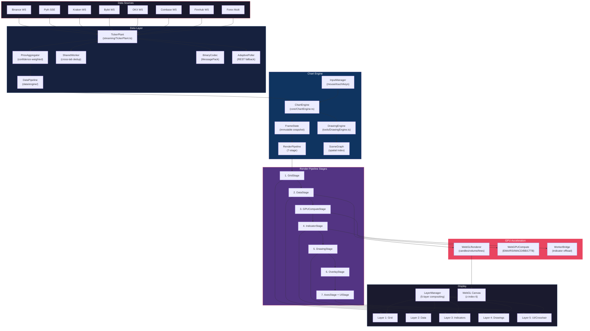

# charEdge Architecture Overview

> End-to-end data flow from market data sources to rendered chart pixels.

## System Architecture

## Key Architectural Decisions

| Decision | Rationale |
|----------|-----------|
| **Demand-driven rendering** | 0% CPU when idle — only renders when data changes |
| **5-layer compositing** | Independent dirty tracking per layer avoids full repaints |
| **WebGPU compute** | 50-150x speedup for EMA/RSI/LTTB on GPU cores |
| **SharedWorker dedup** | Single WebSocket connection shared across browser tabs |
| **Binary wire format** | 3x bandwidth savings via MessagePack encoding |
| **7-stage pipeline** | Each stage can skip if its layer is clean |

## File Map

| Component | Path | Lines | Language |
|-----------|------|-------|----------|
| ChartEngine | `src/charting_library/core/ChartEngine.ts` | 750 | TypeScript |
| WebGPUCompute | `src/charting_library/renderers/WebGPUCompute.ts` | 678 | TypeScript |
| WebGLRenderer | `src/charting_library/renderers/WebGLRenderer.ts` | ~800 | TypeScript |
| TickerPlant | `src/data/engine/streaming/TickerPlant.ts` | 920 | TypeScript |
| DrawingEngine | `src/charting_library/tools/DrawingEngine.ts` | ~600 | TypeScript |
| RenderPipeline | `src/charting_library/core/RenderPipeline.ts` | ~200 | TypeScript |
| LayerManager | `src/charting_library/core/LayerManager.js` | ~150 | JavaScript |
| WorkerBridge | `src/charting_library/core/WorkerBridge.js` | ~130 | JavaScript |
