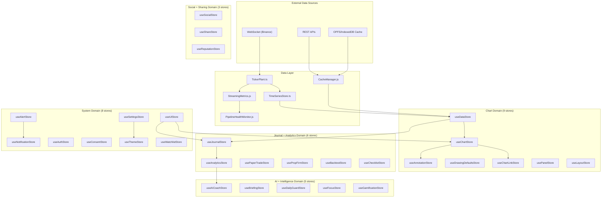

# State Architecture

> How data flows through charEdge's 35+ Zustand stores, organized into 5 domain groups.

---

## Domain Groups



## Data Flow

```
WebSocket → TickerPlant → StreamingMetrics → TimeSeriesStore
                                              ↓
                                      useDataStore (bars)
                                       ↙          ↘
                              useChartStore    useJournalStore
                              (viewport,       (trades, entries)
                               drawings)              ↓
                                              useAnalyticsStore
                                              (Sharpe, drawdown)
                                                     ↓
                                              useAICoachStore
                                              (patterns, tips)
```

## Store Reference

### Chart Domain
| Store | Purpose | Key State |
|-------|---------|-----------|
| `useChartStore` | Viewport, zoom, timeframe, active symbol | `symbol`, `timeframe`, `scrollOffset`, `visibleBars` |
| `useDataStore` | Bar data, loading state, data source | `bars`, `isLoading`, `error`, `source` |
| `useAnnotationStore` | Lines, shapes, text annotations | `annotations[]`, `selectedId` |
| `useDrawingDefaultsStore` | Default styles for drawing tools | `lineColor`, `lineWidth`, `fibLevels` |
| `useChartLinkStore` | Journal ↔ chart trade overlays | `linkedTrades[]`, `ghostBoxes[]` |
| `usePanelStore` | Inspector/side panel visibility | `inspectorOpen`, `activePanel` |
| `useLayoutStore` | BentoGrid layout persistence | `layout`, `gridConfig` |

### Journal + Analytics Domain
| Store | Purpose | Key State |
|-------|---------|-----------|
| `useJournalStore` | Trade entries, notes, screenshots | `entries[]`, `tags[]`, `filters` |
| `useAnalyticsStore` | Computed metrics (Sharpe, Sortino, etc.) | `sharpe`, `sortino`, `maxDrawdown`, `winRate` |
| `usePaperTradeStore` | Paper trading positions | `positions[]`, `balance`, `pnl` |
| `usePropFirmStore` | Prop firm challenge tracking | `rules`, `dailyLoss`, `maxLoss` |
| `useBacktestStore` | Strategy backtest results | `results`, `walkForward` |
| `useChecklistStore` | Pre-trade checklists | `items[]`, `completionRate` |

### AI + Intelligence Domain
| Store | Purpose | Key State |
|-------|---------|-----------|
| `useAICoachStore` | AI co-pilot state, suggestions | `suggestions[]`, `sessionSummary`, `biasDetected` |
| `useBriefingStore` | Morning briefing data | `briefing`, `lastGenerated` |
| `useDailyGuardStore` | Daily loss/trade limits | `dailyPnL`, `tradeCount`, `isLocked` |
| `useFocusStore` | Focus mode (attention narrowing) | `isFocused`, `distractionScore` |
| `useGamificationStore` | Streaks, badges, XP | `streak`, `badges[]`, `xp`, `level` |

### System Domain
| Store | Purpose | Key State |
|-------|---------|-----------|
| `useUIStore` | Global UI state, modals, toasts | `activeModal`, `toasts[]`, `isMobile` |
| `useAlertStore` | Price/condition alerts | `alerts[]`, `triggeredAlerts[]` |
| `useNotificationStore` | Push notification queue | `notifications[]`, `unreadCount` |
| `useAuthStore` | Auth state (Supabase) | `user`, `session`, `isAuthenticated` |
| `useSettingsStore` | User preferences | `settings`, `featureGates` |
| `useThemeStore` | Theme selection | `theme`, `customColors` |
| `useWatchlistStore` | Symbols watchlist | `symbols[]`, `activeGroup` |

## Key Conventions

1. **No cross-domain writes** — stores only write to their own domain. Cross-domain reads use `getState()`.
2. **Selectors over subscriptions** — use `useStore(selector)` to prevent unnecessary re-renders.
3. **Persist middleware** — used for `useSettingsStore`, `useJournalStore`, `useChecklistStore` (localStorage).
4. **Action naming** — `set*` for state setters, `fetch*` for async, `reset*` for cleanup.
