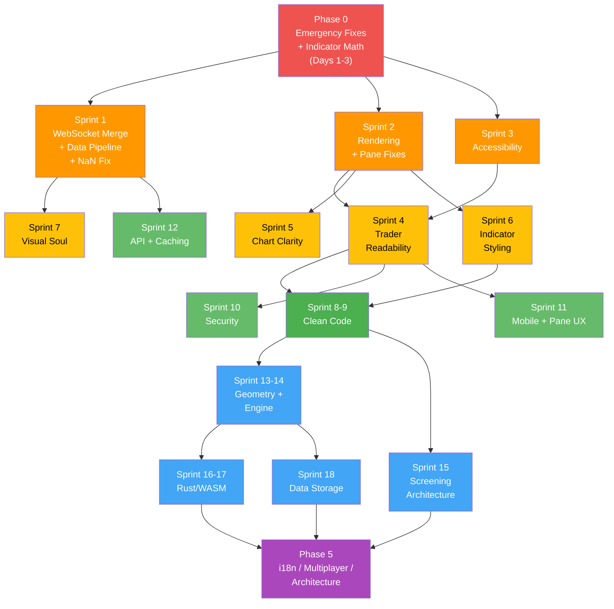

# 🎯 charEdge Master Game Plan v2

> Synthesizing **19 audits • 180+ findings** into an actionable roadmap
> 
> *v2 incorporates: Clean Code Audit, Pane Management Audit, CMT Visual Indicator Audit, Technical Indicator Math Audit*

---

## How to Read This Plan

- **6 Phases** ordered by urgency and dependency chain
- Each phase has **sprints** (1 sprint ≈ 1 week)
- Items tagged with source audit for traceability
- 🔴 = Must do / 🟡 = Should do / 🟢 = Nice to have / 🔵 = Future vision
- **NEW** = item from the 4 latest audits

---

## Phase 0 — Emergency Fixes ⚡ (Days 1–3) ✅ COMPLETE

> Things that are broken, dangerous, or silently producing wrong values **right now**.

| # | Fix | Source Audit | Effort | Status |
|:-:|-----|:-----------:|:------:|:------:|
| 1 | **Remove JWT default secret** — delete `.default('dev-secret…')` from [env.ts](file:///Users/tylermoretti/Documents/GitHub/charEdge/src/api/env.ts) | Security C3 | 15 min | ✅ |
| 2 | **Fix KAMA WGSL data race** — change `@workgroup_size(64)` → [(1)](file:///Users/tylermoretti/Documents/GitHub/charEdge/src/pages/SpeedtestPage.jsx#193-197) in [kama.wgsl.ts](file:///Users/tylermoretti/Documents/GitHub/charEdge/src/charting_library/gpu/kama.wgsl.ts) | GPU G-1 | 10 min | ✅ |
| 3 | **Extract inline `<script>` blocks** from [index.html](file:///Users/tylermoretti/Documents/GitHub/charEdge/index.html) to external files | Security C2 | 1 hr | ✅ |
| 4 | **Fix ScriptEngine sandbox** — freeze `Object.prototype` before `new Function()` | Security C1 | 2 hr | ✅ |
| 5 | **Fix CSRF timing** — replace `!==` with `crypto.timingSafeEqual()` | Security H2 | 10 min | ✅ |
| 6 | **Fix heartbeat** — replace broken `{ op: 'ping' }` with data-staleness monitoring | WebSocket | 1 hr | ✅ |
| 7 | **NEW: Fix Sigma Bands naive variance** — replace `sumSq/n - m²` with two-pass or Welford's in [sigmaBands.ts](file:///Users/tylermoretti/Documents/GitHub/charEdge/src/charting_library/studies/indicators/sigmaBands.ts) | Math Audit | 30 min | ✅ |
| 8 | **NEW: Deprecate IndicatorLibrary.js VWAP bands** — redirect to Welford-based [vwap.ts](file:///Users/tylermoretti/Documents/GitHub/charEdge/src/charting_library/studies/indicators/vwap.ts) | Math Audit | 30 min | ✅ |
| 9 | **NEW: Fix IndicatorLibrary.js ADX smoothing** — replace SMA of DX with Wilder's recursive smoothing | Math Audit | 30 min | ✅ |
| 10 | **NEW: Fix IndicatorLibrary.js Supertrend ATR** — replace [sma(TR)](file:///Users/tylermoretti/Documents/GitHub/charEdge/src/data/engine/indicators/IndicatorLibrary.js#115-127) with Wilder-smoothed ATR | Math Audit | 30 min | ✅ |

> [!CAUTION]
> ~~**Items 1–4 are actively exploitable.** Item 6 means you have **no disconnect detection** in production. Items 7–10 produce **silently wrong indicator values**.~~ **All 10 resolved.**

---

## Phase 1 — Core Stability, Performance & Indicator Accuracy 🔧 (Weeks 1–3)

> Merge divergent code, fix over-rendering, batch API calls, wire dead accessibility code, fix indicator math.

### Sprint 1: WebSocket Merge & Data Pipeline (Week 1) ✅ COMPLETE

| # | Task | Source | Effort | Status |
|:-:|------|:------:|:------:|:------:|
| 11 | **Merge .ts and .js WebSocketService** — use .ts as base, backport gap-stitching + HeartbeatMonitor + silentReconnect from .js, delete .js | WebSocket | 🔴 Med | ✅ |
| 12 | **Batch watchlist API calls** — create `batchGetQuotes(symbols[])` to collapse 40 → 3 HTTP requests | API Layer 1.1 | 🔴 Med | ✅ |
| 13 | **Speculative dual-provider fetch** — `Promise.any()` top-2 providers instead of sequential fallback | API Layer 1.3 | 🔴 Low | ✅ |
| 14 | **Normalize timestamps at adapter boundary** — force Unix ms before caching | API Layer 2.2 | 🟡 Low | ✅ |
| 15 | **Consolidate 3 gap detectors** into one canonical `detectGaps()` | API Layer 3.1 | 🟡 Low | ✅ |
| 16 | **Fix `useWebSocket` array copies** — replace `slice()` with index-based last-element mutation | WebSocket | 🟡 Low | ✅ |
| 17 | **NEW: Eliminate NaN→0 zero-fill pattern** — refactor 10 affected indicators (Stoch %D, StochRSI, PPO, TRIX, KST, Coppock, TSI, Accel Osc, Mass Index) to use NaN-propagating SMA/EMA | Math Audit | 🟡 Med | ✅ |

### Sprint 2: Rendering Pipeline & Pane Management (Week 2) ✅ COMPLETE

| # | Task | Source | Effort | Status |
|:-:|------|:------:|:------:|:------:|
| 18 | **Props diff before [markDirty()](file:///Users/tylermoretti/Documents/GitHub/charEdge/src/charting_library/core/ChartEngine.ts#522-539)** — shallow-diff incoming vs stored props in `ChartEngine.setProps()` | Rendering 3.3 | 🔴 Med | ✅ |
| 19 | **Guard pane dirty on tick** — gate pane `markAllDirty()` with `if (!this._tickUpdate)` | Rendering 3.4 | 🟡 Low | ✅ |
| 20 | **Coarser animation epsilon** — use pixel-threshold for [_needsNextFrame](file:///Users/tylermoretti/Documents/GitHub/charEdge/src/charting_library/core/ChartEngine.ts#484-510) decision | Rendering 3.6 | 🟡 Low | ✅ |
| 21 | **Pool [RenderContexts](file:///Users/tylermoretti/Documents/GitHub/charEdge/src/charting_library/core/RenderPipeline.ts#36-52) object** — reuse single 17-field object instead of new-per-frame | Rendering 3.1 | 🟡 Low | ✅ |
| 22 | **Cache uniform/attrib locations** — store at compile time, stop per-frame `gl.getUniformLocation()` | GPU U-1 | 🟡 Med | ✅ |
| 23 | **Cache [_parseColor()](file:///Users/tylermoretti/Documents/GitHub/charEdge/src/charting_library/renderers/VolumeRenderer.ts#41-42)** — `Map<string, Float32Array>` instead of new alloc per call | GPU B-2 | 🟡 Low | ✅ |
| 24 | **Use `bufferSubData()` in main draw** — pre-allocate at max, stop `bufferData()` re-alloc | GPU B-1 | 🟡 Med | ✅ |
| 25 | **NEW: Fix splitter event listener leak** — store named handlers, `removeEventListener` in `_removeLastPane()` | Pane Mgmt F9 | 🔴 Low | ✅ |
| 26 | **NEW: Unify dual resize systems** — remove InputManager canvas splitter, keep PaneManager DOM splitter only | Pane Mgmt F1 | 🔴 Med | ✅ |
| 27 | **NEW: Render crosshair in indicator panes** — extend UIStage to draw vertical crosshair line on each indicator pane's UI canvas | Pane Mgmt F5 | 🔴 Med | ✅ |

### Sprint 3: Accessibility Integration (Week 3) ✅ COMPLETE

| # | Task | Source | Effort | Status |
|:-:|------|:------:|:------:|:------:|
| 28 | **Wire `getChartAriaProps()`** into [ChartEngineWidget.jsx](file:///Users/tylermoretti/Documents/GitHub/charEdge/src/app/components/chart/core/ChartEngineWidget.jsx) chart container | A11y CF-1 | 🔴 Low | ✅ |
| 29 | **Mount `<ChartKeyboardNav>`** as child of chart widget | A11y CF-2 | 🔴 Low | ✅ |
| 30 | **Mount `<ChartDataTable>`** with toolbar toggle button | A11y CF-4 | 🔴 Med | ✅ |
| 31 | **Instantiate `ChartAnnouncer`** — call `announce()` on price updates | A11y CF-3 | 🔴 Low | ✅ |
| 32 | **High-contrast Canvas** — read `prefers-contrast: more`, adjust stroke/opacity | A11y CF-5 | 🟡 Med | ✅ |
| 33 | **Focus ring audit** — ensure `:focus-visible` outlines on all chart toolbar buttons | A11y CF-6 | 🟡 Low | ✅ |

---

## Phase 2 — UX, Visual Upgrade & Indicator Styling 🎨 (Weeks 4–7)

> Make the chart trader-ready: readability, cognitive load, visual polish, correct indicator presentation.

### Sprint 4: Trader Readability Overhaul (Week 4) ✅ COMPLETE

| # | Task | Source | Effort | Status |
|:-:|------|:------:|:------:|:------:|
| 34 | **Increase candle body width** — `0.35` → `0.70` in [CandleRenderer.ts](file:///Users/tylermoretti/Documents/GitHub/charEdge/src/charting_library/renderers/CandleRenderer.ts) | UX Audit | 🔴 Low | ✅ |
| 35 | **Increase wick width floor** — `0.5` → `Math.max(1.5, pr)` | UX Audit | 🔴 Low | ✅ |
| 36 | **Kill compact mode auto-hide** — delete CSS block that hides toolbar controls after 5s | UX Audit | 🔴 Low | ✅ |
| 37 | **Remove ChartHUD auto-fade** — HUD should be persistent | UX Audit | 🟡 Low | ✅ |
| 38 | **Eliminate triple OHLCV** — choose ONE canonical source (move OHLC to top-left header) | Storytelling P0 | 🟡 Med | ✅ |
| 39 | **Shrink center watermark** — reduce to ≤18px, ≤5% opacity, anchor top-left | Storytelling P0 | 🟡 Low | ✅ |

### Sprint 5: Chart Clarity & Overlays (Week 5) ✅ COMPLETE

| # | Task | Source | Effort | Status |
|:-:|------|:------:|:------:|:------:|
| 40 | **Convert IndicatorPanel to side panel** — stop blocking chart view | UX Audit | 🟡 Med | ✅ |
| 41 | **Add overlay color legends** — VP: `🟩 Buy │ 🟥 Sell │ 🟨 POC`; render in-pane | Storytelling P1 | 🟡 Med | ✅ |
| 42 | **Add delta/OI mini-axes** — min/mid/max labels for sub-pane overlays | Storytelling P1 | 🟡 Med | ✅ |
| 43 | **Footprint onboarding hint** — first-use "Zoom in to see bid/ask" tooltip | Storytelling P1 | 🟢 Low | ✅ |
| 44 | **Unify toggle icons** — replace emoji `🔒`/`🔓` with SVG from [Icon](file:///Users/tylermoretti/Documents/GitHub/charEdge/src/pages/PricingPage.jsx#94-103) system | Storytelling P2 | 🟢 Low | ✅ |

### Sprint 6: Indicator Visual Overhaul (Week 6) — NEW ✅ COMPLETE

> [!IMPORTANT]
> ~~Two critical indicators render without directional coloring, defeating their analytical purpose. All overlay MAs are 2× heavier than TradingView.~~ **All 12 items resolved.**

| # | Task | Source | Effort | Status |
|:-:|------|:------:|:------:|:------:|
| 45 | **NEW: Fix Supertrend dynamic coloring** — teal below price (bull), red above price (bear) | CMT Audit P0 | 🔴 Med | ✅ |
| 46 | **NEW: Fix Ichimoku cloud dual-fill** — green fill when A>B (bull), red fill when B>A (bear) | CMT Audit P0 | 🔴 Med | ✅ |
| 47 | **NEW: Reduce all overlay MA line widths** — `2` → `1` (standard MAs), `1.5` (adaptive MAs: KAMA/VIDYA/FRAMA/McGinley) | CMT Audit P1 | 🟡 Med | ✅ |
| 48 | **NEW: Add OB/OS fill zones** to all bounded oscillators (RSI already has them; add to Stoch, MFI, Williams %R, CCI, StochRSI, Connors RSI) | CMT Audit P1 | 🟡 Med | ✅ |
| 49 | **NEW: Fix Keltner default multiplier** — `1.5` → `2.0` in [registry.js](file:///Users/tylermoretti/Documents/GitHub/charEdge/src/charting_library/studies/indicators/registry.js) | CMT Audit P1 | 🟡 Low | ✅ |
| 50 | **NEW: Add `opacity` field to indicator output definitions** — wire through renderer.js and IndicatorStage.ts | CMT Audit P2 | 🟢 Med | ✅ |
| 51 | **NEW: Increase BB/KC/Donchian fill alpha** — `0.08` → `0.12` (BB), `0.08` → `0.10` (KC), `0.06` → `0.09` (DC) | CMT Audit P2 | 🟢 Low | ✅ |
| 52 | **NEW: Middle band line → neutral grey** `#78909C` for BB/KC (distinguish from envelope) | CMT Audit P2 | 🟢 Low | ✅ |
| 53 | **NEW: Reduce pane oscillator line widths** — `2` → `1.5` (RSI, Stoch %K, MACD, CCI, MFI, Williams %R) | CMT Audit P2 | 🟢 Low | ✅ |
| 54 | **NEW: PSAR dynamic bull/bear coloring** — teal dots below price, red dots above | CMT Audit P3 | 🟢 Low | ✅ |
| 55 | **NEW: Fix band label font** — `Arial` → [Inter](file:///Users/tylermoretti/Documents/GitHub/charEdge/src/charting_library/core/FormingCandleInterpolator.ts#25-29) in [renderer.js](file:///Users/tylermoretti/Documents/GitHub/charEdge/src/charting_library/studies/indicators/renderer.js) | CMT Audit P3 | 🟢 Low | ✅ |
| 56 | **NEW: Harmonize `multiplier` vs `stdDev` param keys** between constants and registry | CMT Audit P3 | 🟢 Low | ✅ |

### Sprint 7: Visual Soul & Motion (Week 7) — ✅ COMPLETE

| # | Task | Source | Effort | Status |
|:-:|------|:------:|:------:|:------:|
| 57 | **Volume intensity gradient** — map bar volume to oklch lightness ramp | Visual Soul | 🟡 Med | ✅ |
| 58 | **Live price badge micro-pulse** — 150ms spring scale(1.03) on each tick | Visual Soul | 🟡 Low | ✅ |
| 59 | **Close-price silk smoothing** — lower FormingCandleInterpolator alpha to 0.15 | Visual Soul | 🟢 Low | ✅ |
| 60 | **Unify color systems** — WebGL shader bull/bear colors read from CSS custom properties | Visual Soul | 🟡 Med | ✅ |
| 61 | **Replay easeInOutCubic** — replace linear lerp in `ReplayInterpolator` | Visual Soul | 🟢 Low | ✅ |

---

## Phase 3 — Code Quality & Platform Hardening 🔒 (Weeks 8–11)

> Clean code remediation, security hardening, mobile experience, API optimization.

### Sprint 8: Clean Code — Stop the Bleeding (Week 8) — NEW — 🟡 3/6 DONE

> [!WARNING]
> ~~85 duplicate [.js](file:///Users/tylermoretti/Documents/GitHub/charEdge/sw.js)/[.ts](file:///Users/tylermoretti/Documents/GitHub/charEdge/middleware.ts) file pairs. 72 stray `console.*` calls.~~ **Twins deleted, console calls migrated.** 20 monster functions remain for Sprint 9. Renaming tasks (#65-67) deferred to guided session.

| # | Task | Source | Effort | Status |
|:-:|------|:------:|:------:|:------:|
| 62 | **NEW: Delete 85 [.js](file:///Users/tylermoretti/Documents/GitHub/charEdge/sw.js) twins** where [.ts](file:///Users/tylermoretti/Documents/GitHub/charEdge/middleware.ts) exists; update all imports | Clean Code 5.1 | 🔴 High | ✅ |
| 63 | **NEW: Replace 72 `console.*` calls** with `logger.*` | Clean Code 6.2 | 🔴 Med | ✅ |
| 64 | **NEW: Move root-level task list files** to `docs/archive/` | Clean Code 6.3 | 🟡 Low | ✅ |
| 65 | **NEW: Rename single-letter domain variables** — 30+ instances (see audit §3.1) | Clean Code 3.1 | 🟡 Med | ⏳ Deferred |
| 66 | **NEW: Rename generic `data`/`result` vars** to intention-revealing names | Clean Code 3.2 | 🟡 Med | ⏳ Deferred |
| 67 | **NEW: Fix misleading function names** — `isWin` → `DashboardWidgetGrid`, `tradeStreamKey` → proper name, etc. | Clean Code 3.3 | 🟡 Med | ⏳ Deferred |

### Sprint 9: Clean Code — Slay the Monsters (Week 9) — NEW — ✅ COMPLETE

| # | Task | Source | Effort | Status |
|:-:|------|:------:|:------:|:------:|
| 68 | **NEW: Decompose `DashboardWidgets.jsx` (832 lines)** → 10 files (8 widgets + shared styles + barrel re-export) | Clean Code 4 | 🟡 High | ✅ |
| 69 | **NEW: Decompose `WebSocketService.ts` (869 lines)** → ws/constants.ts + ws/lazyImports.ts + slimmed main class | Clean Code 4 | 🟡 High | ✅ |
| 70 | **NEW: Decompose `TradeFormModal.jsx` (760 lines)** → PnLCalculator.ts + form components | Clean Code 4 | 🟡 High | ✅ |
| 71 | **NEW: Decompose `TimeSeriesStore.ts` (939 lines)** → 5 storage/ modules (types, LRUCache, BinaryCodec, BTreeIndex) | Clean Code 4 | 🟡 Med | ✅ |
| 72 | **NEW: Decompose remaining top-20 monsters** — DepthEngine, TickerPlant, MorningBriefing, InsightsPanel, CloudBackup | Clean Code 4 | 🟡 Very High | ✅ |
| 73 | **NEW: Consolidate `formatPrice`** — one canonical version in `src/shared/formatting.ts` (8 copies → 1) | Clean Code 5.2 | 🟡 Low | ✅ |
| 74 | **NEW: Consolidate hooks** into feature-local `hooks/` dirs (5 hooks moved to feature-local dirs) | Clean Code 1.4 | 🟡 Med | ✅ |

### Sprint 10: Security Hardening (Week 10) — ✅ COMPLETE

| # | Task | Source | Effort | Status |
|:-:|------|:------:|:------:|:------:|
| 75 | **CSP in dev mode** — add `Content-Security-Policy-Report-Only` | Security H1 | 🟡 Low | ✅ |
| 76 | **Fix proxy error codes** — return actual HTTP status, not 200 OK | Security H3 | 🟡 Low | ✅ |
| 77 | **Replace `dangerouslySetInnerHTML`** in `Icon.jsx` with React SVG elements | Security H4 | 🟡 Med | ✅ |
| 78 | **Restrict Vercel rewrites** — explicit paths instead of wildcard proxy | Security M2 | 🟡 Low | ✅ |
| 79 | **Add `Vary: Origin`** to CORS responses | Security M3 | 🟡 Low | ✅ |
| 80 | **Limit CSP report body** — `{ limit: '4kb' }` on endpoint | Security M5 | 🟡 Low | ✅ |
| 81 | **Add `object-src 'none'`** to CSP | Security CSP | 🟡 Low | ✅ |
| 82 | **Wire `GPUBufferRegistry`** — call `gpuRegistry.track()` in buffer creation | GPU B-3 | 🟡 Low | ✅ |

### Sprint 11: Mobile & Pane UX (Week 11) — ✅ COMPLETE

| # | Task | Source | Effort | Status |
|:-:|------|:------:|:------:|:------:|
| 83 | **Fix touch target sizes** — enforce 44×44px on timeframe pills, toolbar buttons, drawing palette | Mobile | 🔴 Med | ✅ |
| 84 | **Fix toolbar overflow** — `flex-wrap` or scrollable strip with snap | Mobile | 🔴 Low | ✅ |
| 85 | **Wire `getResponsiveChartConfig`** — integrate dead code into chart init | Mobile | 🟡 Med | ✅ |
| 86 | **Fix `e.preventDefault()` trapping** — only prevent after gesture classification | Mobile | 🔴 Med | ✅ |
| 87 | **Long-press crosshair** — 500ms hold → persistent crosshair with vibrate | Mobile | 🟡 Med | ✅ |
| 88 | **Render `GestureGuide`** — mount on `(pointer: coarse)` devices | Mobile | 🟡 Low | ✅ |
| 89 | **Bottom-sheet drawing tools** — use existing `MobileDrawingSheet` on touch devices | Mobile | 🟡 Med | ✅ |
| 90 | **NEW: Proportional pane resizing** — redistribute excess to all panes when min-height forces overflow | Pane Mgmt F2 | 🟡 Med | ✅ |
| 91 | **NEW: Resize animation smoothing** — wrap `_relayout()` in rAF with spring interpolation | Pane Mgmt F3 | 🟡 Low | ✅ |
| 92 | **NEW: Fix PaneState recreation on reorder** — mutate in place, add `updateId()` | Pane Mgmt F11 | 🟡 Low | ✅ |
| 93 | **NEW: Replace O(n) bar scan in synced crosshair** — use `binarySearchByTime()` | Pane Mgmt F7 | 🟡 Low | ✅ |

---

## Phase 4 — Scalability & Architecture 🏗️ (Weeks 12–17)

> Geometry performance, charting grammar, indicator computation, code architecture evolution.

### Sprint 12: API Layer & Caching (Week 12) ✅ COMPLETE

| # | Task | Source | Effort | Status |
|:-:|------|:------:|:------:|:------:|
| 94 | **Batch IDB transactions** — single readonly tx for multi-key reads | API Layer 4.2 | 🟡 Med | ✅ |
| 95 | **Two-pointer sorted merge** for bar dedup — O(n) vs O(n log n) | API Layer 2.1 | 🟡 Low | ✅ |
| 96 | **Parallel gap backfill** — `Promise.allSettled` with market-hours filter | API Layer 3.2/3.3 | 🟡 Med | ✅ |
| 97 | **Redis rate limiter** for production (or evaluate Upstash) | Security M1 | 🟡 Med | ✅ |

### Sprint 13–14: Geometry & Engine (Weeks 13–14) ✅ COMPLETE

| # | Task | Source | Effort | Status |
|:-:|------|:------:|:------:|:------:|
| 98 | **LabelCollisionResolver → interval tree** — O(n²) → O(n log n) | Geometry 8.1 | 🟡 Med | ✅ |
| 99 | **DrawingHitTest → SpatialIndex** — `computeBoundingBox` helper | Geometry 8.2 | 🟡 Med | ✅ |
| 100 | **GhostBoxRenderer → SpatialIndex** — O(1) hit testing | Geometry 8.3 | 🟡 Low | ✅ |
| 101 | **Extract DataStage god function** — already decomposed (253 lines) | Grammar | 🟡 High | ✅ |
| 102 | **Extract `barX`/`priceY` utilities** → `core/scales.ts` | Grammar | 🟡 Low | ✅ |
| 103 | **Define `MarkSpec` types** — declarative encoding interface | Grammar | 🟢 Med | ✅ |

### Sprint 15: Architecture — Screaming Architecture Migration (Week 15) ✅ COMPLETE

> [!NOTE]
> The folder names should **scream** what charEdge does — *trading, charting, journaling* — not whisper "components" and "utils."

| # | Task | Source | Effort | Status |
|:-:|------|:------:|:------:|:------:|
| 104 | **Create domain-driven folder structure** — `trading/`, `journal/`, `psychology/`, `observability/`, `security/`, `a11y/`, `ai/` | Clean Code 2 | 🟢 Very High | ✅ |
| 105 | **Kill `src/utils/`** — 54 files distributed to domain homes, ≤ 15 in `shared/` | Clean Code 2 | 🟢 High | ✅ |
| 106 | **Migrate files by feature area** — `intelligence/` (26 files) + `services/` (6 files) redistributed | Clean Code 2 | 🟢 Very High | ✅ |

### Sprint 16–17: Math/WASM Integration (Weeks 16–17)

| # | Task | Source | Effort |
|:-:|------|:------:|:------:|
| 107 | **Create `charedge-wasm` Rust crate** — port Calc.js batch indicators (SMA, EMA, RSI, Bollinger, MACD) | WASM Phase 1 | 🟢 High |
| 108 | **Wire WASM into existing IndicatorWorker** — replace inline JS with WASM calls | WASM Phase 2 | 🟢 Med |
| 109 | **Port pattern engines** — AutoTrendline (O(n²) → 10×), AutoSR, candlestick patterns | WASM Phase 3 | 🟢 High |
| 110 | **Port bar transforms** — Renko, Range, Kagi, Heikin-Ashi | WASM Phase 4 | 🟢 Med |
| 111 | **NEW: Add TA-Lib regression test suite** — compare indicator output against known reference values | Math Audit | 🟢 Med |

> [!IMPORTANT]
> **Keep streaming `Running*` classes in JavaScript** — per-tick FFI overhead kills the WASM gain for single-value updates.

### Sprint 18: Data Storage Evolution (Week 18) ✅ COMPLETE

| # | Task | Source | Effort | Status |
|:-:|------|:------:|:------:|:------:|
| 112 | **Columnar typed arrays** for bar storage — Float64/Float32 per field | API Layer 4.1 | 🟡 High | ✅ |
| 113 | **Time-partitioned bar keys** — `BTCUSDT:1h:2024-Q1` bucketing | API Layer 4.3 | 🟢 High | ✅ |
| 114 | **DirtyRegion → disjoint rect list** (up to 8) | Geometry 8.5 | 🟢 Med | ✅ |
| 115 | **Extract countdown to separate DOM element** — stop forcing 1/s UIStage repaint | Rendering 3.12 | 🟢 Low | ✅ |

---

## Phase 5 — Future Vision 🔮 (Backlog — After Phase 4)

### Multiplayer Charting

| # | Task | Source | Effort |
|:-:|------|:------:|:------:|
| 121 | Add `yjs` + `y-websocket` — collaborative drawing via Y.Doc | Multiplayer | Very High |
| 122 | Ghost cursors + awareness protocol | Multiplayer | High |
| 123 | Replace snapshot-based undo with `Y.UndoManager` | Multiplayer | Med |

### Architecture Evolution

| # | Task | Source | Effort |
|:-:|------|:------:|:------:|
| 124 | Implement `DataJoin` for GPU buffers (enter/update/exit) | Grammar | Very High |
| 125 | WebGPU compute→render zero-copy fusion | GPU 8.5 | High |
| 126 | OPFS-only bar storage (eliminate IDB candle layer) | API Layer | High |
| 127 | Unified widget chart engine (replace Chart.js dependency) | Grammar | Very High |

### Pane Management — Advanced (NEW)

| # | Task | Source | Effort |
|:-:|------|:------:|:------:|
| 128 | **NEW: Drag-and-drop pane reorder** — sortable indicator panes with spring animation | Pane Mgmt | High |
| 129 | **NEW: Cross-chart pane transfer** — drag indicator from one ChartEngine to another | Pane Mgmt | Very High |

---

## Dependency Map

---

## Cross-Audit Synergies (Updated)

Several findings from different audits address the **same root cause**:

| Root Cause | Audit Findings | Single Fix |
|---|---|---|
| **Dual WebSocket implementations** | WebSocket (divergence), Rendering (over-rendering), API (gap stitching race), Clean Code (685-line monster function) | Merge .ts + .js → one canonical file, decompose the monster |
| **Dead accessibility code** | A11y (CF-1/2/3/4), Localization (`getChartDirection`), Mobile (`GestureGuide`, `getResponsiveChartConfig`) | Integration sprint: wire all dead code into live app |
| **Code duplication across workers** | WASM (triple-copy SMA/EMA), Grammar (ChartTypes.js vs renderers), Clean Code (85 duplicate .js/.ts pairs) | Delete .js twins, WASM crate as single canonical source |
| **Hardcoded en-US everywhere** | Localization (300+ strings), Storytelling (legends), API (volume abbreviations) | `src/i18n/` module with `IntlFormatters` |
| **`setProps` over-triggering** | Rendering 3.3 + 3.4, Storytelling (redundant OHLCV updates) | Props diff gate in `ChartEngine.setProps()` |
| **Three parallel color systems** | Visual Soul (oklch vs hex vs rgba), UX (TradingView default colors), CMT (monochrome bands) | Unify into oklch-based CSS custom properties read by WebGL |
| **NEW: IndicatorLibrary.js divergence** | Math Audit (ADX SMA vs Wilder, Supertrend SMA-ATR vs Wilder-ATR, naive VWAP variance) | Deprecate IndicatorLibrary.js, redirect to charting-layer modules |
| **NEW: NaN→0 zero-fill pattern** | Math Audit (10 indicators), affects warm-up accuracy | nanSafeSma() helper + NaN-propagating EMA (already exists) |
| **NEW: Pane management dual systems** | Pane Mgmt (InputManager + PaneManager both implement splitter drag), Clean Code (dual implementations) | Consolidate to PaneManager DOM-based splitters only |
| **NEW: Indicator visual weight** | CMT (overlays too heavy), Storytelling (chart junk), UX (not TradingView-quality) | Systematic width reduction + opacity field on output definitions |

---

## Risk Matrix (Updated)

| Risk | Likelihood | Impact | Mitigation |
|---|:-:|:-:|---|
| WebSocket merge breaks live data | Med | High | Feature-flag: keep .js importable for 1 sprint |
| WASM build complicates CI/CD | Med | Med | Separate `charedge-wasm` repo with pre-built .wasm artifacts |
| Props diff breaks edge-case rendering | Low | High | Pixel-diff regression tests on key chart states |
| Touch target CSS breaks desktop layout | Low | Med | Scope to `@media (pointer: coarse)` only |
| SharedArrayBuffer COOP/COEP breaks embeds | High | Med | Don't use SAB until cross-origin-isolation is validated |
| **NEW: Deleting 85 .js twins breaks imports** | Med | High | Run full `tsc` + test suite after each batch delete |
| **NEW: Monster decomposition breaks functionality** | Med | High | Write unit tests for extracted pure functions BEFORE moving code |
| **NEW: Indicator styling changes confuse existing users** | Low | Med | Feature-flag or theme-based toggle for "classic" vs "CMT" styling |
| **NEW: Screaming Architecture migration breaks dev workflow** | Med | Med | Migrate one domain at a time with tsconfig path aliases |

---

## Scorecard (Before → After Phase 4)

| Dimension | Current | Target |
|---|:-:|:-:|
| Security | C | **A−** |
| WebSocket reliability | D+ | **A** |
| Accessibility | F | **B+** |
| Mobile readiness | C− | **B+** |
| Rendering efficiency | B+ | **A** |
| Price action readability | 4/10 | **8/10** |
| API efficiency | C+ | **A−** |
| Indicator math accuracy | B+ | **A+** |
| Indicator visual presentation | C+ | **A−** |
| Code quality / Clean Code | D | **B+** |
| Pane management | C | **A−** |
| i18n readiness | F | C (foundation only) |
| Visual polish | C+ | **B+** |

---

## What Changed in v2

| Area | v1 | v2 |
|---|---|---|
| **Phase 0** | 6 emergency items | **10 items** — added 4 indicator math fixes (Sigma Bands variance, VWAP naive formula, ADX SMA divergence, Supertrend ATR divergence) |
| **Phase 1** | 3 sprints, 18 items | 3 sprints, **23 items** — added NaN zero-fill refactor, splitter leak fix, dual resize unification, crosshair sync across panes |
| **Phase 2** | 3 sprints (4–6), 15 items | **4 sprints (4–7), 27 items** — added entire Sprint 6 for indicator visual overhaul (Supertrend/Ichimoku P0 fixes, overlay weight, oscillator fills) |
| **Phase 3** | 3 sprints (7–9), 19 items | **4 sprints (8–11), 32 items** — added 2 full sprints for Clean Code remediation (85 .js twins, 72 console calls, 20 monster decompositions), pane UX improvements |
| **Phase 4** | 4 sprints (10–14) | **7 sprints (12–18)** — added Sprint 15 for Screaming Architecture migration, TA-Lib regression tests |
| **Phase 5** | 12 items | **14 items** — added drag-and-drop pane reorder, cross-chart pane transfer |
| **Total items** | ~86 | **~129** |
| **Total audits synthesized** | 15 | **19** |

---

## Key Takeaway

> [!IMPORTANT]
> **The single highest-impact action is still Phase 0 + Sprint 1.** But Phase 0 now includes **4 indicator math fixes** that prevent traders from seeing wrong data. The Sigma Bands and VWAP naive-variance bugs are ticking time bombs on high-priced instruments.

> **The single biggest technical debt item is the 85 duplicate .js/.ts file pairs** (Clean Code Audit). Every other cleanup effort is undermined while two copies of every store, service, and utility exist. Sprint 8 should be treated as non-negotiable before any architecture evolution.

> **The biggest UX wins per effort are Sprint 6** — fixing Supertrend and Ichimoku single-color rendering is 2 tasks that resurrect two entire indicator classes. Every trader using these indicators is currently getting incomplete visual signals.
